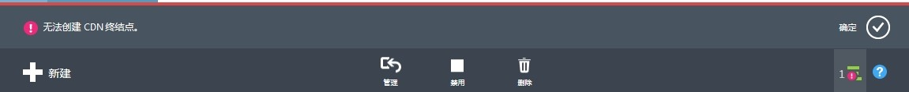

<properties
                pageTitle="在 Azure 经典管理门户中创建 CDN 终结点失败"
                description="在 Azure 经典管理门户中创建 CDN 终结点时，出现无提示或 CDN 终结点创建失败"
                services="cdn"
                documentationCenter=""
                authors=""
                manager=""
                editor=""
                tags="cdn,IPC number, contoso"/>

<tags
                ms.service="cdn-aog"
                ms.date="12/29/2016"
                wacn.date="12/29/2016"/>

# 在 Azure 经典管理门户中创建 CDN 终结点失败

## 问题描述

1. 在 [Azure 经典管理门户](https://manage.windowsazure.cn/)中新建 CDN 终结点时，回显信息没有正在验证或创建失败等提示，并且创建的 CDN 终结点个数没有增加。
2. 在正确申请并使用了备案号之后，发现仍然无法成功创建 CDN 终结点，错误提示如下：

    

## 问题分析

问题 1 : 备案号必须和域名绑定，如果不符，CDN 终结点则无法成功创建。
问题 2 : 域名在 CNC provider (CNC “ChinaNetCent“) 上已经存在，所以创建失败。

## 解决方法

基于以上理论，相应解决方案如下：

1.  申请正确的备案号。
2.  对于域名在 CNC 上存在的情况：
    1.  如果用户之前不是通过 Azure CDN 在 CNC 上创建过某个域名，例如 contoso.cn，需要用户自己将在 CNC 上创建的域名（contoso.cn）删除之后，再通过 Azure 创建。
    2.  如果用户是使用 CCIH 提供的 CDN 服务，请向微软支持团队反应。

