<properties 
	pageTitle="终结点（Endpoint）介绍和相关配置" 
	description="" 
	services="cloud-service" 
	documentationCenter="" 
	authors=""
	manager="" 
	editor=""/>
<tags 
	ms.service="cloud-service-aog"
	ms.date="" 
	wacn.date="08/31/2016"/>
# 终结点（Endpoint）介绍和相关配置

终结点（Endpoint）是一个与网络有关的概念。在 Azure 经典管理门户中，终结点是用来控制访问虚拟机或云服务的配置。每个终结点都必须指明所使用的 IP 协议（TCP 或 UDP），以及该协议对应的公共端口和私有端口。其中，公共端口用来侦听从 Internet 传入的流量，私有端口用来侦听发送到虚拟机上运行的应用程序或服务的流量。公共端口与虚拟机或者云服务的 VIP 绑定，私有端口则绑定在虚拟机的 DIP 上。

用户通过访问 VIP 和公共端口，可访问对应的虚拟机或云服务。终结点将此流量映射到 Azure 内部虚拟机的 DIP 和私有端口。在用户没有配置 ILPIP（Instance-level Public IP）时，这是访问 Azure 内部虚拟机、云服务的唯一途径。正是由于终结点的存在，使得合法用户能够安全、有效的访问 Azure 的资源。每个云服务的输入终结点数最大限制为 150 个。

用户新建、修改已经部署的虚拟机终结点、或设置负载均衡集时，Azure 经典管理门户中都有设置终结点的相关步骤。除了 Azure 经典管理门户，用户也可以通过 Windows PowerShell 来添加、修改、删除终结点。

## 本文包含以下内容

- [新建虚拟机终结点设置](#newVM)
- [在 Azure 经典管理门户管理终结点](#portal)
	- [添加终结点](#portaladd)
	- [编辑终结点](#portaledit)
	- [删除终结点](#portaledit)
- [在 Azure 经典管理门户管理 ACL](#acl)
- [创建/配置负载均衡集](#balance)
- [使用 PowerShell 设置终结点](#powershell)
	- [获取终结点](#powershellget)
	- [添加终结点](#powershelladd)
	- [编辑终结点](#powershelledit)
	- [删除终结点](#powershelledit)
- [终结点在资源管理器（Azure Resource Manager）中的变化](#change)

## 新建虚拟机终结点设置

在 Azure 经典管理门户中，当用户选择从库中创建虚拟机时，创建向导的第三步包含了终结点的相关设置。若用户选择的是 Windows 的映像，这里会自动添加用于 Remote Desktop 和 PowerShell 的终结点。Remote Desktop 的终结点使用 TCP 协议，公共端口会自动分配，私有端口使用Windows 默认的 3389。PowerShell 同样使用 TCP 协议，公共端口和私有端口同为 5986。

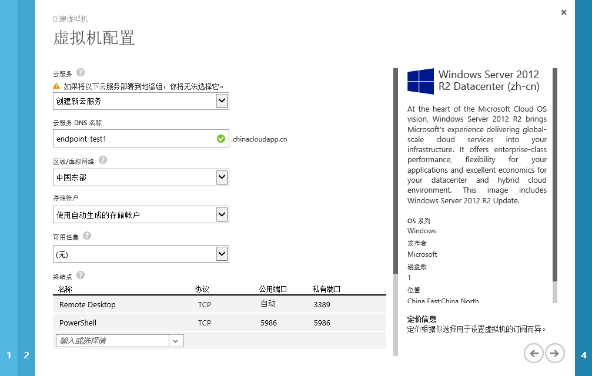

若用户选择的是 Linux 映像，Azure 经典管理门户会自动添加用于 SSH 服务的终结点。SSH 使用 TCP 协议，公共端口和私有端口同为 22。

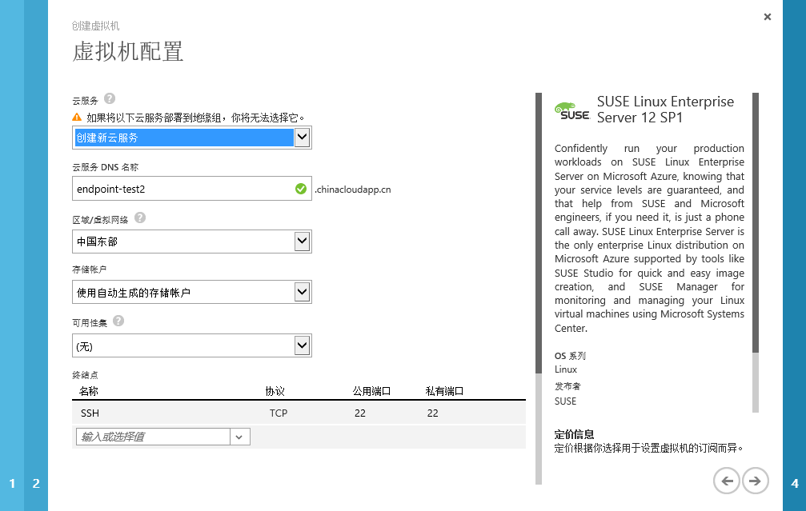

除了自动添加的终结点，用户可以根据需求添加更多终结点。Azure 内置了一些常用的终结点配置以供选择，例如 HTTP（TCP：80-80），HTTPS（TCP：443-443），LDAP（TCP：389-389）等。若需求不在列表范围之内，用户也可以添加自定义的终结点。

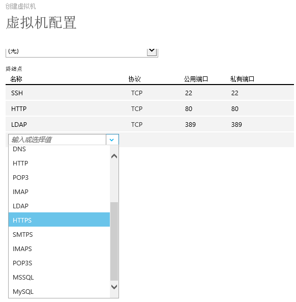

>[AZURE.NOTE]在创建虚拟机的向导中，不要修改自动添加的终结点（Windows 的 Remote Desktop 和 PowerShell， Linux 的 SSH）的协议和私有端口。这些是系统默认使用的协议和端口。若在此时被修改，会导致新创建的虚拟机对应的服务无法连接。待虚拟机部署完成后，可以根据实际的需求再做修改。

## 在 Azure 经典管理门户管理终结点

虚拟机创建过程中，Azure 自动添加的终结点仅用于与虚拟机建立连接。如果在虚拟机创建过程中没有添加自定义的终结点，用户也可以在 Azure 经典管理门户中为创建好的虚拟机添加终结点，或者修改已有的终结点。在 Azure 经典管理门户中选择需要修改终结点的虚拟机，然后点击终结点选项卡。

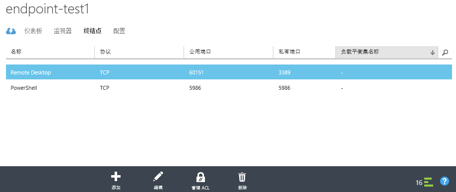

用户可以在这里添加新的终结点，编辑或删除已有的终结点。针对已有的终结点，用户还可以配置访问控制列表（Access Control List，ACL）。

#### 添加终结点

点击“添加”后，选择“添加独立终结点”，然后点击“下一步”。

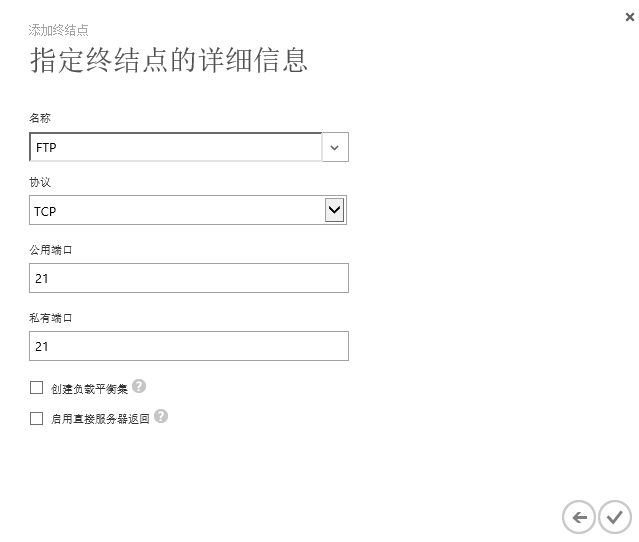

在这里可以填入终结点的名称，协议，以及公共端口和私有端口。若需要创建负载均衡集，则要勾中该选项。下一节中将介绍如何为已经部署的虚拟机设置新的负载均衡集。“直接服务器返回”是终结点的另一个选项。若要选择该项功能，必须保证公共端口和私有端口设为相同的值。输入完成后点击“√”就可以保存了。

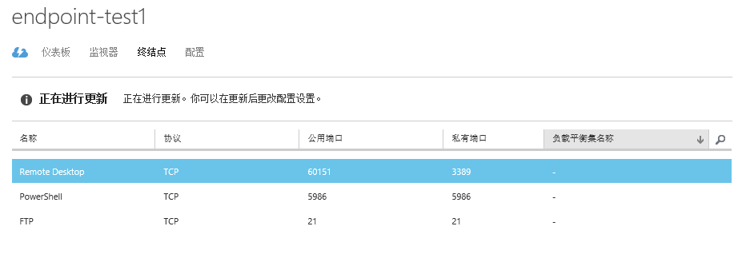

Azure 需要几秒钟更新配置来使新的终结点生效。

#### 编辑终结点

选择需要编辑的终结点，然后点击页面下方的“编辑”。打开的页面中可以修改终结点名称、协议、公共端口和私有端口，也可以在这里创建负载均衡集。但编辑终结点不可以修改服务器返回属性。

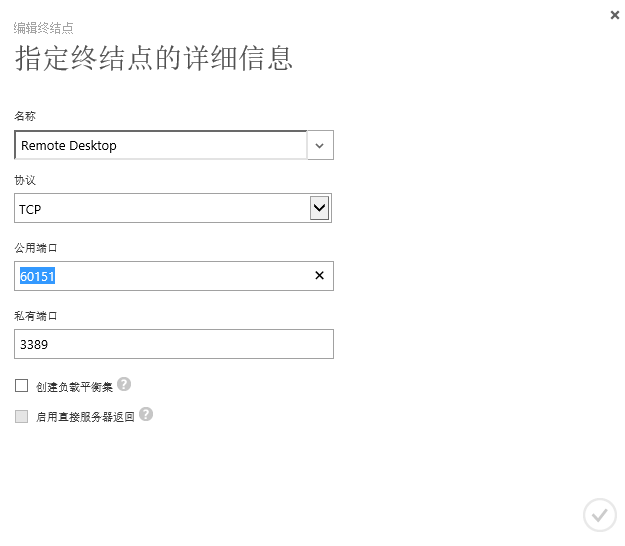

编辑完成后点击“√”保存修改。

#### 删除终结点

选中要删除的终结点，然后点击页面下方的“删除”。页面将二次确认是否要删除终结点。点击“是”确认，或者点击“否”取消删除。

## 管理 ACL

Azure 经典管理门户允许对每个终结点单独设置访问控制列表（ACL）。通过 ACL，能够限制具体某个网段或网络地址（以 CIDR： /32 表示）对终结点的访问权限（允许或禁止）。需要注意的是，当终结点没有配置 ACL 的时候，它默认允许被任何地址访问。一旦设置了 ACL，所有被允许的 ACL 条目以外的访问都将被拒绝。

关于 ACL 的详细信息，请浏览[这篇文章](/documentation/articles/virtual-networks-acl)。

选择需要编辑的终结点，然后点击页面下方的“管理 ACL”。然后再说明中填入该条目的名字，在操作中选择“允许”或“拒绝”，然后填入远程子网的地址。最后点击“√”保存。

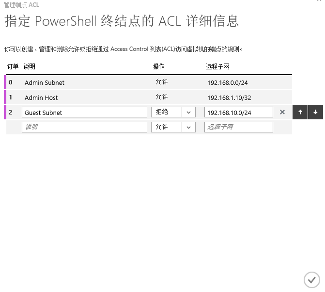

## 创建负载均衡集

Azure 经典管理门户中的负载均衡集基于 Azure 负载均衡器来实现。它是一种工作在传输层（OSI 的第 4 层）类型的负载均衡器。它可以将传入的 TCP、UDP 流量分发到云服务中正常运行的服务实例上，或者分发到负载均衡器集内所定义的虚拟机上。Azure 负载均衡器使用的分发算法 = 是对 5 元组（或 2 元组，3 元组）进行哈希运算。通过对运算结果的比较，负载均衡器将流量映射到对应的可用服务上。负载均衡集的配置通过对终结点的编辑来完成。在将加入负载均衡集的第一台虚拟机的终结点配置页面下，点击“添加”（或者选中将加入负载均衡集的终结点，然后点击“编辑”）。输入名称、协议、公共端口和私有端口后，勾选“创建负载均衡集”，然后点击下一步。

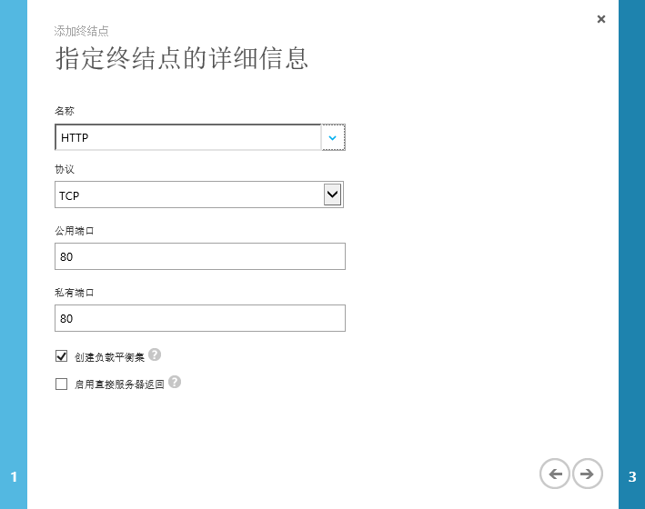

在“配置负载均衡集”页面中，输入负载均衡集的名称。探测协议，探测端口，探测间隔，和探测数若无特别需求，请保留默认值。完成后点击“√”保存更改。

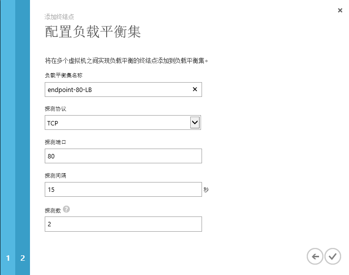

Azure 页面上会显示正在进行更新，大约半分钟后更新完成。

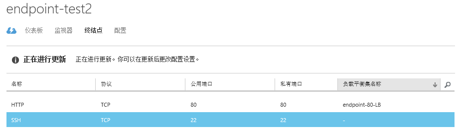

在第一台虚拟机中创建好负载均衡集后，就可以将第二台虚拟机添加到这个负载均衡集了。

>[AZURE.NOTE]多台虚拟机必须处于同一个云服务下，才能加入同一个负载均衡集。而同一个云服务下的多台虚拟机，如果相同的私有端口终结点不在同一个负载均衡集中，那么它们的公用端口必须不同，否则会冲突（设置时页面会有提示）。

在将加入负载均衡集的第二台虚拟机的终结点配置页面下，点击“添加”。在“将终结点添加到虚拟机”页面中，选择“将终结点添加到现有负载均衡集”，并从下拉菜单中选中之前创建的负载均衡集。

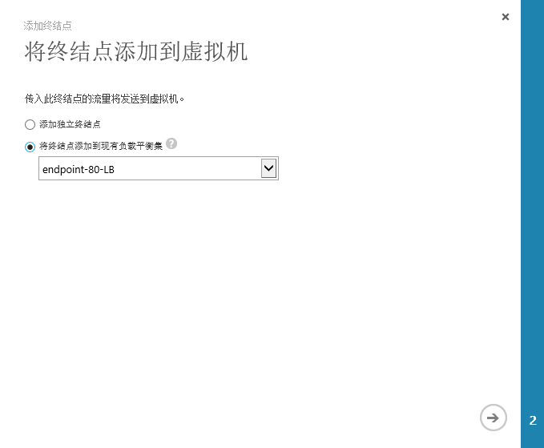

在“指定终结点的详细信息”页面中，输入终结点的名称，然后点击“√”保存。

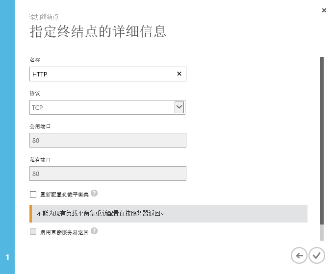

同样，Azure 页面上会显示正在进行更新已保存修改。

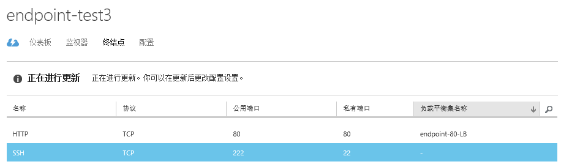

若要添加第三台，甚至更多的虚拟机到这个负载均衡集，用户需要重复第二台的步骤来完成。

## 使用 PowerShell 设置终结点

除了使用 Azure 经典管理门户，用户还可以使用 PowerShell 设置终结点。若要使用 PowerShell 来管理用户在 Azure 上的环境，需要安装 PowerShell 并且下载 Azure 订阅文件。关于如何使用 Windows Azure PowerShell，请浏览[这篇文章](/documentation/articles/powershell-install-configure/)。

### 获取终结点信息

PowerShell 连接 Azure 后，使用 Get-AzureVM 命令列出所有虚拟机，然后将需要设置终结点的虚拟机赋给变量 $vm。

	PS C:\> Get-AzureVM
	
	ServiceName     Name            Status   
	-----------     ----            ------   
	endpoint-test1  endpoint-test1  ReadyRole
	endpoint-test2  endpoint-test2  ReadyRole
	endpoint-test2  endpoint-test3  ReadyRole
	endpoint-test4  endpoint-test4  ReadyRole 

	PS C:\> $vm = Get-AzureVM -ServiceName endpoint-test4 -Name endpoint-test4

接下来，就可以使用 Get-AzureEndpoint 命令来列出该虚拟机的终结点信息了。

	PS C:\> $vm | Get-AzureEndpoint

	LBSetName                : 
	LocalPort                : 22
	Name                     : SSH
	Port                     : 22
	Protocol                 : tcp
	Vip                      : 42.159.XXX.XX
	ProbePath                : 
	ProbePort                : 0
	ProbeProtocol            : 
	ProbeIntervalInSeconds   : 
	ProbeTimeoutInSeconds    : 
	EnableDirectServerReturn : False
	Acl                      : {}
	InternalLoadBalancerName : 
	IdleTimeoutInMinutes     : 
	LoadBalancerDistribution : 
	VirtualIPName            : 

Get-AzureEndpoint 命令的详细说明请参考[这篇文章（英文）](https://msdn.microsoft.com/zh-cn/library/azure/dn495158.aspx)

### 添加终结点

首先用 Get-AzureVM 将需要添加终结点的虚拟机赋给变量 $vm。
	

	PS C:\> $vm = Get-AzureVM -ServiceName endpoint-test4 -Name endpoint-test4

然后用 $vm | Get-AzureEndpoint 查看此虚拟机已配置的终结点。

	PS C:\> $vm | Get-AzureEndpoint
	
	
	LBSetName                : 
	LocalPort                : 22
	Name                     : SSH
	Port                     : 22
	Protocol                 : tcp
	Vip                      : 42.159.XXX.XX
	ProbePath                : 
	ProbePort                : 0
	ProbeProtocol            : 
	ProbeIntervalInSeconds   : 
	ProbeTimeoutInSeconds    : 
	EnableDirectServerReturn : False
	Acl                      : {}
	InternalLoadBalancerName : 
	IdleTimeoutInMinutes     : 
	LoadBalancerDistribution : 
	VirtualIPName            :  

接下来，使用 Add-AzureEndpoint 命令添加新的终结点。这里添加的名为 FTP 的终结点，协议为 tcp，公共端口和私有端口都为 21。

	PS C:\> $vm | Add-AzureEndpoint -Name FTP -Protocol tcp -LocalPort 21 -PublicPort 21

	DeploymentName                    : endpoint-test4
	Name                              : endpoint-test4
	Label                             : 
	VM                                : Microsoft.WindowsAzure.Commands.ServiceManagement.Model.PersistentVM
	InstanceStatus                    : ReadyRole
	IpAddress                         : 10.215.XXX.XX
	InstanceStateDetails              : 
	PowerState                        : Started
	InstanceErrorCode                 : 
	InstanceFaultDomain               : 0
	InstanceName                      : endpoint-test4
	InstanceUpgradeDomain             : 0
	InstanceSize                      : Small
	HostName                          : endpoint-test4
	AvailabilitySetName               : 
	DNSName                           : http://endpoint-test4.chinacloudapp.cn/
	Status                            : ReadyRole
	GuestAgentStatus                  : Microsoft.WindowsAzure.Commands.ServiceManagement.Model.GuestAgentStatus
	ResourceExtensionStatusList       : {}
	PublicIPAddress                   : 
	PublicIPName                      : 
	PublicIPDomainNameLabel           : 
	PublicIPFqdns                     : {}
	NetworkInterfaces                 : {}
	VirtualNetworkName                : 
	RemoteAccessCertificateThumbprint : 2116e952034cb1f515de0dd03cxxxxxx
	ServiceName                       : endpoint-test4
	OperationDescription              : Get-AzureVM
	OperationId                       : 812a9ebeb64f47628502f63c7axxxxxx
	OperationStatus                   : OK

最后使用 Update-AzureVM 命令将终结点更新到 Azure 中。

	PS C:\> $vm | Update-AzureVM
	
	OperationDescription OperationId                          OperationStatus
	-------------------- -----------                          ---------------
	Update-AzureVM       5ceaxxxx-xxxx-xxxx-xxxx-xxxxxxxxc132 Succeeded   

为了确认是否添加成功，可以再次使用 `$vm | Get-AzureEndpoint` 查看终结点。也可以在 Azure 经典管理门户中查看是否添加成功。

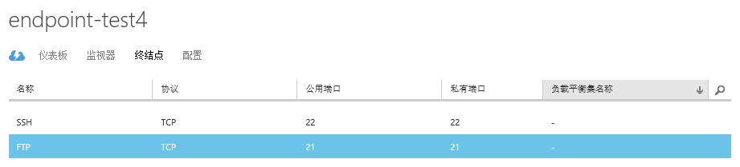

Add-AzureEndpoint 命令的参数和使用方法还有很多，例如前文提到的创建负载均衡集也可以使用 PowerShell 通过 Add-AzureEndpoint 命令来实现。详细说明请参考[这篇文章（英文）](https://msdn.microsoft.com/zh-cn/library/azure/dn495300.aspx)

### 编辑终结点

编辑终结点主要使用 Set-AzureEndpoint 命令。下面的例子中，通过该命令，将前一步创建的 FTP 终结点的公共端口和私有端口都修改为 10021。编辑完成后使用 Update-AzureVM 命令将终结点更新到 Azure 中。

	PS C:\> $vm | Set-AzureEndpoint -Name FTP -PublicPort 10021 -LocalPort 10021
	
	
	DeploymentName                    : endpoint-test4
	Name                              : endpoint-test4
	Label                             : 
	VM                                : Microsoft.WindowsAzure.Commands.ServiceManagement.Model.PersistentVM
	InstanceStatus                    : ReadyRole
	IpAddress                         : 10.215.xxx.xx
	InstanceStateDetails              : 
	PowerState                        : Started
	InstanceErrorCode                 : 
	InstanceFaultDomain               : 0
	InstanceName                      : endpoint-test4
	InstanceUpgradeDomain             : 0
	InstanceSize                      : Small
	HostName                          : endpoint-test4
	AvailabilitySetName               : 
	DNSName                           : http://endpoint-test4.chinacloudapp.cn/
	Status                            : ReadyRole
	GuestAgentStatus                  : Microsoft.WindowsAzure.Commands.ServiceManagement.Model.GuestAgentStatus
	ResourceExtensionStatusList       : {}
	PublicIPAddress                   : 
	PublicIPName                      : 
	PublicIPDomainNameLabel           : 
	PublicIPFqdns                     : {}
	NetworkInterfaces                 : {}
	VirtualNetworkName                : 
	RemoteAccessCertificateThumbprint : 2116e952034cb1f515de0dd03cxxxxxx
	ServiceName                       : endpoint-test4
	OperationDescription              : Get-AzureVM
	OperationId                       : 812a9ebeb64f47628502f63c7axxxxxx
	OperationStatus                   : OK

	PS C:\> $vm | Update-AzureVM
	
	OperationDescription OperationId                          OperationStatus
	-------------------- -----------                          ---------------
	Update-AzureVM       8d72xxxx-xxxx-xxxx-xxxx-xxxxxxxx8c3b Succeeded 

Set-AzureEndpoint命令的详细说明请参考（英文）：[https://msdn.microsoft.com/zh-cn/library/azure/dn495219.aspx](https://msdn.microsoft.com/en-us/library/azure/dn495219.aspx)  

### 删除终结点

删除终结点主要使用 Remove-AzureEndpoint 命令。其参数只需要终结点的名字即可。下面的例子删除了之前创建的终结点 FTP。删除完成后使用 Update-AzureVM 命令将终结点更新到 Azure 中。

	PS C:\> $vm | Remove-AzureEndpoint -Name FTP
	
	
	DeploymentName                    : endpoint-test4
	Name                              : endpoint-test4
	Label                             : 
	VM                                : Microsoft.WindowsAzure.Commands.ServiceManagement.Model.PersistentVM
	InstanceStatus                    : ReadyRole
	IpAddress                         : 10.215.xxx.xx
	InstanceStateDetails              : 
	PowerState                        : Started
	InstanceErrorCode                 : 
	InstanceFaultDomain               : 0
	InstanceName                      : endpoint-test4
	InstanceUpgradeDomain             : 0
	InstanceSize                      : Small
	HostName                          : endpoint-test4
	AvailabilitySetName               : 
	DNSName                           : http://endpoint-test4.chinacloudapp.cn/
	Status                            : ReadyRole
	GuestAgentStatus                  : Microsoft.WindowsAzure.Commands.ServiceManagement.Model.GuestAgentStatus
	ResourceExtensionStatusList       : {}
	PublicIPAddress                   : 
	PublicIPName                      : 
	PublicIPDomainNameLabel           : 
	PublicIPFqdns                     : {}
	NetworkInterfaces                 : {}
	VirtualNetworkName                : 
	RemoteAccessCertificateThumbprint : 2116e952034cb1f515de0dd03cxxxxxx
	ServiceName                       : endpoint-test4
	OperationDescription              : Get-AzureVM
	OperationId                       : 812a9ebeb64f47628502f63c7axxxxxx
	OperationStatus                   : OK
	
	
	
	
	PS C:\> $vm | Update-AzureVM
	
	OperationDescription OperationId                          OperationStatus
	-------------------- -----------                          ---------------
	Update-AzureVM       250f xxxx-xxxx-xxxx-xxxx-xxxxxxxx2bb2 Succeeded      

Remove-AzureEndpoint 命令的详细说明请参考[这篇文章（英文）](https://msdn.microsoft.com/zh-cn/library/mt589109.aspx)。

##  终结点在资源管理器（Azure Resource Manager）中的变化

目前，Azure 同时存在资源管理器和经典两种部署模型。对于大多数新的部署，Azure 推荐使用资源管理器模型。[Azure 门户预览](https://portal.azure.cn/)同时支持两种部署模型。[Azure 经典管理门户](https://manage.windowsazure.cn/)仅支持经典部署模型。在资源管理器部署模型中，终结点是使用“网络安全组（NSG）”配置的。

网络安全组包含一系列访问控制列表（ACL）规则，这些规则允许或拒绝虚拟网络中流向虚拟机实例的网络流量。网络安全组可以与子网或该子网中的各个虚拟机实例相关联。当网络安全组与某个子网相关联时，ACL 规则适用于该子网中的所有虚拟机实例。另外，可以进一步通过将网络安全组直接关联到单个虚拟机，对流向该虚拟机的流量进行限制。

关于网络安全组的详细信息，请浏览[这篇文章](/documentation/articles/virtual-networks-nsg/)。

