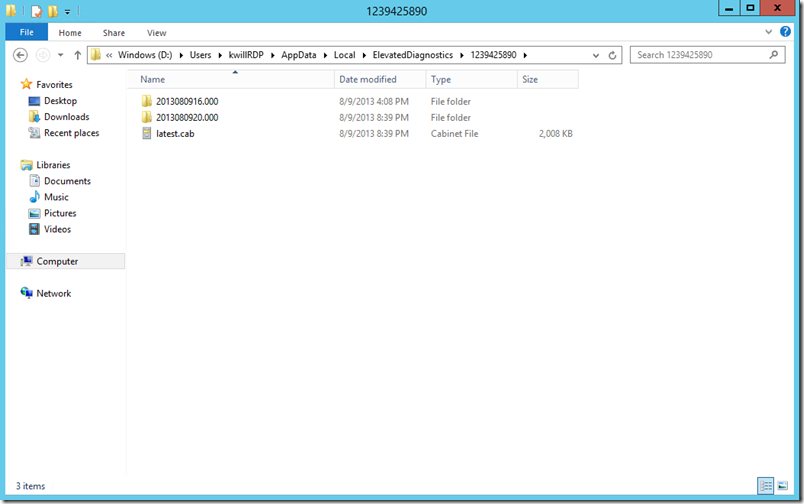

<properties 
	pageTitle="Azure PaaS Compute 诊断数据" 
	description="Azure PaaS Compute 诊断数据" 
	services="cloud-service" 
	documentationCenter="" 
	authors=""
	manager="" 
	editor=""/>
<tags 
	ms.service="cloud-service-aog"
	ms.date="" 
	wacn.date="09/29/2016"/>
# Azure PaaS Compute 诊断数据

当我们在故障排除的时候，其中最重要的事情是了解哪些诊断的数据是可用的。如果你不知道在哪里去查看日志或其他的诊断消息，你就不得不反复的试验或者漫无目的的去排除问题。但是无论如何，通过查看日志记录你可以有很好的机会去排除任何问题，甚至这些问题有可能不在你的知识领域内。这篇文章会描述 Azure PaaS 计算环境中的可用信息，如何更加容易的搜集这些数据，接下来，我还会开始写一系列的文章来讨论如何检查和排除在使用 Azure 平台过程中碰到的问题。

在阅读这篇博客前我强烈建议你阅读这篇文章 [Azure Role Architecture](http://blogs.msdn.com/b/kwill/archive/2011/05/05/windows-azure-role-architecture.aspx)，他讲解了 PasS 虚拟机不同的流程以及他们是如何互相交互的。了解关于排除故障的更高层体系结构的理解将显著的提高你解决问题的能力。

## 排除故障系列(每个场景都包涵主要的概念和工具)

1. [Azure PaaS Compute 诊断数据](https://blogs.msdn.microsoft.com/kwill/2013/08/09/windows-azure-paas-compute-diagnostics-data/)
2. [AzureTools – 开发支持团队使用的有效的诊断工具](https://blogs.msdn.microsoft.com/kwill/2013/08/26/azuretools-the-diagnostic-utility-used-by-the-windows-azure-developer-support-team/)
3. [排除故障场景 1 – 角色回收](https://blogs.msdn.microsoft.com/kwill/2013/08/20/troubleshooting-scenario-1-role-recycling/) 
	- 使用任务管理器去确定哪个进程失败，首先需要看哪个日志。
	- Azure 事件日志
4. [排除故障场景 2 – 在成功运行 2 周后角色回收](https://blogs.msdn.microsoft.com/kwill/2013/08/26/troubleshooting-scenario-2-role-recycling-after-running-fine-for-2-weeks/) 
	- WaHostBootstrapper.log
	- startup 任务失败
	- 系统重启
5. [排除故障场景 3 – 角色一直是 Busy 状态](https://blogs.msdn.microsoft.com/kwill/2013/09/06/troubleshooting-scenario-3-role-stuck-in-busy/)
	- WaHostBootstrapper.log
	- startup 任务失败
	- 修改一个正在运行的服务
6. [排除故障场景 5 – Internal Server Error 500 in WebRole](https://blogs.msdn.microsoft.com/kwill/2013/09/19/troubleshooting-scenario-5-internal-server-error-500-in-webrole/)
	- 使用 DIP 浏览 IIS
7. [排除故障场景 6 – 角色在运行一段时间后被回收](https://blogs.msdn.microsoft.com/kwill/2013/09/23/troubleshooting-scenario-6-role-recycling-after-running-for-some-time/)
	- Deep dive on WindowsAzureGuestAgent.exe logs (AppAgentRuntime.log and WaAppAgent.log)
	- DiagnosticStore LocalStorage resource
8. [排除故障场景 7 – 角色回收](https://blogs.msdn.microsoft.com/kwill/2013/10/03/troubleshooting-scenario-7-role-recycling/) 
	- 简单浏览 WaHostBootstrapper 和 WindowsAzureGuestAgent 日志
	- AzureTools
	- WinDBG
	- Intellitrace
	

这儿有个简短的 Channel 9 视频演示了一些本篇博客提到的文件位置以及使用 SDP 包的方法[https://channel9.msdn.com/Series/DIY-Windows-Azure-Troubleshooting/Windows-Azure-PaaS-Diagnostics-Data](https://channel9.msdn.com/Series/DIY-Windows-Azure-Troubleshooting/Windows-Azure-PaaS-Diagnostics-Data).

## 诊断数据的位置

这个列表包含了 PaaS 虚拟机故障排除时候最常用的数据来源，大致按重要程度排序(比如，诊断问题时最常使用的日志)

- **Azure 事件日志** – Event Viewer –> Applications and Services Logs –> Windows Azure
  - 包含从 Window Azure 运行时输出的重要的诊断数据，包括角色开始/结束，startup 任务，OnStart 开始和结束，OnRun 开始，崩溃，资源回收等信息。
  - 这个日志经常被忽视，原因是它在 Event Viewer 的 Applications and Services Logs 目录下面，并不是在标准的 Application or System event logs 目录下。
  - 这个诊断数据来源会帮助你标识出很多常见的 Azure 角色未能正常启动的原因-startup 任务失败，OnStart 或 OnRun 崩溃。
  - 捕获崩溃以及对应的在 Azure 运行时的主机进程中的调用堆栈信息（比如 WebRole.cs 或者 WorkerRole.cs），这些进程会运行你的角色入口点代码。
- **应用程序事件日志** – Event Viewer –> Windows Logs –> Application 
  - 这是 Azure 以及本地服务器的一个标准故障排除方式。你会经常在这些日志中发现 w3wp.exe 相关的错误。
- **App Agent 运行时日志** – C:\Logs\AppAgentRuntime.log 
  - 这些日志文件是被 WindowsAzureGuestAgent.exe 记录的，其中包含 Guest 代理和虚拟机发生的事件信息。这些信息包括防火墙配置，角色状态改变，回收，重启，健康状态改变，角色停止/启动，证书的配置等。
  - 这个日志对于快速的浏览在一段时间内一个角色的发生的事件是非常有帮助的，因为它只记录了没有记录心跳的角色主要的改变。
  - 如果 Guest 代理没能正常的启动角色（比如一个锁定的文件阻止了所在目录被清理），你会在这个日志中看到它。
- **App Agent 心跳日志** – C:\Logs\WaAppAgent.log 
  - 这些日志文件是被 WindowsAzureGuestAgent.exe 记录的，其中包含了对 Host Bootstrapper 进行健康检查的状态。
  - Guest 代理进程负责汇报健康状态（比如 Ready,Busy 等）到 fabric, 因此这些日志中显示出的健康状态和你在管理门户中看到的是一样的。
  - 这些日志在用于确定虚拟机角色的当前状态以及确定在某一些时间点之前的角色状态方面都是非常有用的。比如一个问题的描述为“我的网站在昨天 10:00am 到 11:30am 之间停止了工作”，这样的心跳日志是非常有助于确定角色在这段时间内的健康状态。
- **Host Bootstrapper 日志** – C:\Resources\WaHostBootstrapper.log 
  - 这个日志中包含了启动任务的条目（包括插件，如缓存或 RDP）和对于运行你的角色入口点代码的主机进程的健康检查（比如运行在 WaIISHost.exe 上的 WebRole.cs 代码）。 
  - 每次主机引导程序被重启的时候（比如每次你的角色由于崩溃，被回收，虚拟机重启，升级等被重新启用的时候），一个新的日志文件就会被产生。它使这些日志文件可以更加方便的去确定你的角色是多久一次或者什么时候被重新启用的。
- **IIS 日志** – C:\Resources\Directory\{DeploymentID}.{Rolename}.DiagnosticStore\LogFiles\Web
  - 这是一个在 Azure 或本地服务器上都会被使用到的标准的排除故障方式。
  - 一个关键的问题是这些日志文件经常被忽视，比如以下场景“我的网站在昨天 10:00am 到 11:30am 之间停止了工作”。我们自然会倾向于责怪 Azure 的故障。（“我的网站已经正常工作了两周，所以这肯定是 Azure 的问题”）。但是 IIS 日志通常会给出其他可能的指示。你可能在中断之前响应时间的突然增加，或者从 IIS 返回的不成功的状态码，这表明问题是出自网站本身（比如在 w3wp.exe 中运行的 ASP.NET 代码）而不是 Azure 的问题。
- **性能计数器** – perfmon, or Windows Azure Diagnostics 
  - 这是一个在 Azure 或本地服务器上都会被使用到的标准的排除故障方式。
  - 这些 Azure 日志上有趣的方面是，如果你在之前已经安装了 WAD，你经常会使用有价值的性能计数器来排查过去发生的问题。（比如，"我的网站在昨天 10:00am-11:30am 之间停止运行了"）
  - 除了你正在收集的特定的性能计数器的问题，性能计数器另一个经常被使用的场景是 WAD 会收集一些刚开始有一些正常的性能计数条目，然后有一段时间无条目，然后又恢复正常的条目（用于指示虚拟机可能没有运行的场景）,或者 100% CPU 使用率（通常用于指示死循环或者其他一些网站代码本身的逻辑问题）。
- **HTTP.SYS 日志** – D:\WIndows\System32\LogFiles\HTTPERR 
  - 这是一个在 Azure 或本地服务器上都会被使用到的标准的排除故障方式。
  - 类似于 IIS 日志，这些日志文件也经常会被忽视，但是当你试图去排查一个托管的服务网站未响应问题的时候，这些日志文件是非常重要的。通常 IIS 无法处理请求的证据都会被显示在这个日志文件中。
- **IIS 失败请求日志文件** – C:\Resources\Directory\{DeploymentID}.{Rolename}.DiagnosticStore\FailedReqLogFiles 
  - 这是一个在 Azure 或本地服务器上都会被使用到的标准的排除故障方式。
  - 这个功能在 Azure 中并没有默认被启动而且并不常用。但是如果你需要排除 IIS 或者 ASP.NET 特定问题的时候，你需要考虑开启 FREB tracing 去获取一些额外的详细信息。
- **Windows Azure 诊断表格和配置** – C:\Resources\Directory\{DeploymentID}.{Rolename}.DiagnosticStore\Monitor 
  - 这是一个本地虚拟机缓存的 Windows Azure 诊断（WAD）数据。WAD 根据你的设定来捕获数据，接着将这些数据存储在虚拟机上定制的.TSF 文件中，然后基于你指定周期性转移时间点将其转移到 Azure 存储上。 
  - 不幸的是，因为它们使用的是在一个自定义的.TSF 数据格式，所以该日志中内容的使用场景是有限的。但是你可以看到是当 Windows Azure 诊断本身没能正确执行的时候，诊断配置文件是非常有助于排查问题的。通过查看 config.xml 文件的配置目录，我们会发现其中包含 WAD 配置数据。如果 WAD 没有正常工作，你需要检查这个文件去确保它反映出的是你期待的 WAD 的配置方式。
- **Windows Azure 缓存日志文件** – C:\Resources\Directory\{DeploymentID}.{Rolename}.DiagnosticStore\AzureCaching 
  - 这些日志中包含关于 Windows Azure 角色缓存的详细信息，它可以帮助排查缓存未正常工作的问题。
- **WaIISHost 日志** – C:\Resources\Directory\{DeploymentID}.{Rolename}.DiagnosticStore\WaIISHost.log 
  - 这个日志文件包含了 WaIISHost.exe 进程的日志文件。而 WaIISHost.exe 进程中包含了你的 WebRoles 运行时候的的角色的入口点代码(比如 WebRole.cs)。这个日志中的大部分信息也被包含在其他日志上面（比如 Windows Azure 事件日志），但在有些情况下你可以在这里找到更多有用的信息。 
- **IISConfigurator 日志** – C:\Resources\Directory\{DeploymentID}.{Rolename}.DiagnosticStore\IISConfigurator.log 
  - 这个日志中包含了 IISConfigurator 进程中的信息，它的作用是根据你已经定义在服务定义文件来实际配置你的网站的 IIS.
  - 这个很少出现故障或遇到错误，但如果你的服务的 IIS 或 W3WP.exe 没有正常的启动，这个文件是值得去查看的。
- **角色配置文件** – C:\Config\{DeploymentID}.{DeploymentID.{Rolename}.{Version}.xml 
  - 这个配置文件包含了关于你的角色的配置信息，比如定义在，你如在 serviceconfiguration.cscfg 文件文件中配置，LocalResource 目录，DIP 和 VIP IP 地址和端口号，证书的指纹，负载均衡的探查，其他的实例等。
  - 类似于角色模型定义文件，它不是一个包含运行时生成的信息的日志文件，但它对于确保您的服务是否被以你期待的方式进行配置是十分有效的。
- **角色模型定义文件** – E:\RoleModel.xml (or F:\RoleModel.xml) 
  - 这个文件包含你的服务相对于 Azure 运行的定义信息。特别是它包含每个 startup 任务的入口以及这个 startup 任务是如何运行的。（比如后台，环境变量，路径等）。你还可以看到你的 web role 的&lt;sites&gt;元素是如何定义的。
  - 这个日志文件并不会包含运行产生信息，但是它会帮助你验证你的服务是否按照你的预期运行在 Azure 上面。他通常适用于以下场景， 一个开发者在他的开发机器上拥有一个特定版本的服务定义文件，但是在打包/部署服务器上使用的是不同版本的服务定义文件。

***ETL 文件说明**

如果你查看 C:\Logs 目录，你会发现 RuntimeEvents_{iteration}.etl 和 WaAppAgent_{iteration}.etl 这两个文件。它们是 ETW 的追踪器，其中包含一些 Windows Azure 事件日志，Guest 代理日志，或其他日志的汇总信息。 这是 Azure 虚拟机中所有最重要的日志数据中一个非常方便的汇总信息。但是由于它们的的数据格式是 ETL, 它需要一些额外的操作去处理这些信息。 如果你有一个好的 ETW 查看工具，你可以忽略上述提到的所有日志文件，只关注这两个 ETL 文件中信息就可以了。

## 收集日志文件进行离线分析和保存

在多数情况下你可以分析所有的日志文件当你远程连接到 Azure 虚拟机上做现场故障排除，这时候你就不会关心是否收集所有的日志文件并且放到一个中心位置上。不过也有一些场景需要我们可以方便的收集所有日志文件并且可以把它们保存到本地以用来让一些人进行分析或者把它们存储起来可以在稍晚的时间进行分析。这样您就可以重新部署主机服务并且恢复您的应用程序。

下面列出了从 PaaS 虚拟机中快速搜集调试日志的三种方法:

1. 最简单的方法是**远程连接到虚拟机并执行 CollectGuestLogs.exe**.  CollectGuestLogs.exe 附属在 Azure Guest 代理上，它存在在所有的 PaaS 虚拟机和大部分 IaaS 的虚拟机上，而且它会基于虚拟机创建一个日志的 ZIP 文件，对于 Paas 虚拟机，这个文件存放在**D:\Packages\GuestAgent\CollectGuestLogs.exe**目录下.  对于 IaaS 虚拟机，这个文件存储在 C:\WindowsAzure\Packages\CollectGuestLogs.exe 目录下.
2. 如果您想要在不使用远程连接的场景下收集日志文件, 或者一次性的搜集多个虚拟机的日志数据, 你可以在你的本地机器上运行 Azure Log Collector Extension.  详细信息，请参考以下链接。[http://azure.microsoft.com/blog/2015/03/09/simplifying-virtual-machine-troubleshooting-using-azure-log-collector/](http://azure.microsoft.com/blog/2015/03/09/simplifying-virtual-machine-troubleshooting-using-azure-log-collector/).
3. 稍老一点的办法是(在 CollectGuestLogs.exe 存在之前)使用 Azure 开发支持团队创建的 SDP 组件.  关于如何使用这个组件请参见以下说明.

## 使用旧版的 SDP 组件

Azure 开发支持团队已经创建了一个 SDP(Support Diagnostics Platform 诊断支持平台)脚本，它可以自动收集以上所有的信息，并把这些信息存储在一个.CAB 文件中。这会让我们在一个具体的支持事件中更加方便的来传输用做分析的必要的日志信息到专业的支持人员中。 这个 SDP 组件同样适用于其他的支持事件，以下链接供你参考。

* **Windows Azure Guest OS Family 2 & 3** (Windows Server 2008 R2 and Windows Server 2012.  Powershell v2) – [2625.CTS_AzurePaaSLogs_global.DiagCab](http://dsazure.blob.core.windows.net/azuretools/AzurePaaSLogs_global-Windows2008R2_Later.DiagCab)
* **Windows Azure Guest OS Family 1** (Windows Server 2008.  Powershell v1) – [5635.CTS_AzurePaaSLogs_en-US_OSFamily1.EXE](http://dsazure.blob.core.windows.net/azuretools/AzurePaaSLogs_en-Windows2008.EXE)

*您可以在这篇文章中找到更多关于 SDP 的内容：[http://support.microsoft.com/kb/2772488](http://support.microsoft.com/zh-cn/kb/2772488).  

### 为 Windows Azure Guest OS Family 2 & 3 获取 SDP 组件

在 Windows Server 2008 R2 或 2012 中获取和执行 SDP 包是非常简单的。

1. **远程连接到 Azure 虚拟机**
2. **打开 Powershell**
3. **复制/黏贴并执行以下代码**

		md c:\Diagnostics; 
		md $env:LocalAppData\ElevatedDiagnostics\1239425890; 
		Import-Module bitstransfer; 
		explorer $env:LocalAppData\ElevatedDiagnostics\1239425890; Start-BitsTransfer http://dsazure.blob.core.windows.net/azuretools/AzurePaaSLogs_global-Windows2008R2_Later.DiagCab c:\Diagnostics\AzurePaaSLogs_global-Windows2008R2_Later.DiagCab; c:\Diagnostics\AzurePaaSLogs_global-Windows2008R2_Later.DiagCab

这行代码会做以下的事情:

* 创建一个文件夹 C:\Diagnostics
* 加载 BitsTransfer 模块并且下载 SDP 包到 C:\Diagnostics\AzurePaaSLogs.DiagCab 目录下
* 执行 AzurePaaSLogs.DiagCab
* 在组件执行完毕之后通过资源管理器打开包含 CAB 文件目录

### 为 Windows Azure Guest OS Family 1 获取 SDP 组件

如果你在使用 Windows Azure Guest OS Family 1 而且你不希望直接在 Azure 虚拟机中下载和运行文件，你可以把对应的文件下载到本地机器上并且在你需要使用它的时候将它拷贝到 Azure 虚拟机中。(在你的本地机器和 Azure 虚拟机的 RDP 会话中使用标准的复制/黏贴[ctrl+c, ctrl+v]).

### 使用 SDP 包

SDP 组件将为您提供一个带有下一步/取消按钮的标准向导。

1. 在一个对话框中有一个"Advanced" 选项，它给我们提供了是否勾选"Apply repairs automatically"选项. 这个选项对这个 SDP 包没有任何影响，因为这个包只会收集数据，而且并不会对 Azure 虚拟机做出任何修改或修复。 接下来点击下一步。
2. 在下一个对话框中会提供一个选项让你选择"Express [Recommended]"或"Custom"，如果你选择"Custome", 还会有一个选项让你选择是否收集 WAD (*.tsf)文件和 IIS 日志文件。一般情况下不需要收集 WAD(*.tsf)文件，因为你没有办法分析自定义的格式， 但是根据你排除故障的特定问题，你有可能会收集 IIS 日志文件。接下来点击下一步。
3. SDP 包将开始收集所有的文件到.CAB 文件中。这个进程需要几分钟，时间长短主要取决于虚拟机运行的时间和不同日志文件中的数据量
3. 只要文件还没有被收集，你的屏幕将会想你展示一些已经被检测到的常见问题。你可以通过点击"Show Additional Information"按钮查看这些常见问题的详细信息。这个报表的中信息还会存储在.CAB 文件中，所以你可以在以后来查看它。 下一步点击"Close"按钮。
5. 这里还有一个要点是**CAT 文件在'%LocalAppData%\ElevatedDiagnostics'文件夹中可用**. 你会在这个文件夹中看到'latest.cab'文件，并且还有一个或多个子文件夹。 这些子文件夹中包含你每次运行 SDP 组件的时间戳结果， 'latest.cab'文件包含最近一次执行 SDP 组件的结果。
6. 你现在可以从你的虚拟机中复制'latest.cab'文件到你的本机用来做存储或离线分析。

