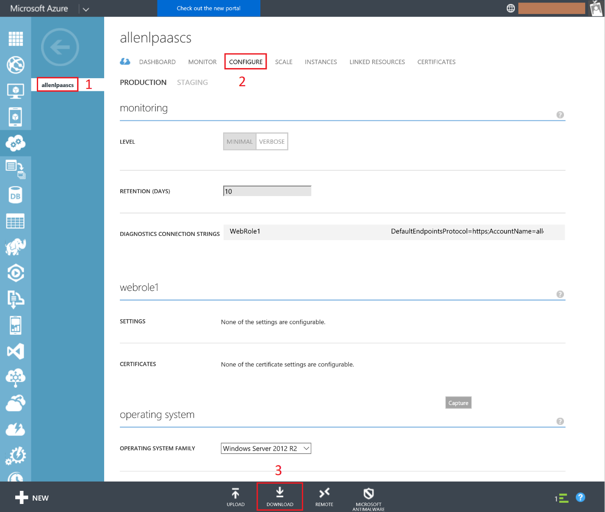
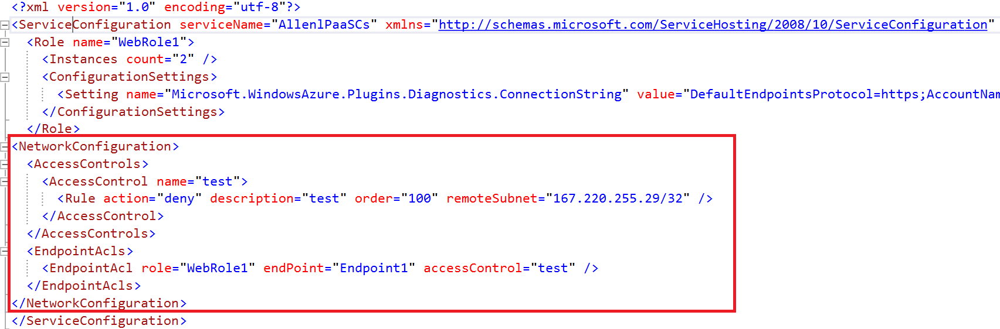
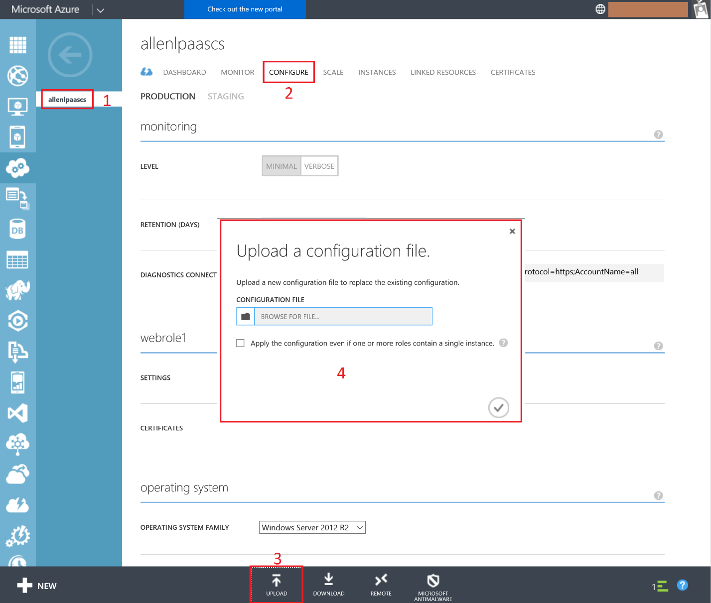

<properties
    pageTitle="PaaS云服务如何拒绝可疑 IP 的访问"
    description="PaaS云服务如何拒绝可疑 IP 的访问"
    service=""
    resource="cloudservices"
    authors="Allan Li"
    displayOrder=""
    selfHelpType=""
    supportTopicIds=""
    productPesIds=""
    resourceTags="Cloud Services, PaaS, IP Filter"
    cloudEnvironments="MoonCake" />
<tags
    ms.service="cloud-services-aog"
    ms.date=""
    wacn.date="03/27/2017" />
# PaaS 云服务如何拒绝可疑 IP 的访问

当客户发布 Azure PaaS 云服务时，如果应用程序本身没有做 IP 过滤，那么默认情况下，是允许所有 IP 访问的。那假如发生来自可疑 IP 的恶意攻击，有没有好的解决方案，既不需要修改应用程序配置，而且也不需要重新发布云服务？答案是有。

一句话描述该解决方案就是：添加网络访问控制（ACL）在云服务的配置文件（**ServiceConfiguration.Cloud.cscfg**）中。

具体操作步骤如下：

1. 下载当前 PaaS 云服务的配置文件

    

2. 添加网络访问控制

    >[AZURE.NOTE]
    >
1. 配置文件是 XML 格式，确保添加的内容符合格式。
    >
2. IP 子网确保格式正确，比如我测试禁止单个 IP，“167.220.255.29/32”

    示例禁止 IP：167.220.255.29 的访问：

    

3. 上传修改后的配置文件

    >[AZURE.NOTE]如果云服务里面有角色只有一个实例，记得将确认框勾选上。

    

4.	上传成功结束后，配置的网络访问控制将马上生效。

    关于更多 PaaS 云服务的网络访问控制的设置，可参照官网说明：[NetworkConfiguration Schema](https://msdn.microsoft.com/library/zh-cn/JJ156091.aspx)。
