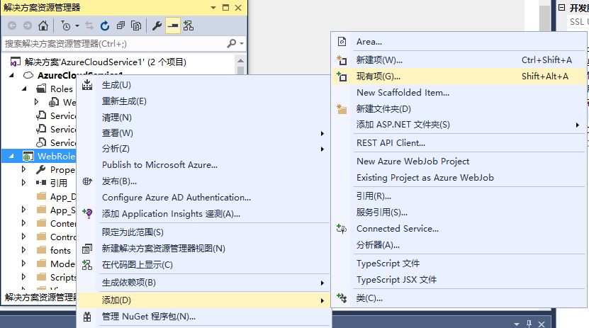
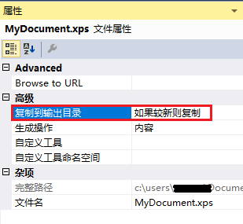

<properties
                pageTitle="如何将文件打包到云服务包中"
                description="通过 Visual Studio 将额外的文件打包到 Cloud Services Package"
                services="cloud-services"
                documentationCenter=""
                authors=""
                manager=""
                editor=""
                tags="Visual Studio,Cloud Service,Package"/>

<tags
                ms.service="cloud-services-aog"
                ms.date="12/16/2016"
                wacn.date="12/16/2016"/>

# 如何将文件打包到云服务包中

在使用 Visual Studio 开发 .NET 云服务应用程序时，经常需要往项目中添加一些额外的资源文件，脚本或者 DLL 动态库，而用户经常会忘记修改这些文件的 “复制到输出目录” 属性，因此将会出现无法预料的异常。
有些用户会遇到在本地运行正常，而发布到云服务上时，这通常是因为没有修改额外添加的引用或者资源文件的 “复制到输出目录” 属性而导致的。

**解决方法：**

在 Visual Studio 中, 将额外添加的引用或者资源文件的 “复制到输出目录” 属性设置为 “始终复制” 或者是 “如果较新则复制”。

**设置操作步骤：**  

1.	首先加入一个外部的文件到解决方案中。

	

2.	设置文件的 “生成操作” 属性为 “内容”。

	

3.	设置文件的 “复制到输出目录” 属性为 “如果较新则复制”。

	

设置完成后，在程序打包时，就会将该文件一起打包到云服务包中，从而避免不可预见的异常产生。
