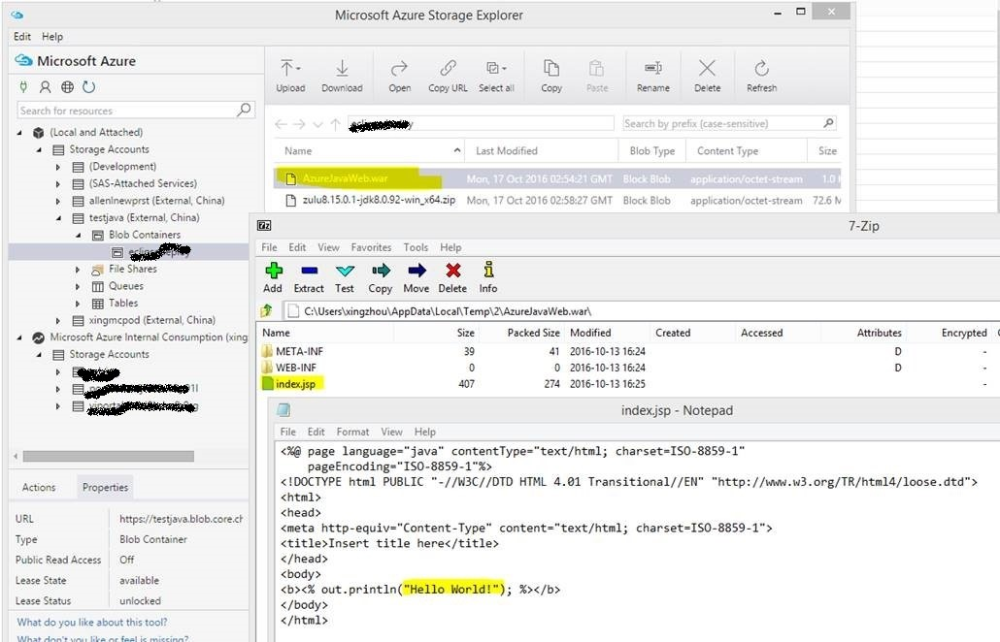

<properties 
	pageTitle="关于部署在云服务下的 Java 应用程序会出现过渡环境被 “同步” 到生产环境的问题" 
	description="关于部署在云服务下的 Java 应用程序会出现过渡环境被 “同步” 到生产环境的问题" 
	services="cloud-service" 
	documentationCenter="" 
	authors=""
	manager="" 
	editor=""/>
<tags 
	ms.service="cloud-service-aog"
	ms.date="" 
	wacn.date="12/05/2016"/>
# 关于部署在云服务下的 Java 应用程序会出现过渡环境被 “同步” 到生产环境的问题 #

### 问题描述 ###

在使用 Java+eclipse 做应用程序开发时，会将开发好的应用程序代码发布到 Azure 云服务过渡环境做测试观察，如果运行稳定，可以将相关更新后的代码发布到正式的生产环境中或者使用交换的功能切换环境。

然而在满足以下全部限定条件时，会出现过渡环境中的代码“被同步” 到生产环境中的现象：

1. 使用 Java+eclipse 做应用程序开发，部署到云服务中。
2. 在用 eclipse 发布相关应用到过渡环境和生产环境中时使用的是同一个 Azure 存储账号。
3. 将相关更新后的应用程序代码发布到过渡环境（生产环境中依旧是旧版本的应用程序代码），并且重启生产环境中的实例。

### 问题分析 ###

当使用 .NET +Visual Studio 做开发，同样为过渡环境和生产环境配置同一个存储账户却不会出现同样的问题。因此，需要了解 .NET +Visual Studio 以及 Java+eclipse 在发布应用程序到云服务时配置的存储账户分别是做什么用的：

1. .NET +Visual Studio

 使用 Visual Studio 在部署应用时指定的存储账户会存储相关的诊断数据，详细的说明可以参考[链接 1 ](/documentation/articles/cloud-services-dotnet-diagnostics-storage/)和[链接 2](/documentation/articles/cloud-services-dotnet-diagnostics/)。而应用程序的代码是不会存放在该存储账户中的。 

2. Java+eclipse

 使用 Java+eclipse 在部署应用时指定的存储账户则是用来存放 Java 应用程序生成的 .war 文件，而该文件里包含了使用 Java 开发的应用程序代码，简而言之，部署时指定的存储账户是用来存放应用程序代码的。
 
 
 
所以使用 Java+eclipse 做开发就会出现这样一个问题，如果 过渡环境和生产环境指定的是同一个存储账户，当我们向过渡环境做新的部署时，原来旧版本的 .war 文件会被新的 .war 文件覆盖掉。这时如果生产环境的实例因为某些原因重启，在重启的过程中云服务会为生产环境重新获取各种文件（包括应用代码），因此生产环境也会获得到从过渡环境更新而来的 .war 文件，产生重启后“被同步的现象”。

而在使用 .NET +Visual Studio 发布应用程序时，客户的代码会被云服务放在 Azure 后台单独的存储账户中，针对不同的环境，该存储账户会不同，因此不会出现过渡环境的代码跟生产环境中的代码使用同一存储账户的问题。

### 解决方法 ###

根据以上分析，可以了解到当使用 Java+eclipse 做开发时，过渡环境与生产环境共享同一存储账户，应用代码会被重写，因此会有一定的几率出现“被同步”的问题。
针对这种情况，建议在使用 Java+eclipse 做开发部署到云服务中时，为过渡和生产环境配置两个不同的存储账户。
