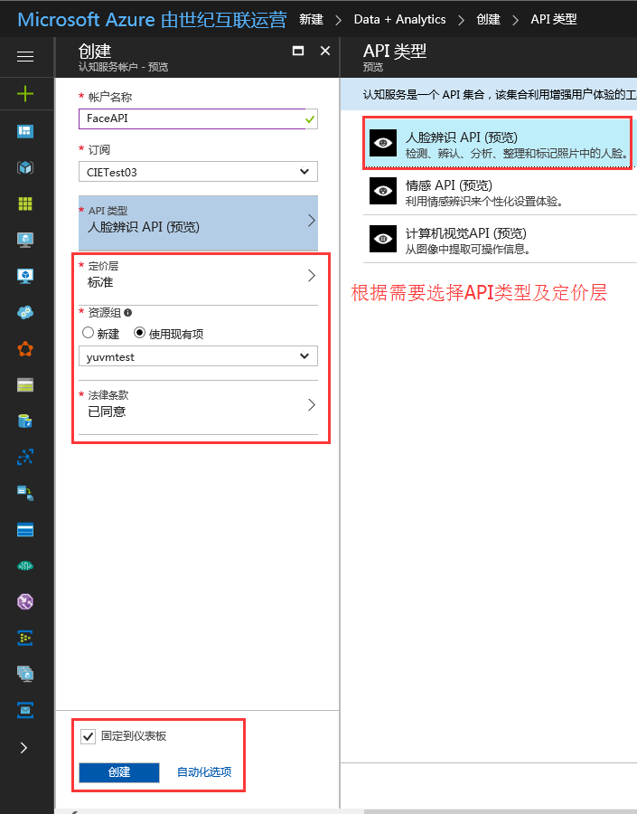
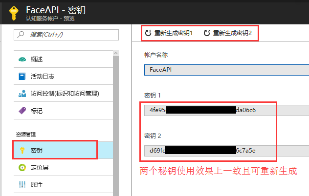
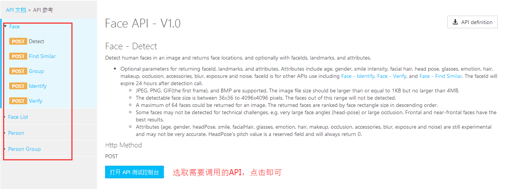
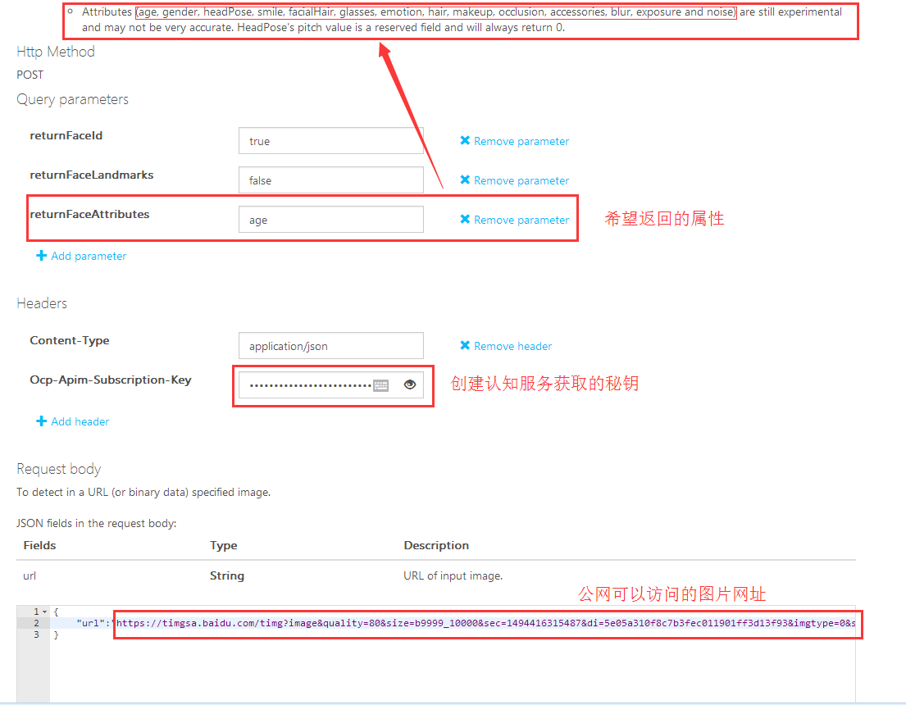
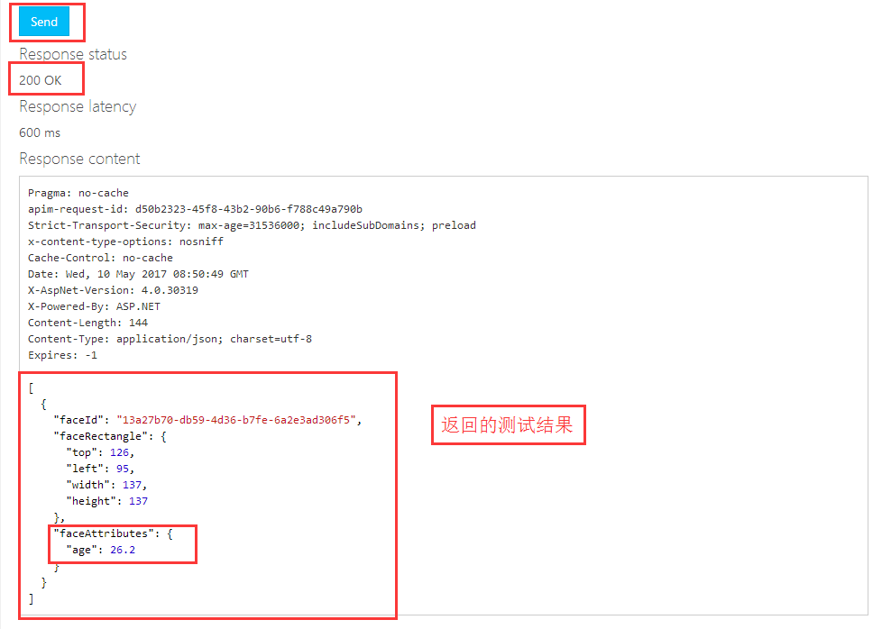

<properties
    pageTitle="中国版认知服务使用指导"
    description="中国版认知服务使用指导"
    service=""
    resource="cognitiveservices"
    authors="Yu Tao"
    displayOrder=""
    selfHelpType=""
    supportTopicIds=""
    productPesIds=""
    resourceTags="Cognitive Services, REST API, Code Sample"
    cloudEnvironments="MoonCake" />
<tags
    ms.service="cognitive-services-aog"
    ms.date=""
    wacn.date="05/16/2017" />

# 中国版认知服务使用指导

认知服务为开发者提供了一组 API 和 SDK，从而将微软公司不断演进的人工智能技术扩展到广大开发者手中。通过认知服务，您的应用可以轻松地获得智能。首批登陆中国的 API 包括人脸识别、情绪识别和计算机视觉。本文主要介绍认知服务的创建，控制台快速测试，多种语言的测试调用。本文以 Face API 的 detect 方法为例进行演示。

## 认知服务的创建

1. 登陆到 [China Azure 管理门户](https://portal.azure.cn)。

2. 新建 Face API (新建 -> Data+Analytics -> 认知服务)：

    

3. 获取服务的 key：

    

## 控制台快速测试

1. [认知服务 - API 参考](https://dev.cognitive.azure.cn/docs/services/563879b61984550e40cbbe8d/operations/563879b61984550f30395236)

    

2. [Detect 控制台测试](https://dev.cognitive.azure.cn/docs/services/563879b61984550e40cbbe8d/operations/563879b61984550f30395236/console)

    

    

## 程序调用示例

- C# Code Samples：

        using System;
        using System.IO;
        using System.Net.Http;
        using System.Text;
        using System.Web;

        namespace FaceAPI
        {
            class Program
            {
                static void Main(string[] args)
                {
                    //UsePictureURL();
                    UseLocalPicture();
                    Console.WriteLine("Hit ENTER to exit...");
                    Console.ReadLine();
                }

                /// 

                /// use picture URL
                /// 

                static async void UsePictureURL()
                {
                    var client = new HttpClient();
                    var queryString = HttpUtility.ParseQueryString(string.Empty);

                    // Request headers
                    client.DefaultRequestHeaders.Add("Ocp-Apim-Subscription-Key", "4fe95********************fda06c6");//Face API key

                    // Request parameters
                    queryString["returnFaceId"] = "true";
                    queryString["returnFaceLandmarks"] = "false";
                    queryString["returnFaceAttributes"] = "age";
                    var uri = "https://api.cognitive.azure.cn/face/v1.0/detect?" + queryString;

                    HttpResponseMessage response;

                    // Request body
                    byte[] byteData = Encoding.UTF8.GetBytes("{\"url\":\"https://timgsa.baidu.com/timg?image&quality=80&size=b9999_10000&sec=1494416315487&di=5e05a310f8c7b3fec011901ff3d13f93&imgtype=0&src=http%3A%2F%2Fimgsrc.baidu.com%2Fbaike%2Fpic%2Fitem%2F4034970a304e251ff1e3819aa486c9177f3e53bf.jpg\"}");//Picture URL

                    using (var content = new ByteArrayContent(byteData))
                    {
                        response = await client.PostAsync(uri, content);
                    }

                    //response result
                    string result = await response.Content.ReadAsStringAsync();
                    Console.WriteLine("response:" + result);
                }

                /// 

                /// use local picture
                /// 

                static async void UseLocalPicture()
                {
                    var client = new HttpClient();

                    var queryString = HttpUtility.ParseQueryString(string.Empty);

                    // Request headers
                    client.DefaultRequestHeaders.Add("Ocp-Apim-Subscription-Key", "4fe95********************fda06c6");//Face API key

                    // Request parameters
                    queryString["returnFaceId"] = "true";
                    queryString["returnFaceLandmarks"] = "false";
                    queryString["returnFaceAttributes"] = "age";
                    var uri = "https://api.cognitive.azure.cn/face/v1.0/detect?" + queryString;

                    HttpResponseMessage response;

                    //read local picture to byte[]
                    string path = @"C:\Users\yuvmtest\Desktop\test.jpg";//local picture path
                    FileStream fs = File.OpenRead(path); //OpenRead
                    int filelength = 0;
                    filelength = (int)fs.Length;
                    byte[] image = new byte[filelength];
                    fs.Read(image, 0, filelength);
                    fs.Close();

                    using (var content = new ByteArrayContent(image))
                    {
                        content.Headers.Add("Content-Type", "application/octet-stream");//set content-type
                        response = await client.PostAsync(uri, content);
                    }

                    //response result
                    string result = await response.Content.ReadAsStringAsync();
                    Console.WriteLine("response:" + result);
                }
            }
        }

- Java Code Samples：

        package buct.edu.cn;

        import java.io.FileInputStream;
        import java.net.URI;

        import org.apache.http.HttpEntity;
        import org.apache.http.HttpResponse;
        import org.apache.http.client.HttpClient;
        import org.apache.http.client.methods.HttpPost;
        import org.apache.http.client.utils.URIBuilder;
        import org.apache.http.entity.ByteArrayEntity;
        import org.apache.http.entity.StringEntity;
        import org.apache.http.impl.client.HttpClients;
        import org.apache.http.util.EntityUtils;

        public class FaceAPI {

            public static void main(String[] args) {

                System.out.println("Begin FaceAPI Test.");

                //UsePictureURL();
                UseLocalPicture();
            }
            /**
            * Use Picture URL
            */
            public static void UsePictureURL()
            {
                HttpClient httpclient = HttpClients.createDefault();

                try
                {
                    URIBuilder builder = new URIBuilder("https://api.cognitive.azure.cn/face/v1.0/detect");

                    builder.setParameter("returnFaceId", "true");
                    builder.setParameter("returnFaceLandmarks", "false");
                    builder.setParameter("returnFaceAttributes", "age");

                    URI uri = builder.build();
                    HttpPost request = new HttpPost(uri);
                    request.setHeader("Content-Type", "application/json");
                    request.setHeader("Ocp-Apim-Subscription-Key", "4fe95********************fda06c6");

                    // Request body
                    StringEntity reqEntity = new StringEntity("{\"url\":\"https://timgsa.baidu.com/timg?image&quality=80&size=b9999_10000&sec=1494416315487&di=5e05a310f8c7b3fec011901ff3d13f93&imgtype=0&src=http%3A%2F%2Fimgsrc.baidu.com%2Fbaike%2Fpic%2Fitem%2F4034970a304e251ff1e3819aa486c9177f3e53bf.jpg\"}"); //URL图片地址
                    request.setEntity(reqEntity);

                    HttpResponse response = httpclient.execute(request);
                    HttpEntity entity = response.getEntity();

                    if (entity != null) 
                    {
                        System.out.println(EntityUtils.toString(entity));
                    }
                }
                catch (Exception e)
                {
                    System.out.println(e.getMessage());
                }
            }

            /**
            * use local picture
            */
            public static void UseLocalPicture()
            {
                HttpClient httpclient = HttpClients.createDefault();

                try
                {
                    URIBuilder builder = new URIBuilder("https://api.cognitive.azure.cn/face/v1.0/detect");

                    builder.setParameter("returnFaceId", "true");
                    builder.setParameter("returnFaceLandmarks", "false");
                    builder.setParameter("returnFaceAttributes", "age");

                    URI uri = builder.build();
                    HttpPost request = new HttpPost(uri);
                    request.setHeader("Content-Type", "application/octet-stream");
                    request.setHeader("Ocp-Apim-Subscription-Key", "4fe95********************fda06c6");

                    // Request body
                    String pic_path = "C:\\Users\\yuvmtest\\Desktop\\test.jpg";

                    FileInputStream is = new FileInputStream(pic_path);
                    int i = is.available();
                    byte data[] = new byte[i];
                    is.read(data);
                    is.close();

                    ByteArrayEntity bae = new ByteArrayEntity(data);
                    request.setEntity(bae);

                    HttpResponse response = httpclient.execute(request);
                    HttpEntity entity = response.getEntity();

                    if (entity != null)
                    {
                        System.out.println(EntityUtils.toString(entity));
                    }
                }
                catch (Exception e)
                {
                    System.out.println(e.getMessage());
                }
            }
        }

- PHP Code Samples:

        <?php

        use GuzzleHttp\Psr7\Request;
        use GuzzleHttp\Client;

        require_once 'vendor\autoload.php';

        $client = new Client();

        $headers = ['Content-Type' => 'application/json','Ocp-Apim-Subscription-Key' => '4fe95********************fda06c6'];

        $body = '{"url":"https://timgsa.baidu.com/timg?image&quality=80&size=b9999_10000&sec=1494416315487&di=5e05a310f8c7b3fec011901ff3d13f93&imgtype=0&src=http%3A%2F%2Fimgsrc.baidu.com%2Fbaike%2Fpic%2Fitem%2F4034970a304e251ff1e3819aa486c9177f3e53bf.jpg"}';

        $request = new Request('POST','https://api.cognitive.azure.cn/face/v1.0/detect?returnFaceId=true&returnFaceLandmarks=false&returnFaceAttributes=age', $headers , $body);

        $response = $client->send($request);

        echo $response->getBody();

        ?>

- Python Code Samples(Python3.3):

        import http.client, urllib.request, urllib.parse, urllib.error, base64

        headers = {
            # Request headers
            'Content-Type': 'application/json',
            'Ocp-Apim-Subscription-Key': '4fe95********************fda06c6',
        }

        params = urllib.parse.urlencode({
            # Request parameters
            'returnFaceId': 'true',
            'returnFaceLandmarks': 'false',
            'returnFaceAttributes': 'age',
        })

        try:
            conn = http.client.HTTPSConnection('api.cognitive.azure.cn')
            conn.request("POST", "/face/v1.0/detect?%s" % params, "{'url':'https://timgsa.baidu.com/timg?image&quality=80&size=b9999_10000&sec=1494416315487&di=5e05a310f8c7b3fec011901ff3d13f93&imgtype=0&src=http%3A%2F%2Fimgsrc.baidu.com%2Fbaike%2Fpic%2Fitem%2F4034970a304e251ff1e3819aa486c9177f3e53bf.jpg'}", headers)
            response = conn.getresponse()
            data = response.read()
            print(data)
            conn.close()
        except Exception as e:
            print("[Errno {0}] {1}".format(e.errno, e.strerror))

### Code 测试结果：

        [{"faceId":"13a27b70-db59-4d36-b7fe-6a2e3ad306f5","faceRectangle":{"top":126,"left":95,"width":137,"height":137},"faceAttributes":{"age":26.2}}]

## 参考链接

- [认知服务价格详情](/pricing/details/cognitive-services/)
- [Cognitive-Samples-IntelligentKiosk](https://github.com/Microsoft/Cognitive-Samples-IntelligentKiosk)
- [PHP 使用 Face API](http://azurecloudapi.cn/?p=366)
- [CognitiveServices SDK](https://github.com/Azure/azure-sdk-for-net/tree/vs17Dev/src/SDKs/CognitiveServices)