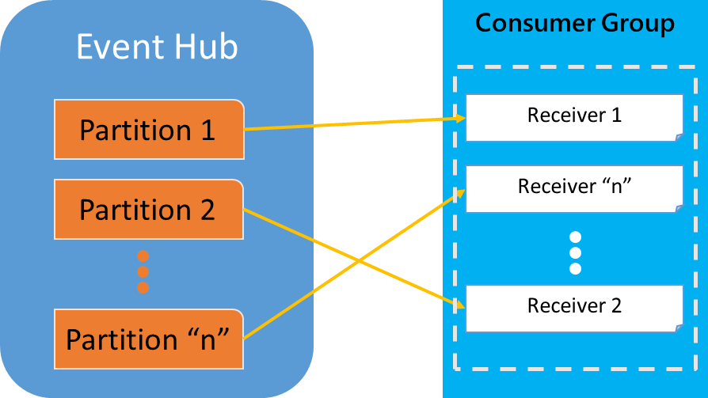

<properties
	pageTitle="基于直接接收的方法消费 Azure 事件中心消息"
	description="基于直接接收的方法消费 Azure 事件中心消息"
	service=""
	resource="eventhubs"
	authors=""
	displayOrder=""
	selfHelpType=""
	supportTopicIds=""
	productPesIds=""
	resourceTags="Event Hubs,receive"
	cloudEnvironments="MoonCake" />
<tags
	ms.service="event-hubs-aog"
	ms.date=""
	wacn.date="01/12/2017" />
# 基于直接接收的方法消费 Azure 事件中心消息

Azure 事件中心支持多种消费消息的方式，而且也提供了不同语言的 SDK 以方便开发者调用，这里做一个汇总的介绍。

总的来说，有三种方式：

1.	直接接收
2.	使用事件处理程序主机（EventProcessorHost）
3.	基于 Apache Storm

下面主要按两种常用语言 C# 和 Java 来归纳。本文介绍“直接接收”法。

直接接收的使用方式如下：

1.	通过连接字符串创建事件中心客户端（EventHubClient）:

		var client = EventHubClient.CreateFromConnectionString("your_connection_string");

2.	创建或获取消费者组（ConsumerGroup）:

		var group = client.GetDefaultConsumerGroup();

3.	通过消费者组创建指定分区（Partition）的事件中心接收者（EventHubReceiver）:

		var receiver = group.CreateReceiver(client.GetRuntimeInformation().PartitionIds[0]);

4.	使用刚创建的 EventHubReceiver 来接收绑定分区的消息 :

		While(true)
		{
			var message = receiver.Receive(TimeSpan.FromSeconds(2));
			// process message based on your own logic
			Logger.Info(“Message received: {0}”, Encoding.UTF8.GetString(message.GetBytes()))
		}

注意创建事件中心接收者是必须指定分区的。另外它也提供了额外的选项，比如指定偏移量，这样就可以控制该接受者开始读取消息的位置。
可以看出，直接接收方式需要自行协调对消费者组中分区的访问，而且也需要自行维护每个分区的偏移量，以避免重复读取历史数据。另外如果要实现负载均衡和故障转移都需要很多额外的工作量。所以虽然这种方式本身简单，但如果用于生产环境来说，对于开发者而言是不够方便快捷的。
 

多语言支持：

*	C#
	*	[SDK 引用库](https://www.nuget.org/packages/WindowsAzure.ServiceBus/)
	*	SDK 源代码*
	*	[示例](https://github.com/allenhula/azure-china-get-started/tree/master/EventHub/CSharp/EventHubDirectDemo)

>[AZURE.NOTE]* 该SDK库因为历史原因没有开源，不过微软已在开发一个[新的SDK](https://github.com/azure/azure-event-hubs-dotnet)，并[开源](https://blogs.msdn.microsoft.com/eventhubs/2016/10/13/event-hubs-and-net-standard/)了，目前还在预览中，不适合用于生产环境。

*	Java 
	*	[SDK 引用库](https://mvnrepository.com/artifact/com.microsoft.azure/azure-eventhubs)
	*	[SDK 源代码](https://github.com/Azure/azure-event-hubs-java/tree/master/azure-eventhubs)
	*	[示例](https://github.com/allenhula/azure-china-get-started/tree/master/EventHub/Java/eventhub-direct)

