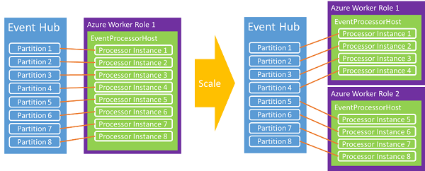

<properties
	pageTitle="基于 EventProcessorHost 消费 Azure 事件中心消息"
	description="基于 EventProcessorHost 消费 Azure 事件中心消息"
	service=""
	resource="eventhubs"
	authors=""
	displayOrder=""
	selfHelpType=""
	supportTopicIds=""
	productPesIds=""
	resourceTags="Event Hubs, EventProcessorHost"
	cloudEnvironments="MoonCake" />
<tags
	ms.service="event-hubs-aog"
	ms.date=""
	wacn.date="01/12/2017" />
# 基于 EventProcessorHost 消费 Azure 事件中心消息

Azure 事件中心支持多种消费消息的方式，而且也提供了不同语言的 SDK 以方便开发者调用，这里做一个汇总的介绍。

总的来说，有三种方式：

1.	直接接收
2.	使用事件处理程序主机（EventProcessorHost）
3.	基于 Apache Storm

在直接接收的基础上，微软提供了一个更高级别的抽象方式，也就是使用 EventProcessorHost，它为事件处理器实现提供线程安全，多进程安全的运行时环境，该环境还能提供检查点和分区租用管理。使用方式如下：

1.	实现 IEventProcessor 接口（假设 MyEventProcessor）:

	1.	[OpenAsync](https://msdn.microsoft.com/zh-cn/library/azure/microsoft.servicebus.messaging.ieventprocessor.openasync.aspx)

			Task IEventProcessor.OpenAsync(PartitionContext context)
			{
				Logger.Info("Initialized.  Partition: '{0}', Offset: '{1}'", context.Lease.PartitionId, context.Lease.Offset);
				this.checkpointStopWatch = new Stopwatch();
				this.checkpointStopWatch.Start();
				return Task.FromResult<object>(null);
			}

	2.	[CloseAsync](https://msdn.microsoft.com/zh-cn/library/azure/microsoft.servicebus.messaging.ieventprocessor.closeasync.aspx)
	
			async Task IEventProcessor.CloseAsync(PartitionContext context, CloseReason reason)
			{
				Logger.Info("Processor Shutting Down. Partition '{0}', Reason: '{1}'.", context.Lease.PartitionId, reason);
				if (reason == CloseReason.Shutdown)
				{
				     await context.CheckpointAsync();
				}
			}

	3.	[ProcessEventsAsync](https://msdn.microsoft.com/zh-cn/library/azure/microsoft.servicebus.messaging.ieventprocessor.processeventsasync.aspx)

			async Task IEventProcessor.ProcessEventsAsync(PartitionContext context, IEnumerable<EventData> messages)
			{
				// process events based on your own logic
				foreach (EventData eventData in messages)
				{
				      string data = Encoding.UTF8.GetString(eventData.GetBytes());
				      Logger.Info(string.Format("Message received.  Partition: '{0}', Data: '{1}'",
				                context.Lease.PartitionId, data));
				}
	
				//Call checkpoint every 5 minutes, so that worker can resume processing from 5 minutes back if it restarts.
				if (this.checkpointStopWatch.Elapsed > TimeSpan.FromMinutes(5))
				{
				      await context.CheckpointAsync();
				      this.checkpointStopWatch.Restart();
				}
			}

2.	实例化 EventProcessorHost，并提供事件中心相应的参数：

		var eventProcessorHost = new EventProcessorHost(eventProcessorHostName, eventHubName, eventHubConsumerGroupName, eventHubConnectionString, storageConnectionString);

3.	调用 RegisterEventProcessorAsync 以将 IEventProcessor 的实现注册到运行时：
		
		eventProcessorHost.RegisterEventProcessorAsync<MyEventProcessor>().Wait();

比起前面直接接收方式，EventProcessorHost 方式不需要开发者写循环去接收消息，也不需要考虑连接哪个分区，只需要专注于对接收消息的处理，方便快捷很多。另外 EventProcessorHost 采用租约的方式来管理分区消息的读取，而获取租约采用的是“贪婪”算法，租约本身是有时间期限的，因此当有新主机加入或者某个主机挂掉的情况下，负载能被转移，建立平衡，最终达到负载均衡。同时，EventProcessorHost 还实现了基于 Azure 存储空间的检查点机制，它将按分区存储偏移量，使每一个消费者都能确定前一个消费者的最后读取位置，进一步的保证负载转移和故障转移。这种转移机制也可以保证消费端的自动缩放。

 
## **多语言支持：**

*	C#
	*	[SDK引用库](https://www.nuget.org/packages/Microsoft.Azure.ServiceBus.EventProcessorHost/)
	*	SDK源代码*
	*	[示例](https://github.com/allenhula/azure-china-get-started/tree/master/EventHub/CSharp/EventProcessorHostDemo)

	>[AZURE.NOTE]* 该 SDK 库因为历史原因没有开源，不过微软已在开发一个[新的 SDK](https://github.com/azure/azure-event-hubs-dotnet)，并[开源](https://blogs.msdn.microsoft.com/eventhubs/2016/10/13/event-hubs-and-net-standard/)了，目前还在预览中，不适合用于生产环境。

*	Java 
	*	[SDK引用库](https://mvnrepository.com/artifact/com.microsoft.azure/azure-eventhubs-eph)
	*	[SDK源代码](https://github.com/Azure/azure-event-hubs-java/tree/master/azure-eventhubs-eph)
	*	[示例](https://github.com/allenhula/azure-china-get-started/tree/master/EventHub/Java/eventhub-eph)）

