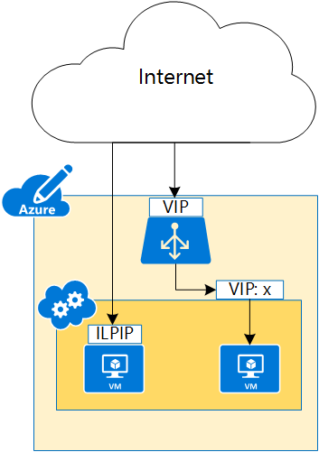
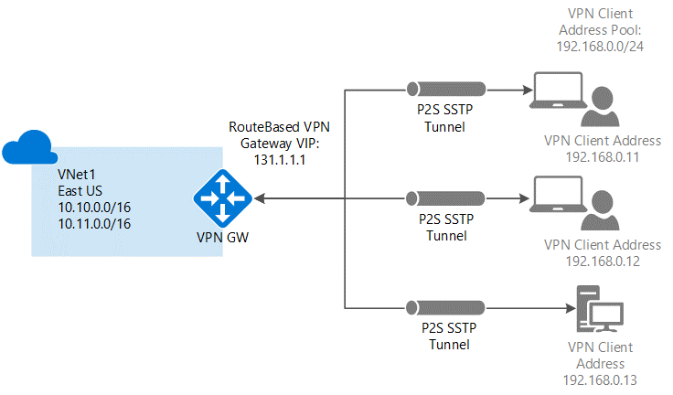
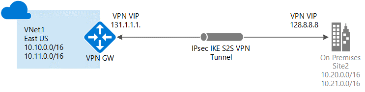

<properties 
	pageTitle="Azure 网络相关名词解释" 
	description="Azure 网络相关名词解释" 
	services="" 
	documentationCenter="" 
	authors=""
	manager="" 
	editor=""/>
<tags ms.service="aog-concept" ms.date="" wacn.date="08/31/2016"/>

# Azure 网络相关名词解释
* [5-tuples/5 元组](#tuples)
* [Application Gateway / 应用程序网关](#application-gateway)
* [Azure SLB / Azure 负载平衡器](#azure-slb)
* [DIP / Dynamic IP address，动态 IP](#dip)
* [Endpoint / 终结点](#endpoint)
* [ExpressRoute](#expressroute)
* [Azure ILB / Azure Internal load balancer / Azure 内部负载平衡器](#azure-ilb)
* [ILPIP / Instance-level public IP address / 实例级公共 IP](#ilpip)
* [NSG / Network Security Group / 网络安全组](#nsg)
* [P2S VPN / Point-to-Site VPN / 点到站点 VPN](#p2s-vpn)
* [S2S VPN / Site-to-Site VPN / 站点到站点 VPN](#s2s-vpn)
* [Traffic Manager / 流量管理器](#traffic-manager)
* [VIP / Virtual IP address / 虚拟 IP](#vip)
* [VNET / Virtual Network / 虚拟网络](#vnet)
* [VPN Gateway / VPN 网关](#vpn-gateway)

## 5-tuples / 5元 组
5 元组，包含源 IP、源端口、目标 IP、目标端口和协议类型。它是工作在传输层（OSI 的第 4 层）的 Azure 负载平衡器（Azure SLB）中的负载平衡模式。通过对 5 元组的哈希计算，负载平衡器将流量映射到 VIP 后的可用服务。根据不同的需求，Azure 还支持 2 元组（源 IP、目标 IP）或 3 元组（源 IP、目标 IP、协议类型），此操作需要通过 PowerShell 实现。

[详细介绍](/blog/2015/03/13/azure-load-balancer-new-distribution-mode)

## Application Gateway / 应用程序网关
Azure 应用程序网关是应用程序层负载平衡（OSI 的第 7 层）的 HTTP 负载平衡解决方案。它充当反向代理服务，截获客户端连接，并将请求转发到后端终结点。

应用程序网关当前支持以下第7层应用程序传送功能：HTTP 负载平衡，基于 Cookie 的会话相关性，安全套接字层 (SSL) 卸载，和基于 URL 的内容路由。

[详细介绍](/documentation/articles/application-gateway-introduction/)

## Azure SLB / Azure 负载平衡器
Azure 负载平衡器是一种工作在传输层（OSI 的第 4 层）类型的负载平衡器。它可以将传入的 TCP、UDP 流量分发到云服务中正常运行的服务实例上，或者分发到负载平衡器集内所定义的虚拟机上。

Azure 负载平衡器使用的分发算法是对 5 元组（或 2 元组，3 元组）进行哈希运算。通过对运算结果的比较，负载平衡器将流量映射到对应的可用服务上。

[详细介绍（英文）](https://azure.microsoft.com/en-us/documentation/articles/load-balancer-overview/)

## DIP / Dynamic IP address / 动态 IP
DIP 是虚拟机在部署时，Azure 通过 DHCP 分配给虚拟机的内部 IP 地址。只要虚拟机没有被停机或删除，DIP 将一直分配在这台虚拟机上。但是，如果虚拟机被停机或删除，DIP 将被释放，并分配给新部署的虚拟机。若虚拟机部署在虚拟网络的子网中，DIP 将从虚拟机所在的子网中分配。如果你需要虚拟机使用固定的内部 IP，则需要为其设置静态内部专用 IP。

[如何设置静态内部专用 IP](/documentation/articles/virtual-networks-reserved-private-ip/)

## Endpoint / 终结点
终结点包含 IP 协议和对应的端口。每个终结点都有一个公用端口和一个专用端口。Azure 负载平衡器使用公用端口侦听从 Internet 传入的虚拟机流量。虚拟机使用专用端口侦听通常发送到虚拟机上运行的应用程序或服务的传入流量。

使用 Azure 经典管理门户创建终结点时，将为 IP 协议和众所周知的网络协议的 TCP 或 UDP 端口提供默认值。例如用于远程桌面和 Windows PowerShell 远程处理的终结点。对于自定义终结点，必须指定正确的 IP 协议（TCP 或 UDP）以及公用和专用端口。若要将传入流量随机分布到多个虚拟机上，必须创建包含多个终结点的负载平衡集。

请注意，Azure 流量管理器（Traffic Manager）和 CDN 中也有终结点的概念，与此处的终结点不同，请勿混淆。

[在经典 Azure 虚拟机上设置终结点](/documentation/articles/virtual-machines-windows-classic-setup-endpoints/)

[在经典 Azure Linux 虚拟机上设置终结点](/documentation/articles/virtual-machines-set-up-endpoints/)

## ExpressRoute
ExpressRoute 是一项 Azure 网络相关的服务，允许你在 Azure 数据中心与你的本地环境或第三方托管设施中的基础结构之间创建专用连接。

ExpressRoute 连接不通过公共 Internet。与通过 Internet 的典型连接相比，ExpressRoute 连接提供更高的可靠性、更快的速度、更低的延迟和更高的安全。

[详细介绍](/documentation/articles/expressroute-introduction/)

## Azure ILB / Azure Internal load balancer / Azure 内部负载平衡器
Azure 内部负载平衡器是一种面向 Azure 内部的负载均衡器。只有 Azure 内部的资源以及接入 VPN 通道的设备能够访问 Azure 内部均衡器。所有通过内部负载平衡器的数据流量都不会直接流向公网。Azure 内部负载均衡器适用于对安全级别要求较高的负载均衡。例如在 Azure 内部部署的多层级应用的后端数据库需要负载平衡时，就可以使用 Azure 内部负载平衡器。对于跨界连接（例如 S2S VPN）中的负载均衡需求，Azure 内部负载平衡器也能很好的满足。

[详细介绍（英文）](https://azure.microsoft.com/en-us/documentation/articles/load-balancer-internal-overview/)

## ILPIP / Instance-level public IP address / 实例级公共 IP
实例级公共 IP 是可直接向 VM 或角色实例分配的公共 IP 地址。它不是用来代替分配给云服务的 VIP（虚拟 IP），而是可以用来直接连接到 VM 或角色实例的 IP 地址。需要注意的是，ILPIP 及其绑定的端口都是直接暴露在公网上的，访问时数据将不再通过云服务和负载均衡器。在使用时，需要格外注意网络安全的配置。

[详细介绍](/documentation/articles/virtual-networks-instance-level-public-ip/)

## NSG / Network Security Group / 网络安全组
网络安全组包含一系列访问控制列表 (ACL) 规则，这些规则可以允许或拒绝虚拟网络中流向 VM 实例的网络流量。NSG 可以与子网或该子网中的各个 VM 实例相关联。当 NSG 与某个子网相关联时，ACL 规则适用于该子网中的所有 VM 实例。另外，可以进一步通过将 NSG 直接关联到单个 VM 对流向该 VM 的流量进行限制。

网络安全组的规则分为入站规则和出站规则，每一条规则都有唯一的优先级。所有的网络安全组都包含一组默认规则，且无法删除，但是它们的优先级最低。

[详细介绍](/documentation/articles/virtual-networks-nsg/)
## P2S VPN / Point-to-Site VPN / 点到站点 VPN
点到站点连接允许你从任何位置的单台计算机连接到 Azure 虚拟网络中的任何内容。它使用 Windows 内置的 VPN 客户端。在进行点到站点配置时，你需要安装证书和 VPN 客户端配置包，其中包含的设置允许你的计算机连接到虚拟网络中的任何虚拟机或角色实例。当你无法访问 VPN 硬件或面向公网的 IPv4 地址（二者是进行站点到站点 VPN 连接所必需的）时，后者仅有少量客户端需要连接到虚拟网络时，点到站点 VPN 连接是很好的选择。

[使用经典管理门户配置与 VNET 的点到站点 VPN 连接](/documentation/articles/vpn-gateway-point-to-site-create/)

[使用 PowerShell 配置与虚拟网络的点到站点连接](/documentation/articles/vpn-gateway-howto-point-to-site-rm-ps/)

## S2S VPN / Site-to-Site VPN / 站点到站点 VPN
站点到站点 VPN 用于建立你的本地网络到 Azure 虚拟网络中的任何虚拟机或角色实例的连接。此类连接依赖于 IPsec VPN 设备（硬件或软件设备），该设备必须部署在网络边缘（不能位于 NAT 后面）。若要创建此类连接，你必须具有必需的 VPN 硬件设备和面向公网的 IPv4 地址。

[使用 Azure 经典管理门户创建具有站点到站点 VPN 连接的虚拟网络](/documentation/articles/vpn-gateway-site-to-site-create/)

[使用 Azure 门户预览和 Azure Resource Manager 创建具有站点到站点 VPN 连接的 VNET](/documentation/articles/vpn-gateway-howto-site-to-site-resource-manager-portal/)

[使用 PowerShell 和 Azure 资源管理器创建具有站点到站点 VPN 连接的虚拟网络](/documentation/articles/vpn-gateway-create-site-to-site-rm-powershell/)

[站点到站点 VPN 网关连接 VPN 设备](/documentation/articles/vpn-gateway-about-vpn-devices/)

## Traffic Manager / 流量管理器
Azure 流量管理器用于控制用户流量的分布，根据需要将用户流量分布到在全球不同数据中心运行的服务终结点。流量管理器支持的服务终结点包括 Azure VM、Web Apps 和云服务。也可将流量管理器用于外部的非 Azure 终结点。流量管理器在DNS级别工作。它使用 DNS 响应将客户端引导到相应的服务终结点。然后客户端直接连接到服务终结点，不通过流量管理器进行连接。流量管理器不是代理，它看不到流量在客户端和服务之间传递。更多详细请阅读[这篇文章](/documentation/articles/traffic-manager-overview/)，[这篇文章](/documentation/articles/traffic-manager-how-traffic-manager-works/)是其工作原理。
## VIP / Virtual IP address / 虚拟 IP
虚拟 IP 是允许你从外部访问在 Azure 中部署的资源的 IP 地址。它可以被用于云服务，IaaS 虚拟机，PaaS 角色实例，和应用程序网关。如果需要为 Azure 资源分配虚拟 IP 地址，该 IP 地址将动态地从资源的创建位置中的可用公共 IP 地址池中分配。停止该资源时，此 IP 地址将被释放。对于需要使用固定 IP 的资源，可以使用静态（保留）IP 来实现。

[Azure 中的 IP 地址（经典）](/documentation/articles/virtual-network-ip-addresses-overview-classic)

[保留 IP 概述](/documentation/articles/virtual-networks-reserved-public-ip/)
## VNET / Virtual Network / 虚拟网络
Azure 虚拟网络是你自己的网络在云中的表示形式。它是对专用于你的订阅的 Azure 云进行的逻辑隔离。你可以完全控制该网络中的 IP 地址块、DNS 设置、安全策略和路由表。你还可以进一步将 VNET 细分成各个子网，并启动 Azure IaaS 虚拟机 (VM) 和/或云服务（PaaS 角色实例）。实际上，你可以将网络扩展到 Azure，对 IP 地址块进行完全的控制，并享受企业级 Azure 带来的好处。更多详细请阅读[这篇文章](/documentation/articles/virtual-networks-overview/)
## VPN Gateway / VPN 网关
VPN 网关用于建立虚拟网络和本地位置之间的 VPN 通道，并承载其间的网络流量。VPN 网关还用于在 Azure 的多个虚拟网络之间发送流量（VNET 到 VNET）。

若要配置 VPN 网关，需要先在 VNET 中创建网关子网。根据不同的配置，网关子网可以创建不同的大小。最小的为 /29，但是建议创建 /28 甚至更大的网关。若要配置站点到站点 /Express Route 并存配置，网关子网必须创建为 /28 或者更大。

Azure 的 VPN 有两种类型，分别为基于策略的 VPN（PolicyBased）和基于路由的 VPN（RouteBased）。根据不同的部署方式，需要选择不同的类型。

[详细介绍](/documentation/articles/vpn-gateway-about-vpngateways/)

[VPN 网关常见问题](/documentation/articles/vpn-gateway-vpn-faq/)

