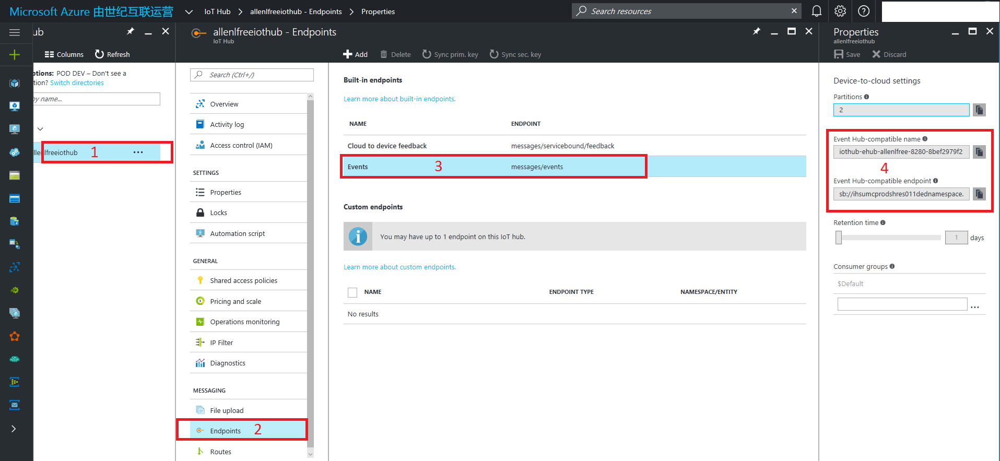

<properties
	pageTitle="使用 EventHubClient 连接 IoT 中心的正确连接字符串"
	description="使用 EventHubClient 连接 IoT 中心的正确连接字符串"
	service="microsoft.iothub"
	resource="iothub"
	authors=""
	displayOrder=""
	selfHelpType=""
	supportTopicIds=""
	productPesIds=""
	resourceTags="IoT Hub, EventHubClient, D2C, C2D, Connection String"​
	cloudEnvironments="MoonCake" />
<tags
	ms.service="iot-hub-aog"
	ms.date=""
	wacn.date="01/12/2017" />
# 使用 EventHubClient 连接 IoT 中心的正确连接字符串

Azure IoT 中心支持两种通信方式，一个是设备到云（以下简称 D2C），另一个是云到设备（以下简称 C2D）。对于这两种通信，都会有相应的发送端和消费端。微软也提供了相应的 SDK 以供开发者方便使用。

以 .NET 为例（其他语言 SDK 的源代码分享在此 [Github 库](https://github.com/Azure/azure-iot-sdks)中）:

-	D2C 消息发送端：[DeviceClient](https://github.com/Azure/azure-iot-sdk-csharp/blob/1f5a259eee0d178db42d2bf866b80c9846adebba/device/Microsoft.Azure.Devices.Client/DeviceClient.cs), [Nuget](https://www.nuget.org/packages/Microsoft.Azure.Devices.Client/), namespace: Microsoft.Azure.Devices.Client

		var deviceConnectionString = "HostName=<iothub_host_name>;DeviceId=<device_id>;SharedAccessKey=<device_key>"
		var deviceClient = DeviceClient.CreateFromConnectionString(deviceConnectionString);

-	D2C 消息消费端：EventHubClient, [Nuget](https://www.nuget.org/packages/WindowsAzure.ServiceBus/), namespace: 
Microsoft.ServiceBus.Messaging

		var eventHubCompatibleConnStr = “Endpoint=<eventhub_compatible_endpoint>;SharedAccessKeyName=<iothub_sas_policy_name>;SharedAccessKey=<iothub_sas_policy_key>;EntityPath=<eventhub_compatible_name>"
		var eventHubClient = EventHubClient.CreateFromConnectionString(eventHubCompatibleConnStr);

-	C2D 消息发送端：[ServiceClient](https://github.com/Azure/azure-iot-sdk-csharp/blob/1f5a259eee0d178db42d2bf866b80c9846adebba/service/Microsoft.Azure.Devices/ServiceClient.cs), [Nuget](https://www.nuget.org/packages/Microsoft.Azure.Devices/), namespace: Microsoft.Azure.Devices

		var iotHubConnectionString = “HostName=<iothub_host_name>;SharedAccessKeyName=<iothub_sas_policy_name>;SharedAccessKey=<iothub_sas_policy_key>;”
		var serviceClient = ServiceClient.CreateFromConnectionString(iotHubConnectionString, <transport_type>);

-	C2D 消息消费端：[DeviceClient](https://github.com/Azure/azure-iot-sdk-csharp/blob/1f5a259eee0d178db42d2bf866b80c9846adebba/device/Microsoft.Azure.Devices.Client/DeviceClient.cs), [Nuget](https://www.nuget.org/packages/Microsoft.Azure.Devices.Client/), namespace: Microsoft.Azure.Devices.Client

		var deviceConnectionString = "HostName=<iothub_host_name>;DeviceId=<device_id>;SharedAccessKey=<device_key>"
		var deviceClient = DeviceClient.CreateFromConnectionString(deviceConnectionString);

可以看到其中消费 D2C（设备到云）消息是比较特殊的，它不是调用 IoT 中心的 SDK，而是使用服务总线 SDK 里的 EventHubClient。这是因为 IoT 中心公开[事件中心](/documentation/services/event-hubs/)兼容的终结点来接收设备到云的消息 。这样就可以重用现有的事件中心所支持的方式来消费 IoT 中心的 D2C 消息，包括使用 EventHubClient 直接读取，使用事件处理程序主机（EventProcessorHost），或者使用 Apache Storm 等等。这样做好处很明显，但是有时候也会产生混淆，**经常容易出错的地方就是使用 IoT 中心的连接字符串来创建 EventHubClient**。这样的使用是会产生问题的，比如连接不上或者连接容易断开等等。**正确的使用方式是使用事件中心兼容的连接字符串来创建 EventHubClient**。所以在 IoT 中心的管理门户里面提供了相应的事件中心兼容的名称和端点信息，以供构建正确的连接字符串。

### 事件中心兼容的连接字符串格式：

	Endpoint=<eventhub_compatible_endpoint>;SharedAccessKeyName=<iothub_sas_policy_name>;SharedAccessKey=<iothub_sas_policy_key>;EntityPath=<eventhub_compatible_name>

### 在IoT中心的管理门户上获取相应值：

| eventhub_compatible_endpoint   	| {Your IoT Hub} -> Endpoints -> Built-in endpoints -> Events -> Event Hub-compatible endpoint 	|
| iothub_sas_policy_name_and_key 	| {Your IoT Hub} -> Shared access policies -> {any policy with Device connect permission}      	|
| eventhub_compatible_name       	| {Your IoT Hub} -> Endpoints ->,Built-in endpoints -> Events -> Event Hub-compatible name     	|

## **操作步骤：**
 

## **代码示例：**

	var eventHubCompatibleConnStr = “Endpoint=<eventhub_compatible_endpoint>;SharedAccessKeyName=<iothub_sas_policy_name>;SharedAccessKey=<iothub_sas_policy_key>;EntityPath=<eventhub_compatible_name>"
	var eventHubClient = EventHubClient.CreateFromConnectionString(eventHubCompatibleConnStr);
