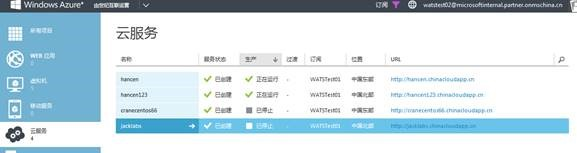
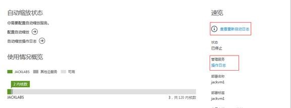
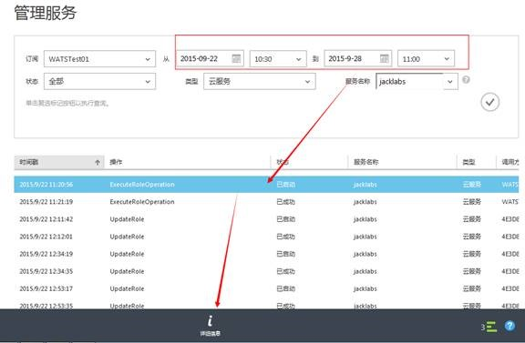

<properties 
	pageTitle="如何通过管理服务查看在管理门户中执行的相关操作记录" 
	description="本文介绍如何通过管理服务查看在管理门户中执行的相关操作记录" 
	services="management portal" 
	documentationCenter="" 
	authors=""
	manager="" 
	editor=""/>
<tags ms.service="na" ms.date="" wacn.date="12/18/2015"/>

#如何通过管理服务查看在管理门户中执行的相关操作记录

###本文包含以下内容
- [操作日志的作用](#function)
- [如何访问日志](#access)
- [详细步骤](#detail)
 
## 操作日志的作用
 
1. 可以通过操作日志的详细情况知道我们的操作失败的具体原因
2. 通过操作日志可以在失败的详情中找出操作ID，在联系技术支持的过程中可以对应到具体的操作
 
## 如何访问日志
 
我们有两种方式来访问我们服务的日志 ，1) 云服务仪表盘右侧“操作日志”2) Azure 门户网站“管理服务”
 
## 详细步骤
 
云服务提供了重启日志和在门户网站里面操作的日志，请通过以下步骤来查看详细。

1. 登录Azure 门户网站，选择云服务

	
 
- 选择要查看的云服务->仪表板，可以查看相关的操作日志和启动日志

	
 
- 选择要查看哪个时间段的操作记录

	
