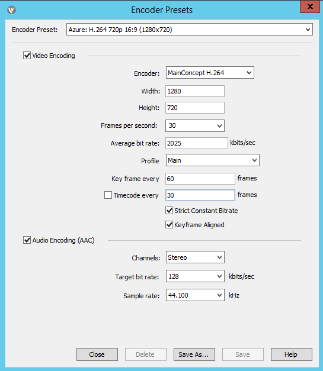
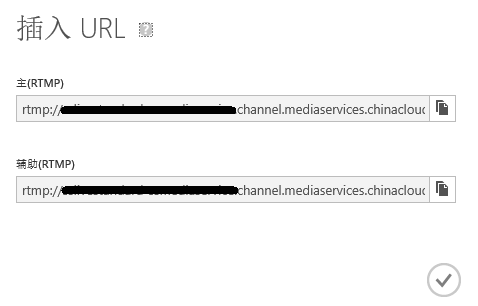

<properties
	pageTitle="Azure 媒体直播服务操作流程"
	description="以 Wirecast 为例，讲述 Azure 媒体直播服务操作流程"
	service=""
	resource="mediaservices"
	authors=""
	displayOrder=""
	selfHelpType=""
    supportTopicIds=""
    productPesIds=""
    resourceTags="Azure, Media Services, webcast, 容灾"
    cloudEnvironments="MoonCake" />
<tags
	ms.service="meida-services-aog"
	ms.date=""
	wacn.date="1/19/2016" />
# Azure 媒体直播服务操作流程

本文以 Wirecast 为例，介绍了使用 Azure 媒体服务进行直播的操作流程。

## 直播前的测试

1.	测试阶段推荐使用与正式直播相同的网络环境和硬件设备，如果条件允许，建议在直播现场申请网络专线，保证上行网络有足够的带宽资源。同时测试时建议使用与正式直播相同的图像和音频采集设备，以及 Wirecast 工作站等其他硬件设备等等。

2.	测试阶段实时监控 Wirecast 界面中的数据上传以及 CPU 利用率，主要测试直播现场的网络是否可以支撑 Wirecast 中配置的上传速率，另外如果 CPU 利用率超过 90%，则需要考虑更换工作站电脑。

	

3.	如果在测试阶段，终端用户通过播放器观看出现质量不佳或者卡顿情况，先在 Wirecast 端确认是否是输入源的问题，如果 Wirecast 端的视频和上传信号都显示正常，再登录 portal 通过预览观看，如果预览观看也没有问题，建议从客户端方向排查如下事宜:

	-	客户端的网络情况(如让多个测试人员在不同的网络环境下观看)。
	-	使用不同的客户端平台进行测试，确认是否是某些 OS 或者播放器有兼容性问题。
	-	排除 CDN 问题（如有配置），可以暂时移除 CDN 配置，让测试人员直接播放媒体服务发布的 URL。

4.	测试结束后，保存 Wirecast 的最优配置，以供后续正式直播使用。Wirecast 的默认配置如下：

	

5.	测试阶段创建的节目不要在正式直播继续使用，也可以考虑删除测试节目，删除测试节目并不会删除测试时归档的视频。
6.	测试结束后，请及时关闭频道和流式处理端点，避免频道空转收取额外费用。

## 正式直播的操作流程

1.	登录 Azure portal 启动频道，如果是标准频道，启动频道最长有可能需要 20 分钟左右，建议提前启动。
2.	创建并发布新的直播节目。设置节目时长，直播时长不可以超过设置的节目时长。
3.	频道启动后，在 Wirecast 中连接 ingest URL 上传媒体流。
4.	在 Azure portal 上预览直播。
5.	预览成功后，开启至少一个流式处理单元，如果收看人数较多，可以考虑增加流式处理单元或者配置 CDN。
6.	启动步骤 2 创建的直播节目。

	>[AZURE.NOTE]如果点击开播流媒体，会自动创建一个时长为 1 小时的 DefaultProgram 节目。

	

7.	通过节目发布地址观看节目，如果没有问题，将节目发布地址更新到终端播放器或者网页。
8.	直播过程中，在 Azure portal 监控生成的归档视频，视频文件会随着时间而增大。

	

9.	直播结束后，停止频道和流式处理端点，避免产生额外的费用。

## 容灾方案

在上行网络允许的情况下，可以考虑冗余上传:

### 插入 URL 冗余上传：

媒体服务提供了两个插入 URL，可以考虑配置 Wirecast 同时上传媒体流到主插入 URL 和辅助插入 URL。

### 多频道冗余上传： 

考虑在东部和北部数据中心各创建一个频道，Wirecast 同时上传媒体流到两个数据中心的频道，并在客户端实现动态切换播放地址的功能，如果某一数据中心的频道在直播过程中发生问题，可以及时将播放地址切换到另一个数据中心的备选频道。

## 参考文档

[媒体服务常见故障解决方案](/documentation/articles/aog-media-services-troubleshoot-faq/)

