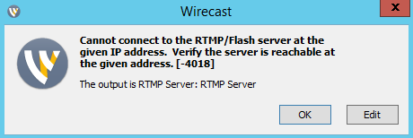
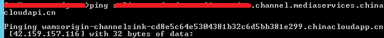
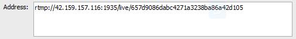
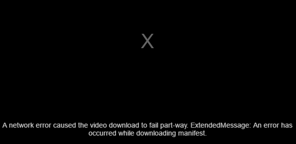
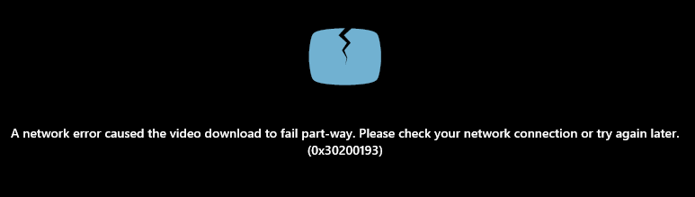

<properties 
	pageTitle="媒体服务常见故障解决方案" 
	description="媒体服务常见故障解决方案" 
	services="" 
	documentationCenter="" 
	authors=""
	manager="" 
	editor=""/>
<tags ms.service="media-services-aog" ms.date="" wacn.date="09/29/2016"/>
# 媒体服务常见故障解决方案

##直播篇
###场景一: 
Wirecast 无法连接直播频道的 ingest URL，出现 -4018 错误:

###解决方法:

1. 登录 azure portal，检查频道是否在运行状态。
2. 如果频道已经运行，检查 ingest URL 的域名是否可以在 Wirecast 工作站解析，如果无法解析，找到一台可以正常解析 ingest url 域名的电脑，运行 ping 命令获取 IP 地址:

	  
 在 Wirecast 的输出设置中，用获取的 IP 地址 替换 ingest URL 的域名:  
 
  
	>注：当频道重启后，IP 地址会发生变化，需要重新获取。**

###场景二: 

直播无法预览，提示下载 manifest 文件出错: 

  
###解决方法:

1. 将 preview URL 复制到浏览器，看是否可以下载 manifest 文件，如果同样无法下载，需要等待 1 到 2 分钟，直到浏览器可以下载 manifest 后，返回 azure portal，重新尝试预览。  
[http://{channel}-{accountname}.channel.mediaservices.chinacloudapi.cn/preview.isml/manifest](http://{channel}-{accountname}.channel.mediaservices.chinacloudapi.cn/preview.isml/manifest)
2. 如果还是无法预览，请在 azure portal 上重置频道。

###场景三:

直播预览成功，但是无法观看节目，如在 Media Service Player 出现下面错误:

  或者
  

    
###解决方法:
检查是否流式处理端点处于运行状态，并且包含至少一个流式处理单元。如果没有，扩容到至少一个流式处理单元后，运行流式处理端点。

###场景四: 
收看直播过程中出现间断，如在客户端看到缓冲状态，或者直播画面出现蓝天白云的静态图片，如下图:

###解决方法:

通常是由于 Wirecast 上传信号出现问题，建议首先排查 Wirecast 工作站:  

1. 查看工作站上行网络情况，确保上行宽带足够支撑媒体流的传输，并查看是否有多路同时传输导致网络带宽不够，另外可以考虑在 Wirecast 中设置一个较低的码率上传。
2. 查看工作站 CPU 情况，如果 CPU 占用超过 90%，建议切换到性能更强的工作站，并且升级最新版本的 Wirecast。
3. 同时查看 Wirecast 的各项配置，建议使用 H.264 编解码器，如果每秒帧数默认是 30，那么关键帧间隔建议设置成 60 帧。具体配置请查看文档[使用 Wirecast 编码器发送单比特率实时流](https://www.azure.cn/documentation/articles/media-services-configure-wirecast-live-encoder/)

###场景五:
若出现其它错误无法用上述方法解决，建议按照如下步骤重新尝试:

1. 在 azure portal 上停止所有正在运行的节目。
2. 在 azure portal 上重置频道，或者重启频道。
3. 创建并发布新的节目。
4. 在 Wirecast 中连接 ingest URL 并且上传媒体流。
5. 在 azure portal 上预览直播。
6. 预览成功后，确保流式处理端点包含至少一个流式处理单元运行后，启动节目。
7. 直播结束后，停止频道和流式处理端点，避免产生额外的费用。

##点播篇：
###场景一:
无法点播视频，如在 Media Service Player 出现下面错误:

  或者
  

###解决方法:
检查是否流式处理端点处于运行状态，并且包含至少一个流式处理单元。如果没有，扩容到至少一个流式处理单元后，运行流式处理端点。

###场景二:
在 azure portal 上将流式处理单元从 0 个扩容到 1 个或者多个后，portal 已经显示扩容成功，但还是无法播放视频，在 azure media player 出现类似以下错误。通常需要等待 30 分钟以上，才可以正常播放:

###解决方法:
此问题有可能是在扩容还没有完成前，用户试图访问点播地址，导致后台扩容时间延长，建议扩容过程中，不要访问点播地址，直到在 azure portal 上看到扩容完成后，再试图访问，此问题只发生在从 0 个流式处理单元扩容到 1 个或多个时。

###场景三：
部分安卓设备无法播放 HLS 协议的视频，客户端收到 404 错误。用 Apple 设备或者 PC 端则可以成功播放同一个 HLS 视频源。

###解决方法:
如果视频源某种码率的第一个 fragment 丢失，当播放器尝试用此码率播放时，Azure 媒体服务器会因找不到第一个 fragment 而返回 404 错误给客户端，部分安卓设备收到此错误后，不会尝试 retry 其他的码率，最终导致播放失败。而 Apple 设备或者 PC 端包含 retry 逻辑，则可以播放成功。

对于上述视频源，可以考虑使用 dynamic manifests 技术过滤掉视频源的第一个 fragment，具体方法请参考以下文档:

[Dynamic Manifests and Rendered Sub-Clips, Essential Tools for Live Streaming](https://azure.microsoft.com/en-us/blog/dynamic-manifests-and-rendered-sub-clips/)

[Customized Renditions and Asset trimming with Dynamic Manifest](https://azure.microsoft.com/en-us/blog/dynamic-manifest/)

