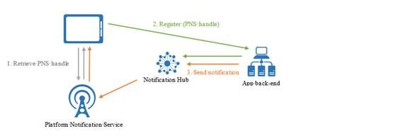
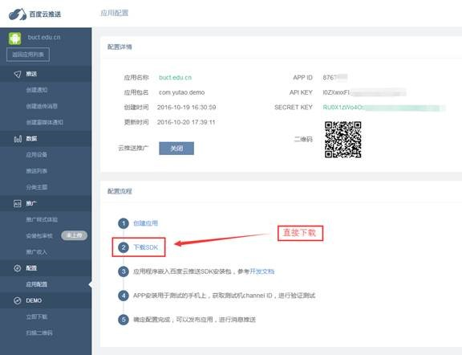
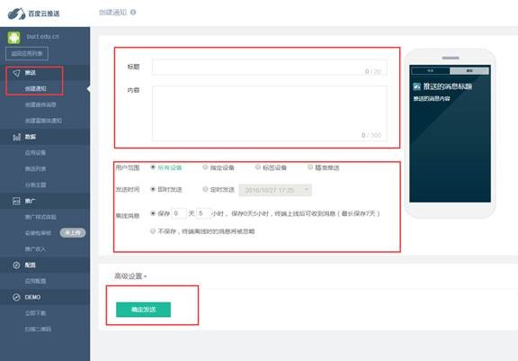
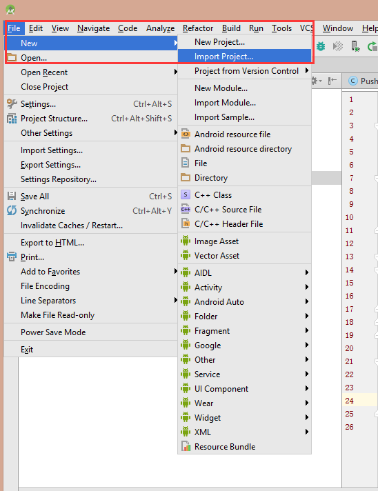
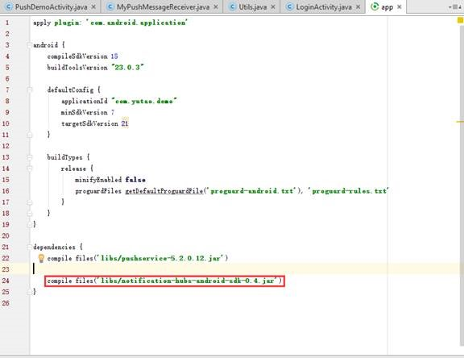
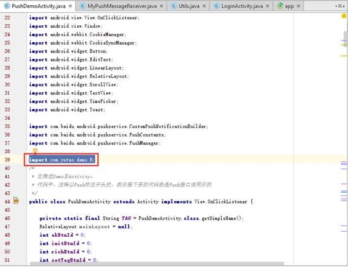
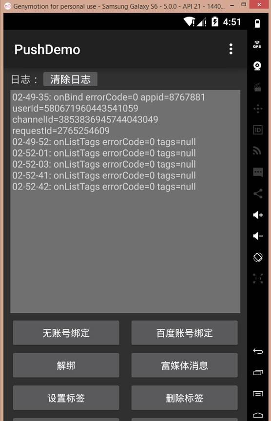
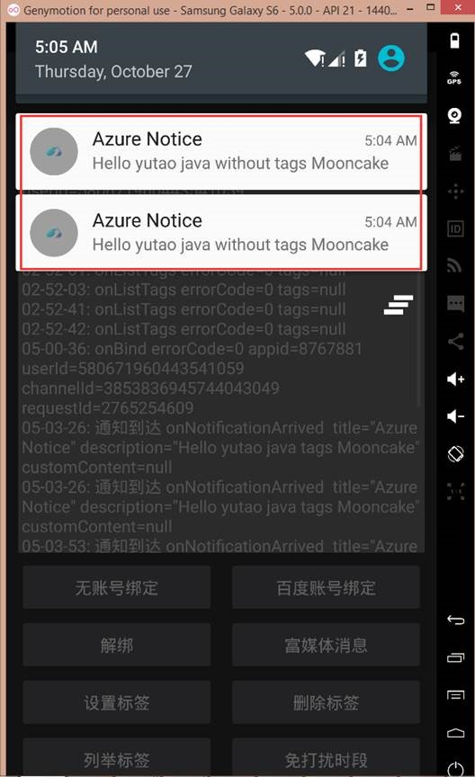
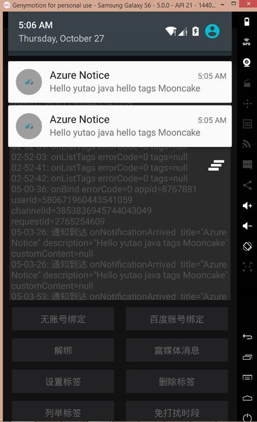
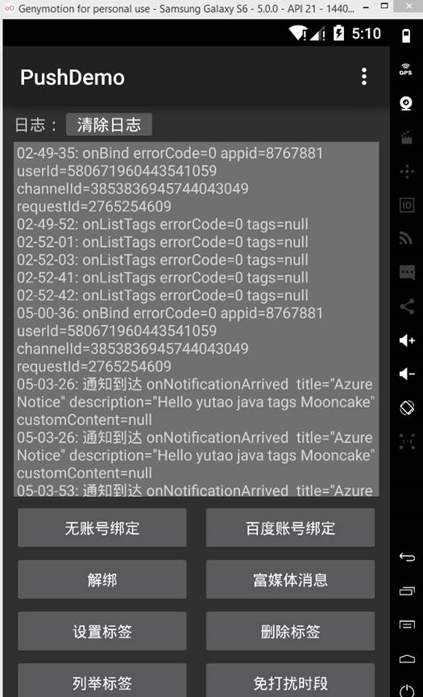

<properties
	pageTitle="Azure 通知中心结合 Android 百度云推送实现消息定制化服务"
	description="Azure 通知中心结合 Android 百度云推送实现消息定制化服务"
	service="microsoft.notificationhubs"
	resource="notificationhubs"
	authors=""
	displayOrder=""
	selfHelpType=""
	supportTopicIds=""
	productPesIds=""
	resourceTags="Notification Hubs, Android, 百度云"​
	cloudEnvironments="MoonCake" />
<tags
	ms.service="notification-hubs-aog"
	ms.date=""
	wacn.date="01/12/2017" />
# Azure 通知中心结合 Android 百度云推送实现消息定制化服务

## 功能要点

1.	完成 azure 通知中心 到 android apk 的消息推送。
2.	利用 tag 完成分组发送测试（实现信息发送的定制化服务）。

## 环境依赖

- IDE：Android studio
- AVM：Genymotion

## 原理分析

 
### 测试案例(集成原有的百度 PushDemo)

1.	注册百度云推送，下载 [SDK](http://boscdn.bpc.baidu.com/channelpush/sdk/Baidu-Push-SDK-Android-L2-5.5.0.50.zip)，也可以直接扫描二维码手机安装 apk。
 
	

	利用创建的通知直接进行测试：

	

2.	测试完成后将推送服务关联到 azure 通知中心：
	1.	使用 Android studio 导入下载解压后的项目: `file/new/input project`, 项目默认为 Android。

		

	2.	在 `app/lab` 目录导入 `notification-hubs-android-sdk-0.4.jar`, `app/build.gradle` 加入：

		compile files('libs/notification-hubs-android-sdk-0.4.jar')，完成对包的引用。

		

	3.	PushDemo 中加入 `import com.yutao.demo.R`;

		

	4.	添加 `ConfigurationSettings.java` 类加入相关参数，主要目的是配置相关参数。
	
		>[AZURE.NOTE]代码中相关参数均已经无效，仅供格式参考

			package com.baidu.push.example;
			
			/**
			 * Created by yu.tao on 10/26/2016.
			 */
			public class ConfigurationSettings {
			    public static String API_KEY = "I0ZXwxxFhewpXe36tx433QaG";
			    public static String NotificationHubName = "baidudemotest";
			    public static String NotificationHubConnectionString = "Endpoint=sb://yutaonotification.servicebus.chinacloudapi.cn/;SharedAccessKeyName=DefaultListenSharedAccessSignature;SharedAccessKey=4RyJjHcAm7PW9Tr83S5PQ9Qbi/AqbYFl2PfSACGI1UY=";
			
			}

	5.	MyPushMessageReceiver 类中添加代码绑定到 azure notification ：

			public static NotificationHub hub = null;
			public static String mChannelId, mUserId;
			
			public static final String TAG = MyPushMessageReceiver.class
			     .getSimpleName();
			
			//add test
			
			
			// public static final String TAG = MyPushMessageReceiver.class
			//        .getSimpleName();
			
			/**
			* 调用PushManager.startWork后，sdk将对push
			* server发起绑定请求，这个过程是异步的。绑定请求的结果通过onBind返回。 如果您需要用单播推送，需要把这里获取的channel
			* id和user id上传到应用server中，再调用server接口用channel id和user id给单个手机或者用户推送。
			*
			* @param context
			*            BroadcastReceiver的执行Context
			* @param errorCode
			*            绑定接口返回值，0 - 成功
			* @param appid
			*            应用id。errorCode非0时为null
			* @param userId
			*            应用user id。errorCode非0时为null
			* @param channelId
			*            应用channel id。errorCode非0时为null
			* @param requestId
			*            向服务端发起的请求id。在追查问题时有用；
			* @return none
			*/
			@Override
			public void onBind(Context context, int errorCode, String appid,
			     String userId, String channelId, String requestId) {
			 String responseString = "onBind errorCode=" + errorCode + " appid="
			         + appid + " userId=" + userId + " channelId=" + channelId
			         + " requestId=" + requestId;
			 Log.d(TAG, responseString);
			
			 mChannelId = channelId;
			 mUserId = userId;
			
			 if (errorCode == 0) {
			     // 绑定成功
			     Log.d(TAG, "绑定成功");
			 }
			 // Demo更新界面展示代码，应用请在这里加入自己的处理逻辑
			// updateContent(context, responseString);
			
			
			 try {
			     if (hub == null) {
			         hub = new NotificationHub(
			                 ConfigurationSettings.NotificationHubName,
			                 ConfigurationSettings.NotificationHubConnectionString,
			                 context);
			         Log.i(TAG, "Notification hub initialized");
			     }
			 } catch (Exception e) {
			     Log.e(TAG, e.getMessage());
			 }
			
			 registerWithNotificationHubs();
			
			 Log.d("注册到azure","注册成功");
			
			 updateContent(context, responseString);
			}
			
			
			private void registerWithNotificationHubs() {
			 new AsyncTask<Void, Void, Void>() {
			     @Override
			     protected Void doInBackground(Void... params) {
			         try {
			             hub.registerBaidu(mUserId, mChannelId);
			             Log.i(TAG, "Registered with Notification Hub - '"
			                     + ConfigurationSettings.NotificationHubName + "'"
			                     + " with UserId - '"
			                     + mUserId + "' and Channel Id - '"
			                     + mChannelId + "'");
			         } catch (Exception e) {
			             Log.e(TAG, e.getMessage());
			         }
			         return null;
			     }
			 }.execute(null, null, null);
			}
			f)      对LoginActivity类添加代码，标黄部分为添加代码：
			@Override
			protected void onCreate(Bundle savedInstanceState) {
			super.onCreate(savedInstanceState);
			
			mWebView = new WebView(LoginActivity.this);
			
			setContentView(mWebView);
			
			initWebView(mWebView);
			
			getAccessToken();
			
			PushManager.startWork(getApplicationContext(),
			        PushConstants.LOGIN_TYPE_API_KEY, ConfigurationSettings.API_KEY);
			}

	6.	后台发送端代码编写：

			String baiduid = "580671960443544459";
			String channelid = "3853836944444043049";
								
			NotificationHub hub = new NotificationHub("Endpoint=sb://yutaonotification.servicebus.chinacloudapi.cn/;SharedAccessKeyName=DefaultFullSharedAccessSignature;SharedAccessKey=8xCem7s4223GB/rSLvTi222OhjMBHF5NDwUoTZ8KPTA=", "baidudemotest");
					
			BaiduRegistration reg = new BaiduRegistration(baiduid,channelid);
					
			reg.setTagsFromString("tagtest");
					
			hub.createRegistration(reg);
					
			//发送测试
			String message = "{\"title\":\"Java SDK test\",\"description\":\"english !\"}";
					
			//发送测试
			Notification n = Notification.createBaiduNotifiation(message);
				
			hub.sendNotification(n);

## 实验测试

### 虚拟机界面：

-	无 tag 发送：

		hub.sendNotification(n);

	
 
-	有 tag 发送 1，注册包含目标 tag：

		hub.sendNotification(n, "hello");

	
 
-	有 tag 发送 2，注册不包含目标 tag：无法接收到消息。

		hub.sendNotification(n, "world");

	

>[AZURE.NOTE]Android studio 问题比较多，有时候注释也会报错，需要根据情况更新版本。
 
