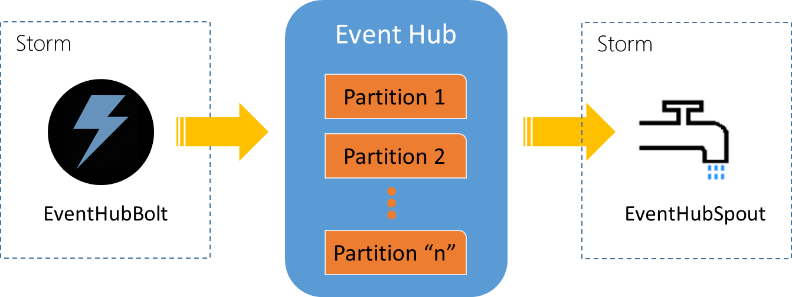

<properties
	pageTitle="基于 Apache Storm 消费 Azure 事件中心消息"
	description="基于 Apache Storm 消费 Azure 事件中心消息"
	service="microsoft.notificationhubs"
	resource="notificationhubs"
	authors=""
	displayOrder=""
	selfHelpType=""
	supportTopicIds=""
	productPesIds=""
	resourceTags="Event Hubs, Apache Storm"
	cloudEnvironments="MoonCake" />
<tags
	ms.service="notification-hubs-aog"
	ms.date=""
	wacn.date="01/12/2017" />
# 基于 Apache Storm 消费 Azure 事件中心消息

Azure 事件中心支持多种消费消息的方式，而且也提供了不同语言的 SDK 以方便开发者调用，这里做一个汇总的介绍。
总的来说，有三种方式：

1.	直接接收
2.	使用事件处理程序主机（EventProcessorHost）
3.	基于 Apache Storm

本文介绍基于 Apache Storm 的方法。下面主要按两种常用语言 C# 和 Java 来归纳。

前面的两种方式都是微软自己提供的，而 Azure 事件中心也支持第三方，比如业界很流行的 Apache Storm。Apache Storm 是一个分布式实时计算系统，它简化了对未绑定的数据流进行可靠处理的过程。事件中心与 Storm 集成后，使用 Storm 的 Zookeeper 以透明方式对事件消费进度执行检查点操作和管理持久检查点。使用方式如下：

1.	配置EventHubSpout：

		EventHubSpoutConfig spoutConfig = new EventHubSpoutConfig(policyName, policyKey, namespaceName, entityPath, partitionCount, zkEndpointAddress, checkpointIntervalInSeconds, receiverCredits);
		// tTrget to mooncake
		spoutConfig.setTargetAddress("servicebus.chinacloudapi.cn");

2.	将EventHubSpout加入拓扑结构：

		TopologyBuilder builder = new TopologyBuilder();
		builder.setSpout("eventhubspout", new EventHubSpout(spoutConfig), spoutConfig.getPartitionCount()).setNumTasks(spoutConfig.getPartitionCount());

微软实现并开源了基于 Apache Storm 的 EventHubBolt 和 EventHubSpout，前者用来发送消息到事件中心，后者则是用于连接事件中心接收消息，对于开发者来说也是很方便使用的。
 

## 多语言支持：
*	C# 
	*	[SDK引用库*](https://mvnrepository.com/artifact/org.apache.storm/storm-eventhubs)
	*	[SDK源代码*](https://github.com/apache/storm/tree/master/external/storm-eventhubs)
	*	[示例](https://github.com/Azure-Samples/hdinsight-dotnet-java-storm-eventhub)

>[AZURE.NOTE]* 这里的 SDK 其实还是使用的 Java 构件（EventHubBolt\EventHubSpout），只是拓扑是 C# 的，基于 [Microsoft.SCP.Net.SDK](https://www.nuget.org/packages/Microsoft.SCP.Net.SDK/) 包。

*	Java 
	*	[SDK引用库](https://mvnrepository.com/artifact/org.apache.storm/storm-eventhubs)
	*	[SDK源代码](https://github.com/apache/storm/tree/master/external/storm-eventhubs)
	*	[示例](https://github.com/allenhula/azure-china-get-started/tree/master/EventHub/Java)
