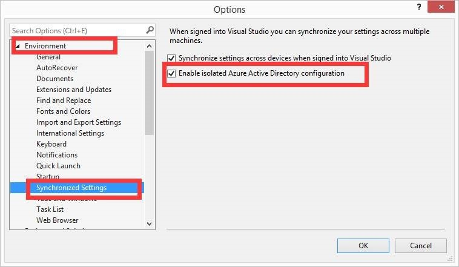

<properties
	pageTitle="VS2015 直接使用账户登录 Azure"
	description="VS2015 直接使用账户登录 Azure。"
	services=""
	documentationCenter=""
	authors=""
	manager=""
	editor=""
	tags=""/>

<tags
	ms.service="na-aog"
	ms.date="12/05/2016"
	wacn.date="12/05/2016"/>
# VS2015 直接使用账户登录 mooncake #

### 问题描述 ###

对于在 Visual Studio 2015 上登录由世纪互联运营的 Azure 账户，通常方法是使用导入 publishsetting 的方式，而此方法并不是十分便捷。

### 解决方法 ###

Visual Studio 2015 的 Azure 服务资源管理器默认是连接由微软运营的（国际版） Azure，在 VS2015 update2 之前的版本都是无法通过账号登陆的，所以如果想要使用账号登录，必须升级到 VS2015 update2 以上的版本，参考以下说明，设置你的 Visual Studio 2015 。

- **前提**

	1.	必须安装 Azure SDK for .NET，下载地址： [https://www.azure.cn/develop/net/](/develop/net/)
	2.	VS2015 必须为 update2 之后版本

- **Visual Studio设置**

 通过菜单【tools】-【options】，打开 vs 设置界面，如下图修改 VS 设置即可
 
 
 
 设置后即可通过 Azure 账号登录 VS，然后在 VS 中管理该账号下的订阅资源。
