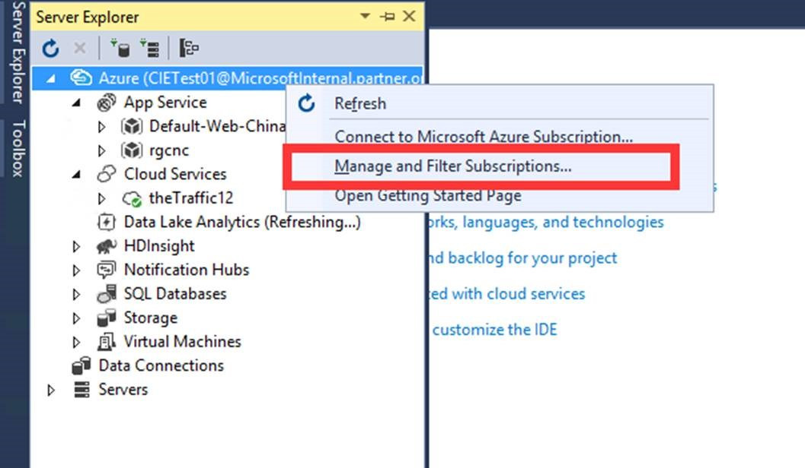
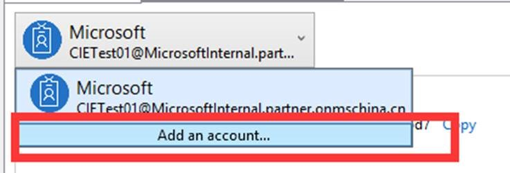
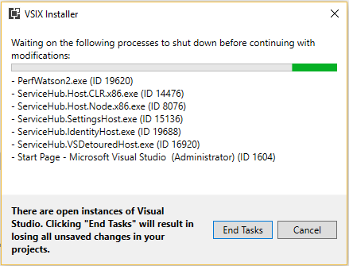
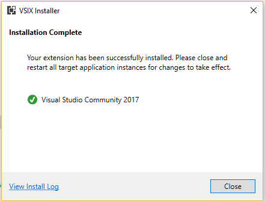
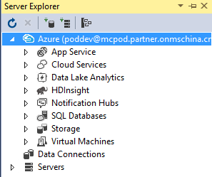

<properties
    pageTitle="VS2017 直接使用账户登录 Azure"
    description="VS2017 直接使用账户登录 Azure"
    service=""
    resource=""
    authors="Chen Rui"
    displayOrder=""
    selfHelpType=""
    supportTopicIds=""
    productPesIds=""
    resourceTags="PowerShell, VS2017"
    cloudEnvironments="MoonCake" />
<tags
    ms.service="na-aog"
    ms.date=""
    wacn.date="05/18/2017" />
# VS2017 直接使用账户登录 Azure

## **问题描述**

目前使用 Visual Studio 2017 时，无法使用世纪互联运营的 Azure 账户登录管理 VS 的资源管理器，也不能像 VS2015 Update3 那样修改注册表或者设置同步参数来修复。

## **解决方案**

以下两种方式均可实现在 VS2017 中登录中国区 Azure 账户。

- 手动添加配置文件：

    1. 首先，需要安装 Azure .NET SDK for VS 2017。

    2. 安装成功后，关闭 Visual Studio 2017，然后到 `C:\Users\<user name>\AppData\Local\.IdentityService\AadConfigurations` 目录下，如果没有 AadConfigurations 目录，则新建该目录，之后将<a href="./media/aog-portal-management-qa-vs2017-login/AadProvider.Configuration.json" download target="_blank">此Json配置文件</a>下载到该文件夹下。

    3. 之后开启Visual Studio 2017，参考以下截图，管理账户和订阅。

        

        点开后，在第一个选项卡界面选择添加账户，之后就可以登录Azure账户了。

        

- 运行 extension 文件，自动添加配置文件：

    1. 首先，需要安装 Azure .NET SDK for VS 2017。

    2. 安装成功后，关闭 Visual Studio 2017，下载 <a href="./media/aog-portal-management-qa-vs2017-login/AzureEnvironmentSelector.vsix" download target="_blank"> extension </a>文件。

    3. 双击运行下载好的 extension 文件。

        

    4. 安装结束点击 Close。

        

    5. 开启Visual Studio 2017，即可以成功登录中国的订阅账号。

        

## **参考文档**

[中国区 Azure 应用程序开发说明](/documentation/articles/developerdifferences/)
