<properties
    pageTitle="PowerBI-Cli 工具使用指南"
    description="PowerBI-Cli 工具使用指南"
    service=""
    resource="powerbiembedded"
    authors="Stanley Huang"
    displayOrder=""
    selfHelpType=""
    supportTopicIds=""
    productPesIds=""
    resourceTags="Power BI Embedded, Azure CLI"
    cloudEnvironments="MoonCake" />
<tags
    ms.service="power-bi-embedded-aog"
    ms.date=""
    wacn.date="03/28/2017" />

# PowerBI-Cli 工具使用指南

PowerBI-Cli 命令行工具可以很方便地完成创建 workspace，上传 report，创建令牌等工作，其主要功能介绍参见 [PowerBI-Cli](https://github.com/Microsoft/PowerBI-cli)(以下简称官网)。本文主要目的是对官网内容进行中文介绍，以及添加一些必要的补充说明。

## 安装 PowerBI-Cli 工具

npm 全称是 Node Packaged Modules，是 nodejs 官方开发的一个 node.js 包管理器，可通过 npm 快速下载安装 nodejs 的模块包。在执行 `npm install powerbi-cli -g` 命令安装 PowerBI-Cli 工具之前，需要先完成 npm 环境的安装。

在安装 npm 环境之前，需确保 nodejs 和 git 均已安装。

>[AZURE.NOTE]新版本的 nodejs 内置 npm，无需独立安装了，若使用的是新版本则无需继续看以下内容。

### npm 安装步骤：

1. 打开 git 命令行输入以下命令，在 github 中 clone 下来 npm 的源码包：

        git clone --recursive git://github.com/isaacs/npm.git

    附：git 工具下载链接为 : [https://git-scm.com/download/win](https://git-scm.com/download/win)。

2. 下载完成后，打开 nodejs 命令行窗口，进入到 npm 的代码文件下，使用以下令安装：

        node cli.js install npm -gf

等 npm 安装完毕之后，便可用管理员身份执行以下命令安装 PowerBI-Cli 工具了：

    npm install powerbi-cli -g

## PowerBI-Cli 命令

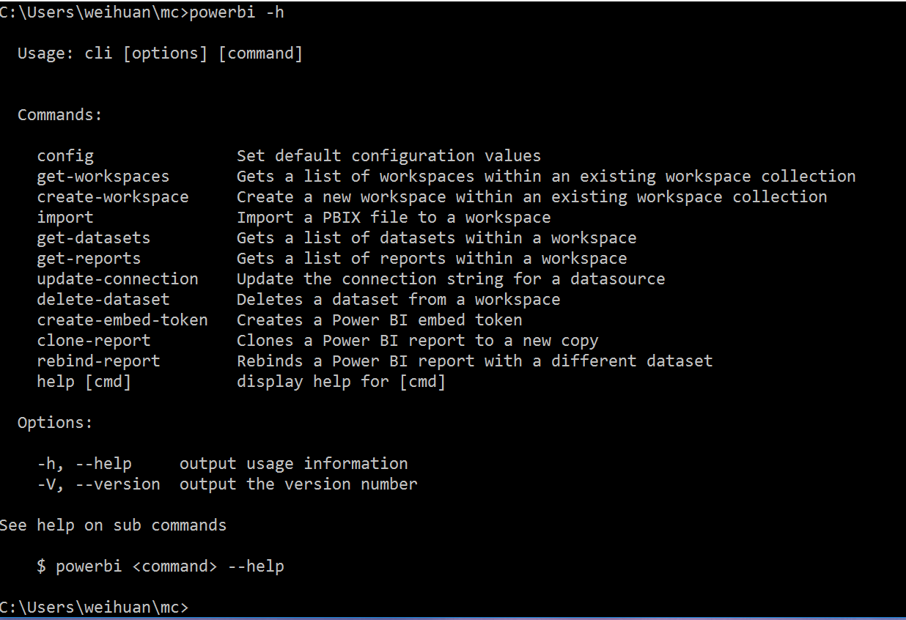

PowerBI-Cli 命令的格式为 `powerbi [command] [options]`

只有在执行正确命令中出现内容缺失或错误时才会报错。

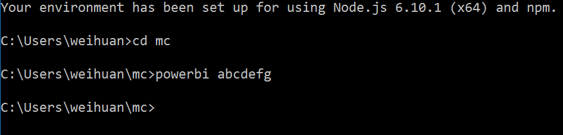

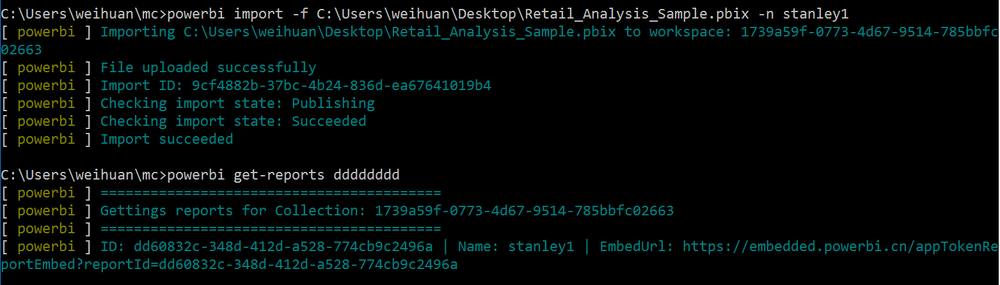

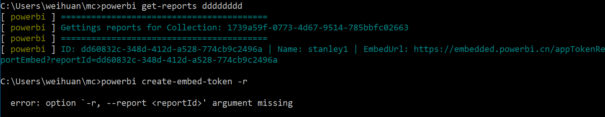

### config 命令

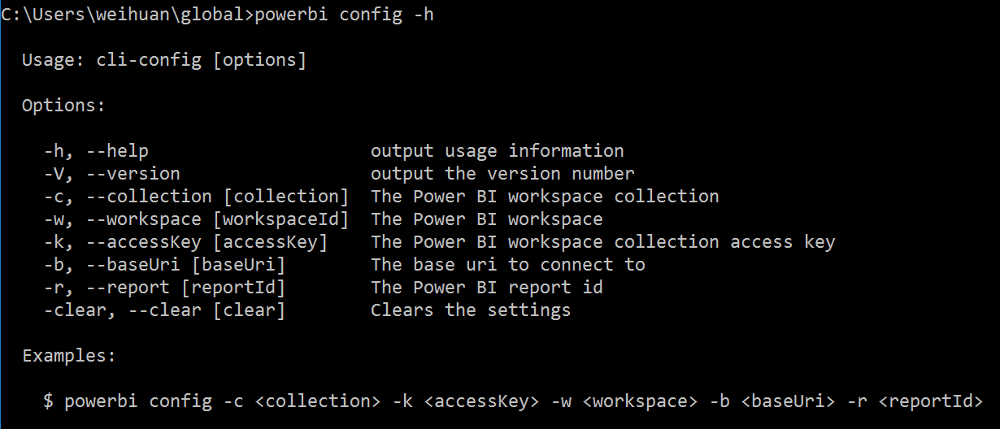

    powerbi config -c <collection> -k <accessKey> -w <workspace> -b <baseUri> -r <report ID>

`config` 命令用于获取并存放需要在其他命令中所用到的配置值，其内容存放在该路径下的 .powerbirc 文件中。

`config` 命令可存储的配置值包括：

    -c --collection
    工作区集合名

    -w --workspace
    工作区 ID

    -k --accessKey
    工作区集合连接密钥

    -b --baseUri
    HTTP 请求的 baseURI

>[AZURE.NOTE] Power BI REST API 发送 HTTP 请求的 **baseURI** 默认值为 **https://api.powerbi.com**。 若使用的是中国区 Power BI 时，可输入命令 `powerbi config -b https://api.powerbi.cn` 使连接指向 **Mooncake Power BI** 的 **base URI**。

此外，为了方便操作，建议在不同的路径下存储不同的 .powerbirc 配置文件，如下所示：

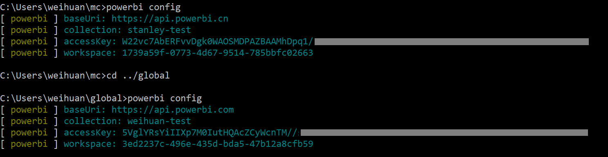

### get-workspaces 命令

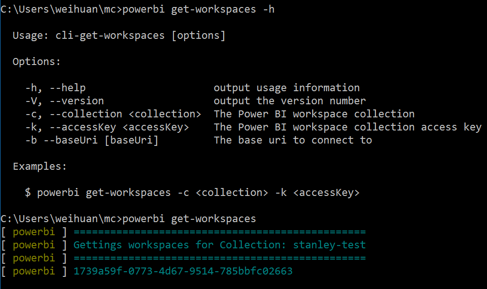

    powerbi get-workspaces -c <collection> -k <accessKey>

`get-workspaces` 命令用于获取当前工作区集合中所有工作区的 `ID`。

### create-workspace 命令

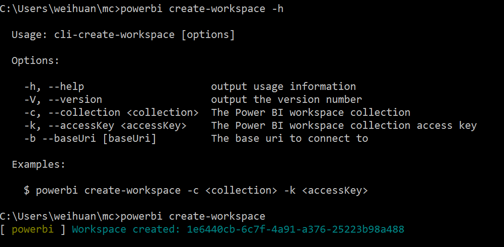

    powerbi create-workspace -c <collection> -k <accessKey>

`create-workspace` 命令用于在当前的工作区集合中创建新的工作区。

### import 命令

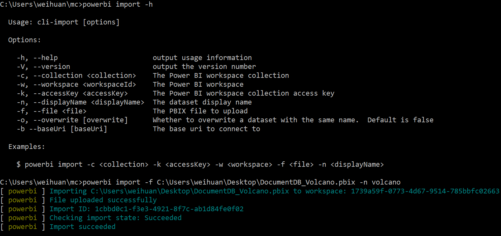

    powerbi import -c <collection> -k <accessKey> -w <workspace> -f <file> -n <displayName>

`import` 命令用于向当前的工作区上传新的 .pbix 文件并返回相应的 `import ID`，其中 `-f` 后是 .pbix 文件在本机的绝对路径，`-n` 后是给该数据集所起的标识名称，如果此名称已在该工作区中被使用，可输入 `-o [overwrite]` 命令进行覆盖。

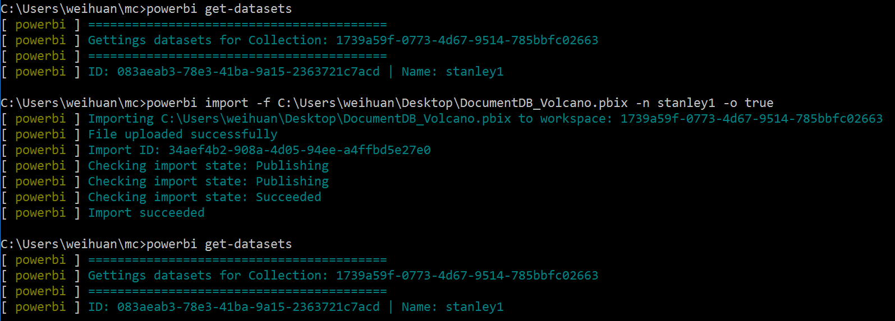

反之则会另外创建一个同名的数据集。

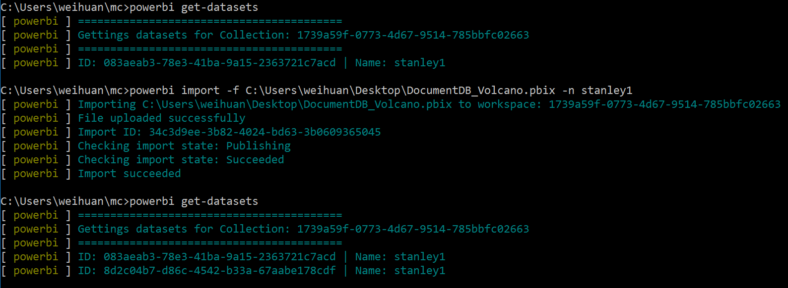

### get-datasets 命令

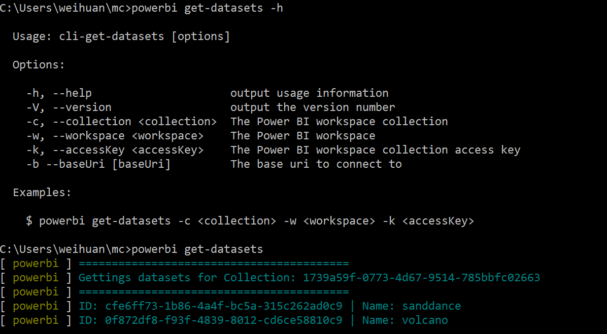

    powerbi get-datasets -c <collection> -w <workspace> -k <accessKey>

`get-datasets` 命令用于获取当前工作区中所有数据集的基本信息。

### get-reports 命令

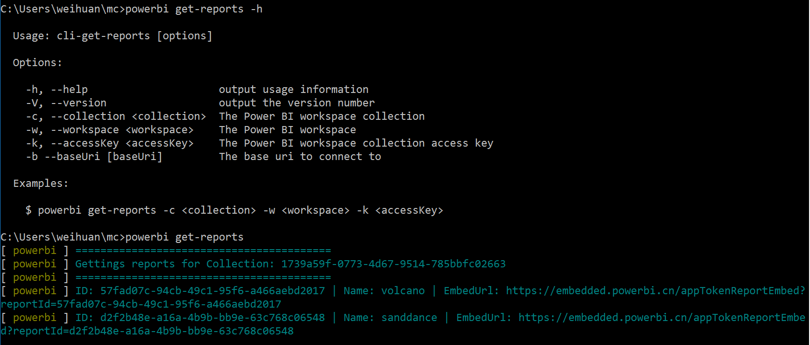

    powerbi get-reports -c <collection> -w <workspace> -k <accessKey>

`get-reports` 命令用于获取当前工作区中所有报表的基本信息。

### update-connection 命令

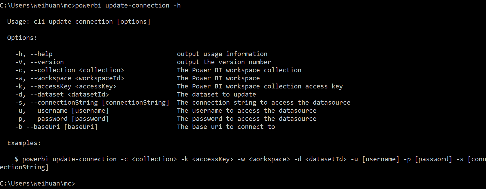

    powerbi update-connection -c <collection> -k <accessKey> -w <workspace> -d <dataset ID> -u [username] -p [password] -s [connectionString]

`update-connection` 命令用于对数据源连接进行更新。当上传的数据集需要凭据时(例如用 DirectQuery 方式连接的数据源)，可使用此命令传输用户名和密码。
值得一提的是 `-s` 后所跟的连接字符串必须采用以下形式：

    Data Source=tcp:MyServer.database.chinacloudapi.cn,1433;Initial Catalog=MyDatabase

而若输入一般的服务器和数据库属性如：

    Server=tcp:MyServer.database.chinacloudapi.cn,1433;Database=MyDatabase

在 PowerBI-Cli 工具中会被直接忽略，在其他工具（如[通过 Power BI Embedded 在 Azure Web 应用中集成报告](https://github.com/Azure-Samples/power-bi-embedded-integrate-report-into-web-app/)）中则会出现报错。

但是此项参数只是可选项，可以不填。

由下各图可见，对于用 direct query 连接方式创建的报表，直接上传到 Power BI Embedded 的工作区后并不能展现，只有更新了数据源凭据后才可以展现出来。

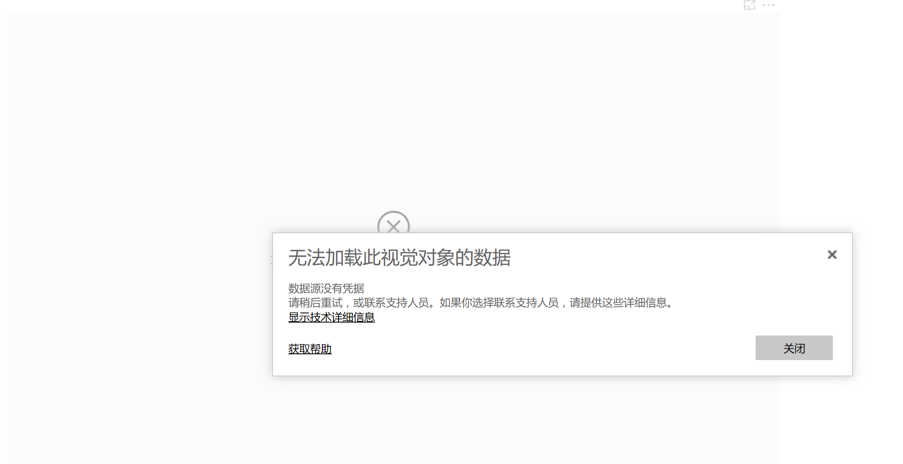

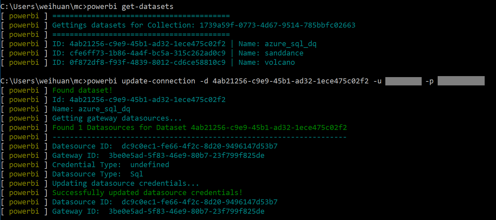

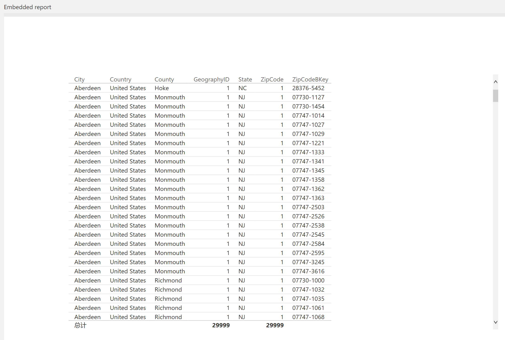

### delete-dataset 命令

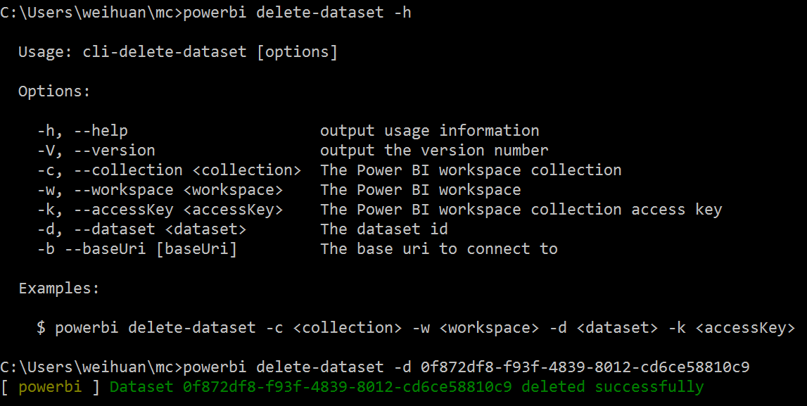

    powerbi delete-dataset -c <collection> -w <workspace> -d <dataset> -k <accessKey>

`delete-dataset` 命令用于删除当前工作区中的数据集。由于 Power BI 报表是基于数据集的，所以当执行 `delete-dataset` 命令时，基于该数据集的所有报表，包括通过 `clone-report` 和 `rebind-report` 所生成的报表，都将被删除。

### create-embed-token 命令

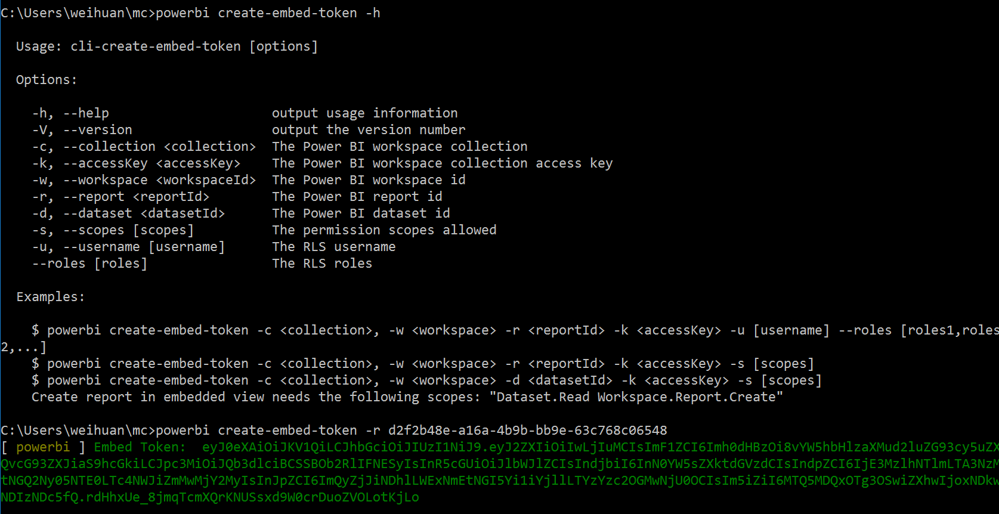

    powerbi create-embed-token -c <collection>, -w <workspace> -r <report ID> -k <accessKey> -u [username] --roles [roles1,roles2,...]
    powerbi create-embed-token -c <collection>, -w <workspace> -r <report ID> -k <accessKey> -s [scopes]
    powerbi create-embed-token -c <collection>, -w <workspace> -d <dataset ID> -k <accessKey> -s [scopes]

`create-embed-token` 命令用于创建令牌。令牌用于身份验证和授权，其创建可基于报表 ID 或数据集 ID，前者支持用 RLS 和 scope 的方式进行用户凭据设置，而后者则只支持用 scope 方式来实现此功能。

当创建好令牌后，可在 [Sample Report](https://microsoft.github.io/PowerBI-JavaScript/demo/code-demo/index.html#) 输入 report ID, 令牌以及 EmbedURL 查看内嵌报表的展示效果：

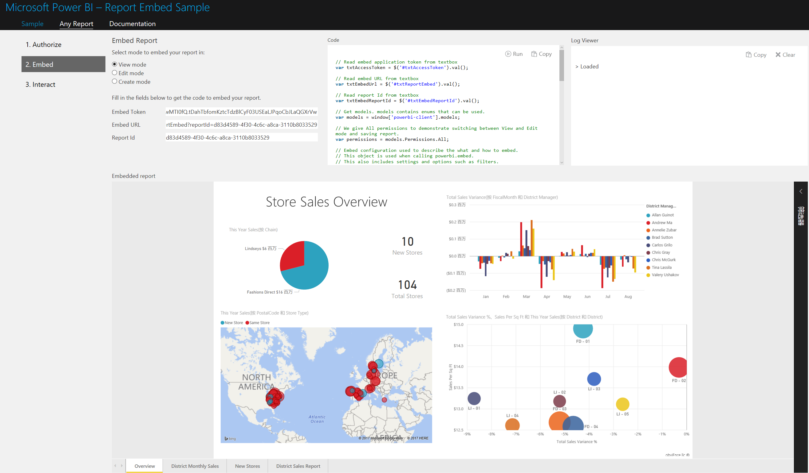

RLS介绍参见: [Power BI Embedded 的行级别安全性](/documentation/articles/power-bi-embedded-rls/)。

scope介绍参见:[Power BI permissions](https://powerbi.microsoft.com/en-us/documentation/powerbi-developer-power-bi-permissions/)。

此外可参考以下链接了解更多有关 Power BI Embedded 的身份验证和授权方面的内容：[通过 Power BI Embedded 进行身份验证和授权](/documentation/articles/power-bi-embedded-app-token-flow/)。

### clone-report 命令

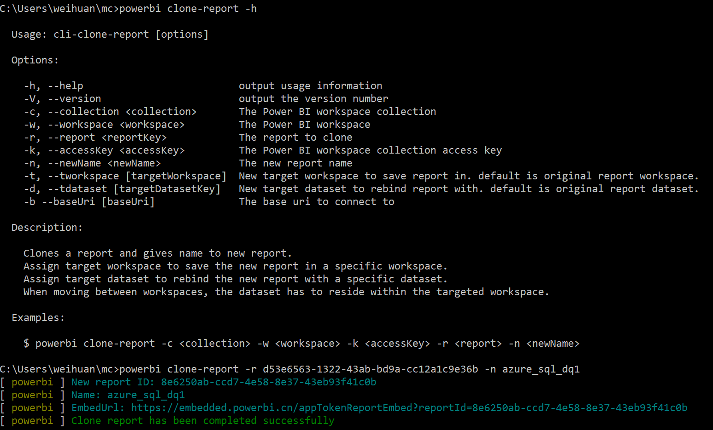

    powerbi clone-report -c <collection> -w <workspace> -k <accessKey> -r <report> -n <newName>

`clone-report` 命令用于给报表创建基于同一个数据集的拷贝。

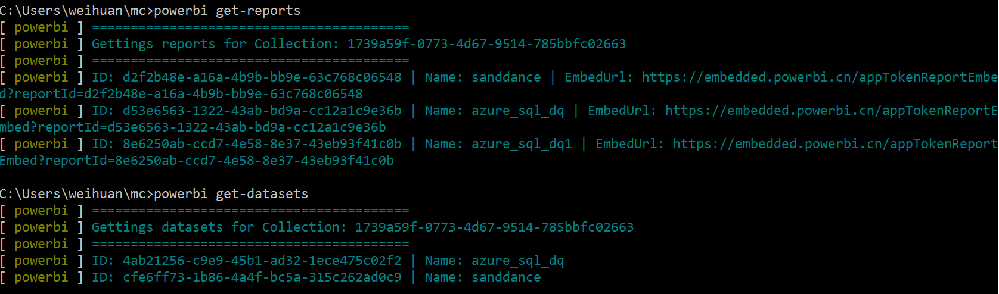

### rebind-report 命令

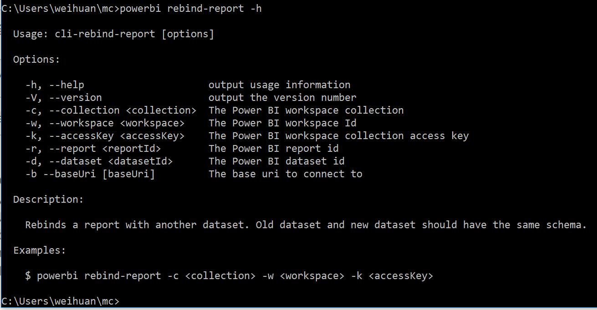

    powerbi rebind-report -c <collection> -w <workspace> -k <accessKey> -r <report> -d <dataset>

rebind-report 命令用于将某个 Power BI 报表绑定在另一个数据集上，但要求两个数据集具有相同的 schema。

在以下例子中，AzureSQL_top20.pbix 和 AzureSQL_bottom20.pbix 的内容分别是同一张表格的最前 20 行的数据和最后 20 行的数据，通过 `rebind-report` 命令，AzureSQL_top20.pbix 的 `report ID` 被绑在 AzureSQL_bottom20.pbix 的 `dataset ID` 上，相当于用 `clone-report` 命令将后者的 `report ID` 进行拷贝。

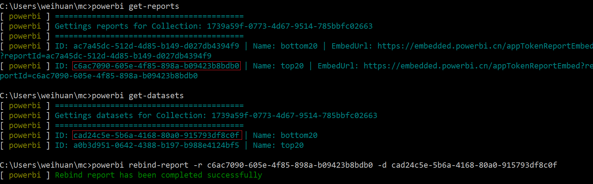

之后再将 AzureSQL_top20.pbix 的 `dataset ID` 删除，`report ID` 并没有受到影响。

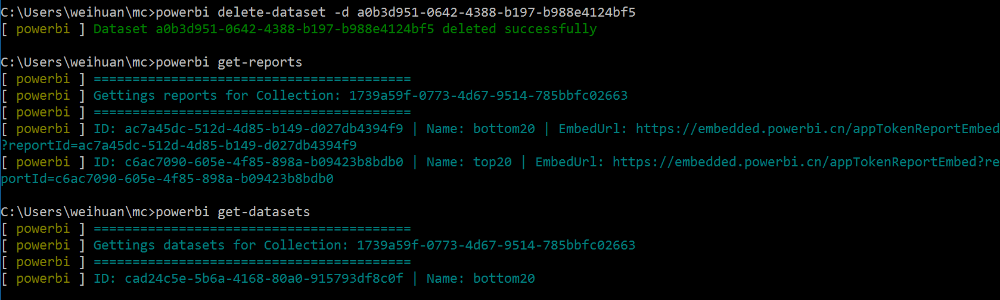

此命令开发的背景是由于 Power BI Embedded 的资费是基于会话(session)来定价的（详情参考 [Power BI Embedded](/pricing/details/power-bi-embedded/)），当一个 `report ID` 或 `dataset ID` 所生成的令牌被展示网页调用时，便是一个会话的开始。会话结束可以按用户关闭报表来算，也可以按启动会话一个小时后来算，以先发生者为准。

因此若客户希望浏览不同的数据集，且令牌生成是基于 `report ID` 的情况下，可以通过 `rebind-report` 命令将同一个 `report ID` 先后绑定在不同的 `dataset ID` 上，这样便可以在无需生成新的会话(一小时内)的前提下浏览更多的报表数据。
