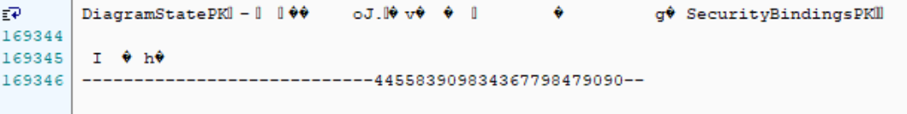

<properties
    pageTitle="PowerShell 脚本调用 Post Import 功能故障排查"
    description="PowerShell 脚本调用 Post Import 功能故障排查"
    service=""
    resource="powerbiembedded"
    authors="Stanley Huang"
    displayOrder=""
    selfHelpType=""
    supportTopicIds=""
    productPesIds=""
    resourceTags="Power BI Embedded, PowerShell, REST API, Post Import"
    cloudEnvironments="MoonCake" />
<tags
    ms.service="power-bi-embedded-aog"
    ms.date=""
    wacn.date="04/29/2017" />

# PowerShell 脚本调用 Post Import 功能故障排查

Power BI Embedded 支持多种发送 HTTP 请求调用 REST API 功能(参见 [REST Operations](https://msdn.microsoft.com/library/azure/mt711507.aspx) )，本文主要讨论的是对客户的 PowerShell 脚本调用 Post Import 功能中出现的故障进行排查。

### 客户运行 PowerShell 脚本，报 HTTP 411 错误

客户希望通过 PowerShell 调用 Post Import 功能，从而将 pbix 文件上传到 Power BI Embedded 的工作区中(参见[Post Import](https://msdn.microsoft.com/en-us/library/azure/mt711504.aspx))，但运行脚本的过程中出现报错。

客户的原始脚本如下：

    $url = "https://api.powerbi.cn/v1.0/collections/<workspace collection name>/workspaces/<workspace ID>/imports?datasetDisplayName=Sales"
    $bytes = [System.IO.File]::ReadAllBytes("D:\temp\RetailAnalysisSamplePBIX.pbix")

    [System.Net.WebRequest]$webRequest = [System.Net.WebRequest]::Create($url)
    $webRequest.Headers.Add("Authorization","AppKey <key>")
    $webRequest.ContentType = "multipart/form-data"
    $webRequest.Method = "POST"

    $reqStream = $webRequest.GetResponse()
    $reqStream.Write($bytes, 0, $bytes.Length)
    $reqStream.Flush()

其中 `<workspace collection name>` 指 Power BI Embedded 工作区集合名，`<workspace ID>` 指工作区 `ID`，`<key>` 指工作区密钥。

运行时报错如下：

    Exception calling "GetResponse" with "0" argument(s): "The remote server returned an error: (411) Length Re
    quired."
    At line:9 char:1
    + $reqStream = $webRequest.GetResponse()
    + ~~~~~~~~~~~~~~~~~~~~~~~~~~~~~~~~~~~~~~
        + CategoryInfo          : NotSpecified: (:) [], MethodInvocationException
        + FullyQualifiedErrorId : WebException

HTTP 411 错误指的是在没有定义 Content-Length 字段的情况下，服务器拒绝了 HTTP 请求。之所以出现这个故障，是因为客户仅设定将 pbix 文件的内容读入 $bytes 变量，却没有执行所需的编码过程，而且没有设定必须的 Boundary (参见[Forms](http://www.w3.org/TR/html401/interact/forms.html))，导致系统无法识别上传的文件。

### 修改客户脚本，运行时报 HTTP 500 错误

PowerShell 常用 `Invoke-RestMethod` 这个 cmdlet 来执行 HTTP 上传文件至 REST API。因此可将 PowerShell 脚本改写如下：

    $LF = "`r`n";
    $boundary = [System.Guid]::NewGuid().ToString();
    $url = "https://api.powerbi.cn/v1.0/collections/<workspace collection name>/workspaces/<workspace ID>/imports?datasetDisplayName=Sales"
    $CODEPAGE = "ISO-8859-1";

    $headers = New-Object "System.Collections.Generic.Dictionary[[String],[String]]";
    $headers.Add("Authorization", "AppKey <key>");

    $FileContent = [System.IO.File]::ReadAllBytes("D:\temp\RetailAnalysisSamplePBIX.pbix");
    $enc = [System.Text.Encoding]::GetEncoding($CODEPAGE);
    $fileEnc = $enc.GetString($FileContent);

    $body = ("--$boundary",
                "Content-Disposition: form-data; name=`"filename`", filename=`"RetailAnalysisSamplePBIX.pbix`"",
                "Content-Type: application/octet–stream$LF",
                $fileEnc,
                $LF,
                "--$boundary--",
                $LF) -join $LF;

    Invoke-RestMethod -ContentType "multipart/form-data" -Method POST -Uri $uri -Body $body -Headers $headers

相比客户的原始脚本，此脚本主要有以下几方面的变化：

1. 采用比较主流的 `Invoke-RestMethod` 这个调用 REST API 的命令。

2. 设定了 Boundary，使得系统得以识别上传的 pbix 文件。

3. 采用 HTTP 1.1 默认的 "ISO-8859-1" 编码方式对上传文件进行编码。

4. 构建了 Body 的结构，使其符合 Power BI Embedded 对 Post Import 内容的要求。

之后运行修改后的 PowerShell 脚本依旧不成功，报错信息如下：

    Invoke-RestMethod : {"Message":""}
    At line:21 char:1
    + Invoke-RestMethod -ContentType "multipart/form-data" -Method POST -Ur ...
    + ~~~~~~~~~~~~~~~~~~~~~~~~~~~~~~~~~~~~~~~~~~~~~~~~~~~~~~~~~~~~~~~~~~~~~
        + CategoryInfo          : InvalidOperation: (System.Net.HttpWebRequest:HttpWebRequest) [Invoke-RestMet
    hod], WebException
        + FullyQualifiedErrorId : WebCmdletWebResponseException,Microsoft.PowerShell.Commands.InvokeRestMethod
    Command

由于并无返回信息，给故障排查造成了一定困难。Fiddler 日志上的报错信息如下：

    HTTP/1.1 500 Internal Server Error
    Content-Length: 14
    Content-Type: application/json; charset=utf-8
    Server: Microsoft-HTTPAPI/2.0
    Strict-Transport-Security: max-age=31536000; includeSubDomains
    X-Frame-Options: deny
    X-Content-Type-Options: nosniff
    RequestId: 3f5f663d-a149-4401-ab81-6ee9859adb03
    Date: Wed, 26 Apr 2017 02:55:12 GMT
    Connection: close

    {"Message":""}

HTTP 500 错误指的是服务器遭遇异常而阻止了当前请求，其可能由多种原因引发，因此 Fiddler 日志对故障排查也并无帮助。

### 对比 Postman 成功案例，确定为 Body 构建错误。

首先，由于类似结构的 PowerShell 脚本可以执行其他 REST API 操作，因此首先排除 Uri 和 Header 有错误。

其次，执行编码的部分经排查，格式没有问题，故也排除此处有错误。

接着结合之前用 Postman 执行 Post Import 成功的案例(参见)，在进行了仔细比对后，发现问题出现在Body结构的构建上。

PowerShell-Body开头：

PowerShell-Body结尾：

Postman-Body开头：

Postman-Body结尾：

在对比二者差异并查阅了相关资料后，将脚本中 `$body` 的设定进行了修改，之后执行脚本成功返回了 Import ID，如下所示：

    $body = (   "--$boundary",
                "Content-Disposition: form-data; name=`"filename`", filename=`"RetailAnalysisSamplePBIX.pbix`"$LF",
                $fileEnc,
                "--$boundary--$LF"
                ) -join $LF;

    Invoke-RestMethod -ContentType "multipart/form-data" -Method POST -Uri $uri -Body $body -Headers $headers

    id
    --
    a4df89c6-ea24-490f-9284-06b77f26af48

### 经验总结

在本案例中，`Invoke-RestMethod` 是较为常见的调用 REST API 的 PowerShell cmdlet，然而在执行 Post Import 时的报错却没有具体信息，给故障排查造成了一定的困难，因此有必要结合之前成功的案例进行逐一对比排查，最终找出问题之所在，排除故障。

