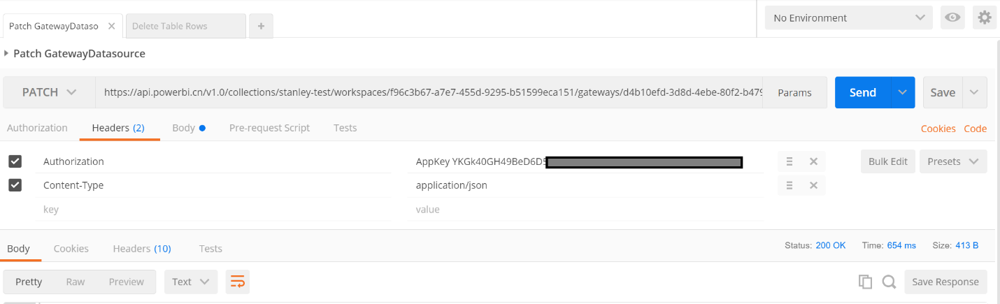
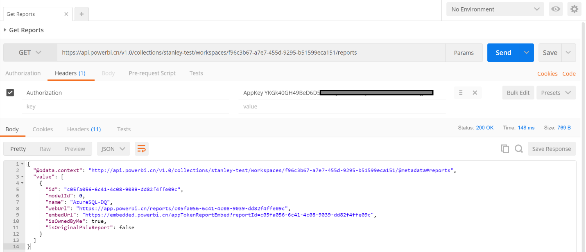

<properties
    pageTitle="Power BI Embedded 的工作流及相关 REST API 命令介绍"
    description="Power BI Embedded 的工作流及相关 REST API 命令介绍"
    service=""
    resource="powerbiembedded"
    authors="Stanley Huang"
    displayOrder=""
    selfHelpType=""
    supportTopicIds=""
    productPesIds=""
    resourceTags="Power BI Embedded, REST API"
    cloudEnvironments="MoonCake" />
<tags
    ms.service="power-bi-embedded-aog"
    ms.date=""
    wacn.date="03/28/2017" />

# Power BI Embedded 的工作流及相关 REST API 命令介绍

Power BI Embedded 服务使用 HTTP 请求实现对 REST API 的调用，完成创建Power BI 工作区，将 .pbix 报表文件导入工作区，数据源连接，在网页中进行身份验证和托管（嵌入）报表以及将报表嵌入网页等一系列动作。这些工作均可在 PowerBI-Cli 工具中完成，本文则主要介绍 Power BI Embedded 工作流所用到的 REST API 命令。

本文所采用的工具为 Postman V4.10.3 的 64 位版本。

- Power BI Embedded 的工作流可参考:[如何将 Power BI Embedded 与 REST 配合使用](/documentation/articles/power-bi-embedded-iframe/)
- Power BI Embedded 相关的 REST API 命令介绍可参考: [REST Operations](https://msdn.microsoft.com/zh-cn/library/azure/mt711507.aspx)
- PowerBI-Cli 工具介绍可参考: [PowerBI-Cli](https://github.com/Microsoft/PowerBI-cli)

## 前提

1. 已创建 Power BI Embedded 的工作区集合(workspace collection);
2. 已使用 Power BI Desktop 创建 .pbix 报表文件;
3. 已安装 Postman V4.10.3 版本(旧的版本在执行有些功能时会报错)。

## 参数

文中所提到的一些Uri参数含义如下:

    {collectionName}:  工作区集合名
    {Key}:  工作区集合密钥
    {workspaceID}:  工作区ID
    {datasetDisplayName}:  数据集名
    {importID}: 导入ID
    {datasetID}: 数据集ID
    {reportID}: 报表ID
    {createDateTime}: 创建导入的时间戳，格式如“2016-04-25T14:09:53.803”。
    {updatedDateTime}: 更新导入的时间戳，格式同上。
    {datasourceID}: 数据源ID
    {gatewayID}: 网关ID
    {userName}: 数据源的用户名
    {password}: 数据源的密码

## 工作流

Power BI Embedded 工作流的主要步骤如下:

1. 创建 Power BI 工作区集合并获取访问密钥（预配）
2. 使用 Power BI Desktop 创建 .pbix 文件
3. 创建 Power BI 工作区
4. 将 .pbix 文件导入工作区
5. 获取导入状态(GET Import)
6. 获取网关及数据源信息(Get BoundGatewayDatasources)
7. 更新数据源凭据(PATCH GatewayDatasource)
8. 获取嵌入URL和报表ID(GET Reports)
9. 创建令牌
10. 在Demo页面上展示

其中 **1** 和 **2** 分别在 Azure Portal 上和 Power BI Desktop 中完成，**9** 未包含在 [REST Operations](https://msdn.microsoft.com/zh-cn/library/azure/mt711507.aspx) 中，因此本文主要介绍其他步骤及相应的 REST API 命令。

## 创建 Power BI 工作区(POST Workspace)

    请求: POST http://api.powerbi.cn/v1.0/collections/{workspaceCollectionName}/workspaces
    标头: Authorization:  AppKey {Key}
    正文: 无
    返回内容:
    {
        "@odata.context":  "http://api.powerbi.cn/v1.0/collections/{workspaceCollectionName}/workspaces",
        Workspace {
                workspaceID: string
                workspaceCollectionName: string
                displayName: string
            }
    }

此命令在现有的工作区集合中创建新的工作区并返回所创建的工作区信息，等效于 PowerBI-Cli 工具中的 `powerbi create-workspace` 命令，其返回的 json 内容中的 `workspace ID` 将用于后续的 API 调用。

将 .pbix 文件导入工作区(POST Import)

    请求:  POST https://api.powerbi.cn/v1.0/collections/{collectionName}/workspaces/{workspaceID}/imports?datasetDisplayName={datasetDisplayName}
    标头:  Authorization:  AppKey {Key}
            Content-Type:  multipart/form-data
    正文:  Content-Disposition: form-data;
            name="filename";  filename="xxx.pbix"
    返回内容: 202 Accepted
    {
        "id": "{importID}"
    }

此命令将 .pbix 文件导入工作区并返回一个导入 ID，等效于 PowerBI-Cli 工具中的 `powerbi import` 命令。执行此命令后的 HTTP 返回状态为 `202 Accepted`，表示请求得到接受但未说明是否被执行，可根据返回的导入 ID 用 `Get Import` 命令获知导入状态。而当用 PowerBI-Cli 工具进行文件导入时，导入状态将直接在 `powerbi import` 命令执行时返回。

## 获取导入状态(GET Import)

    请求:  GET https://api.powerbi.cn/v1.0/collections/{collectionName}/workspaces/{workspaceID}/imports/{importId}
    标头:  Authorization:  AppKey {Key}
    正文:  无
    返回内容: 200 OK
    {
        "id":"{importID}",
        "importState":"Succeeded",
        "createdDateTime":"{createDateTime}",
        "updatedDateTime":"{updatedDateTime}",
        "reports":[
            {
                "id":"{reportID}",
                "name":"{datasetDisplayName} ",
                "webUrl":"https://app.powerbi.cn/reports/{reportID}",
                "embedUrl":"https://app.powerbi.cn/appTokenReportEmbed?reportId={reportID}"
            }
        ],
        "datasets":[{
            "id":"{datasetID}",
            "name":{datasetDisplayName},
            "tables":[],
            "relationships":[],
            "webUrl":"https://embedded.powerbi.cn/datasets/{datasetID}"}],
        "name":{datasetDisplayName}
    }

此命令用于根据 importID 查询导入情况，导入成功的话将返回以上的 json 内容，否则 `importState` 将为不同的状态(如 `Publishing` 或 `Failed`)。

导入的 .pbix 文件中不包含数据源的凭据。当导入的 .pbix 文件是由 DirectQuery 方式创建时(即文件中没有数据集，只有针对数据源的查询部分)，其数据源是通过数据源 ID 和网关 ID 来进行唯一标识的，因此需要先用 `GET BoundGatewayDatasources` 命令获取 .pbix 文件中的数据源 ID 及网关 ID，然后再用 `PATCH GatewayDatasource` 命令对数据源凭据进行更新。连续执行这两个命令等效于 PowerBI-Cli 工具中的 `powerbi update-connection` 命令。

## 获取网关及数据源信息(Get BoundGatewayDatasources)

    请求:  GET https://api.powerbi.cn/v1.0/collections/{collectionName}/workspaces/{workspaceID}/datasets/{datasetID}/Default.GetBoundGatewayDatasources
    标头:  Authorization:  AppKey {Key}
    正文:  无
    返回内容: 200 OK
    {
        "@odata.context": "http://api.powerbi.cn/v1.0/collections/{workspaceName}/workspaces/{workspaceID}/datasets/{datasetID}/$metadata#datasources",
        "value":[
            {
                “id”:“{datasourceID}”
                “gatewayId”:“{gatewayID}”
                “datasourceType”: string
                “connectionDetails”: string
                “credentialType”: string
            }
        ]
    }

此命令用于根据 `datasetID` 进行查询，获取其数据源的信息，其中包含数据源 ID 和网关 ID。当得到了这二者的值之后，可通过 `PATCH GatewayDatasource` 对数据源凭据进行更新。

## 更新数据源凭据(PATCH GatewayDatasource)

    请求:  PATCH https://api.powerbi.cn/v1.0/collections/{collectionName}/workspaces/{workspaceID}/gateways/{gatewayID}/datasources/{datasourceID}
    标头:  Authorization:  AppKey {Key}
                Content-Type: application/json
    正文:
    {
        "credentialType": "Basic",
        "basicCredentials": {
            "username": "{username}",
            "password": "{password}"
        }
    }
    返回内容:  200 OK

此命令用于更新数据源的凭据信息，当返回状态为 `200 OK` 时，表示凭据更新成功，上传的用 DirectQuery 方式创建的 .pbix 文件可在 demo 页面上显示。

>[AZURE.NOTE]如果用的是 Import 模式而非 DirectQuery 模式创建的 .pbix 文件，执行 `GET BoundGatewayDatasource` 命令也会返回 `gatewayID` 和 `datasourceID`，但执行 `PATCH GatewayDatasource` 命令会返回 `400 Bad Request` 的状态，如下所示:

## 获取嵌入 URL 和报表 ID(GET Reports)

    请求:  GET https://api.powerbi.cn/v1.0/collections/{collectionName}/workspaces/{workspaceID}/reports
    标头:  Authorization:  AppKey {Key}
    正文:  无
    返回内容:  200 OK
    {
        "@odata.context":"https://api.powerbi.com/v1.0/collections/{WorkspaceName}/workspaces/{WorkspaceID}/$metadata#reports",
        "value":[
            {
                "id":"{reportID}",
                "name":"{datasetDisplayName}",
                "webUrl":"https://app.powerbi.cn/reports/{reportID}",
                "embedUrl":"https://embedded.powerbi.cn/appTokenReportEmbed?reportId={reportID}"
            }
        ]
    }

此命令用于获取导入的 `reportID` 和 `embedURI`，等效于 PowerBI-Cli 工具中的 `powerbi get-reports` 命令。

## 创建令牌

创建令牌等效于 PowerBI-Cli 工具中的 `powerbi create-embed-token` 命令，由于其机制相对复杂，且不在 [REST Operations](https://msdn.microsoft.com/zh-cn/library/azure/mt711507.aspx) 中，故本文不予详述，具体内容可参考以下几个链接:

- 令牌的创建: [如何将 Power BI Embedded 与 REST 配合使用](/documentation/articles/power-bi-embedded-iframe/)

- 令牌的工作流:[通过 Power BI Embedded 进行身份验证和授权](/documentation/articles/power-bi-embedded-app-token-flow/)

在 Demo 页面上展示

当 reportID，embedURI 和令牌均已获得后，便可在进行报表的内嵌展示，以下是本文介绍的 AzureSQL_DQ.pbix 在官网 demo 页面 [Report Embed Sample](https://microsoft.github.io/PowerBI-JavaScript/demo/code-demo/index.html#) 上的展示效果:

## 其他的 REST API 命令

除了以上介绍的部分外，Power BI Embedded 所支持的其他 REST API 命令如下所示:

数据集和表格相关:

    Delete Dataset
    Delete Table Rows
    Get Datasets
    Get Dataset Schema
    Get Tables
    Post Datasets
    Put Table Schema

数据源相关:

    Get Datasources
    Post SetAllConnections

导入相关:

    Get Imports

工作区相关:

    Get Workspaces

具体内容参见: [REST Operations](https://msdn.microsoft.com/zh-cn/library/azure/mt711507.aspx)。
