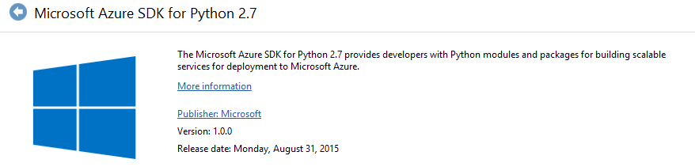
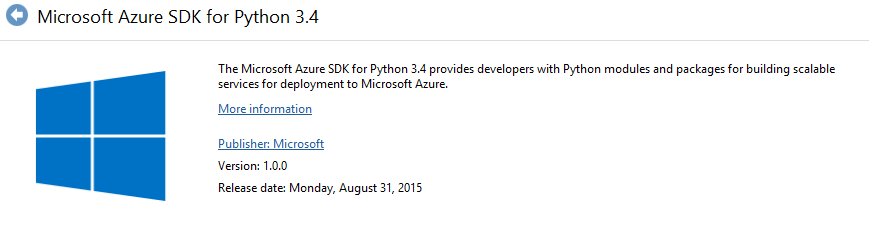
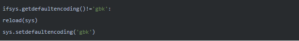
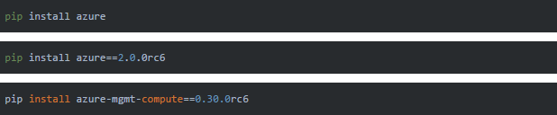
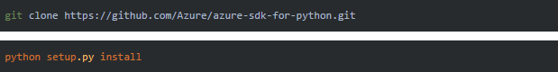

<properties 
	pageTitle="手动安装 Azure for Python SDK" 
	description="手动安装 Azure for Python SDK" 
	services="" 
	documentationCenter="" 
	authors=""
	manager="" 
	editor=""/>
<tags ms.service="na-aog" ms.date="" wacn.date="12/05/2016"/>
# 手动安装 Azure for Python SDK #

### 问题描述 ###

Windows 环境下搭建 Azure 的 Python 开发环境，由于需要最新的 API，因此需要安装新的 azure-sdk-for-python。
azure-sdk-for-python 已经发布了较多的版本，而[官网](/documentation/articles/python-how-to-install/)给出的 Windows 环境的 SDK 安装包都是老的版本：

因此，这种方式无法满足需要新 feature 的客户，因此我们只能进行手动安装。

### 解决方法 ###

解决 UnicodeDecodeError 报错：

1. 安装报错：
在 Windows 平台下，安装 python 模块时，报如下错误：
          UnicodeDecodeError: ‘ascii’ codec can’t decode byte 0xd7 in position 9: ordinal not in range(128)
2. 解决方法：
修改 mimetypes.py 文件，路径位于 python 的安装路径下的 <安装根目录>\Lib\mimetypes.py 文件。在 import 下添加如下几行：

 

手动安装两种方式：

1. pip 安装

 

 更多参考: [azure-sdk-for-python](https://github.com/Azure/azure-sdk-for-python)

2. 源码安装

 
 

