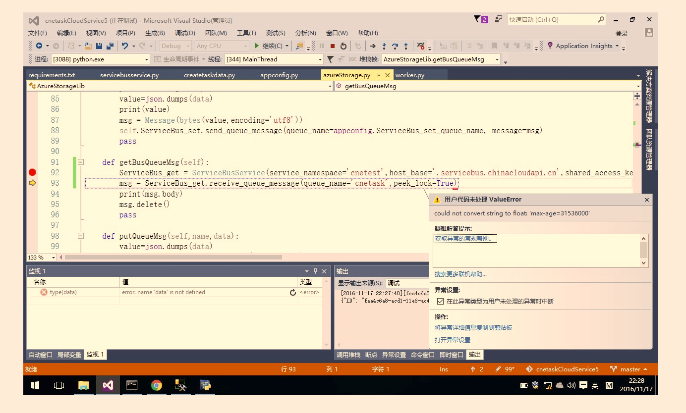

<properties
                pageTitle="使用 python 获取服务总线消息"
                description="通过更新解决 azure-servicebus v0.20.2 之前版本的问题"
                services="service-bus"
                documentationCenter=""
                authors=""
                manager=""
                editor=""
                tags="Python,service bus"/>

<tags
                ms.service="service-bus-aog"
                ms.date="12/15/2016"
                wacn.date="12/15/2016"/>

# 使用 python 获取服务总线消息

##问题描述  

通过 python 获取服务总线（Azure Service Bus ）的消息时发生报错。

**报错信息为：**  

报错信息为 : `could not convert string to float :'max-age=31536000'`。  

## 解决方法：  

更换 python 引用的 Service Bus SDK，这个问题发生在 `azure-servicebus V0.20.2` 版本以前，现在最新版本为 `V0.20.3` 版本，引用最新即可。  

**前提：** 

1. 搭建 python 环境。
2. 在 CMD 中使用 `pip` 命令引用 `azure-servicebus V0.20.3`。
3. 下载 Python Tools for Visual Studio 插件并安装。
  
**代码如下：**  

	from azure.servicebus import ServiceBusService, Message, Queue
	bus_service = ServiceBusService(
	    service_namespace='xhservicebus',
	    host_base='.servicebus.chinacloudapi.cn',
	    shared_access_key_name='RootManageSharedAccessKey',
	shared_access_key_value='TWJwaQugbYZfu3qnbgXIGNWSGayn1tq9pIXeN3MLRZE=')
	bus_service.create_queue('xuhuaq1')
	msg = Message(b'Test Message')
	bus_service.send_queue_message('xuhuaq1', msg)
	msg = bus_service.receive_queue_message('xuhuaq1')
	print(msg.body)

就可以正常的获取 Azure 服务总线队列里的消息。
