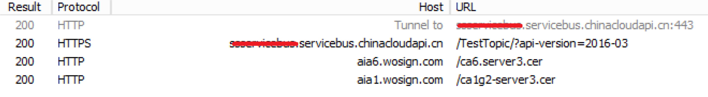

<properties 
	pageTitle="Azure Web 应用连接 Service Bus 出现证书错误的解决方案" 
	description="Azure Web 应用连接 Service Bus 出现证书错误的解决方案" 
	services="" 
	documentationCenter="" 
	authors=""
	manager="" 
	editor=""/>
<tags ms.service="service-bus-aog" ms.date="" wacn.date="11/23/2016"/>
# Azure Web 应用连接 Service Bus 出现证书错误的解决方案

##问题描述：

当使用 Web 应用连接 Service Bus 服务发送消息时发生证书错误，错误发生期间，用本地程序运行相同的代码则不会出现错误。

###示例代码：
 
    string connectionString = "servicebus connection string";
    
    var namespaceManager = NamespaceManager.CreateFromConnectionString(connectionString);
    
    if (!namespaceManager.TopicExists("TestTopic"))
    {
        namespaceManager.CreateTopic("TestTopic");
    }
    
    TopicClient client = TopicClient.CreateFromConnectionString(connectionString, "TestTopic");
    
    BrokeredMessage testMessage = new BrokeredMessage("test message");
    testMessage.MessageId = "message id";
    
    client.Send(testMessage);

###错误消息:

	The X.509 certificate CN=servicebus.chinacloudapi.cn, OU=Azure, O=Shanghai Blue Cloud Technology Co Ltd, L=Shanghai, S=Shanghai, C=CN is not in the trusted people store. 
	The X.509 certificate CN=servicebus.chinacloudapi.cn, OU=Azure, O=Shanghai Blue Cloud Technology Co Ltd, L=Shanghai, S=Shanghai, C=CN chain building failed. 
	The certificate that was used has a trust chain that cannot be verified. 
	Replace the certificate or change the certificateValidationMode. 
	A certificate chain could not be built to a trusted root authority.

###错误堆栈：

	at Microsoft.ServiceBus.Common.AsyncResult.End[TAsyncResult](IAsyncResult result)
	at Microsoft.ServiceBus.Messaging.IteratorAsyncResult`1.RunSynchronously()
	at Microsoft.ServiceBus.Messaging.MessageSender.OnSend(TrackingContext trackingContext, IEnumerable`1 messages, TimeSpan timeout)
	at Microsoft.ServiceBus.Messaging.MessageSender.Send(TrackingContext trackingContext, IEnumerable`1 messages, TimeSpan timeout)
	at Microsoft.ServiceBus.Messaging.MessageSender.Send(BrokeredMessage message)
	at Microsoft.ServiceBus.Messaging.TopicClient.Send(BrokeredMessage message)

##问题原因：

如果代码中不对 **ConnectivityMode** 做预先设置，service bus 客户端( web 应用)默认使用了 **AutoDetect 模式** 连接 service bus 服务。 **AutoDetect 会优先使用 TCP 连接模式**。由于 TCP 连接模式也是加密的，所以客户端需要首先验证 service bus 服务器证书 CN = servicebus.chinacloudapi.cn 的有效性，证书链信息在 SSL 协议的 server hello 消息中返回。

如果证书链中的某些中间证书没有安装在 web 应用实例上，web 应用需要发起额外的请求到 CA 服务器上下载中间证书并安装。
 
###Fiddler 日志示例:

当下面任何一种情况发生时，web 应用无法对 service bus 服务器证书建立信任的证书链，随后会报告上述的证书错误：

1. Web 应用实例和 CA 服务器之间存在网络问题，导致无法下载证书.
2. Web 应用实例无法成功安装证书，如权限问题等。

###解决方案：

我们推荐在代码中强制使用 HTTPS 模式连接 service bus 服务，HTTPS 模式有不同的设计，因此会很大程度上避免上述错误发生

	ServiceBusEnvironment.SystemConnectivity.Mode = ConnectivityMode.Https

> **注:**此设置是基于 app domain 层面的全局设置，如果访问 service bus 的代码都在同一个 app domain，那么只需要设置一次就可以。如果还有其他 app domain 中的代码访问 service bus 服务，则需要为各自的 app domain 分别调用上面的代码设置 HTTPS 模式。