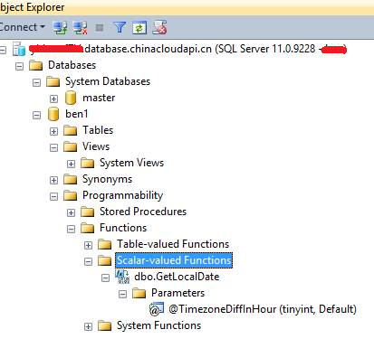
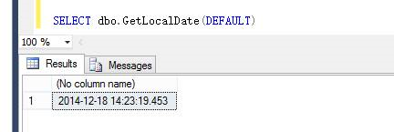

<properties
    pageTitle="如何修改 Azure SQL 数据库时区"
    description="如何将 Azure SQL 数据库时区修改为中国时间"
    service=""
    resource="sqldatabase"
    authors="Yu Tao"
    displayOrder=""
    selfHelpType=""
    supportTopicIds=""
    productPesIds=""
    resourceTags="SQL Database, UTC"
    cloudEnvironments="MoonCake" />
<tags
    ms.service="sql-database-aog"
    ms.date=""
    wacn.date="05/16/2017" />

# 如何修改 Azure SQL 数据库时区

Azure SQL Database 后台的虚拟机时间都是 UTC 时间，所以我们获取到的时间不是中国时间，由于用户并没有权限登录到虚拟机中去修改，所以只能使用以下方法：

1. 先创建一个自定义函数：

        CREATE FUNCTION [dbo].[GetLocalDate]
        (
            @TimezoneDiffInHour TINYINT = 8
            -- default set to 8 (GMT +8 = Beijing Timezone) 
        )
        RETURNS DATETIME
        AS
        BEGIN
            RETURN DATEADD(Hh, @TimezoneDiffInHour , GETUTCDATE())
        END

    

2. 执行该函数：

        SELECT dbo.GetLocalDate(DEFAULT)

    

查找所有 SQL 对象，将其中使用到的 getdate() 函数统一替换为 dbo.GetLocalDate(DEFAULT)。