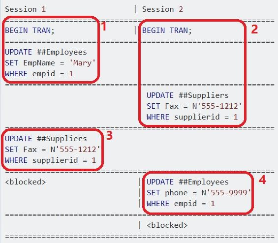
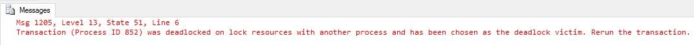
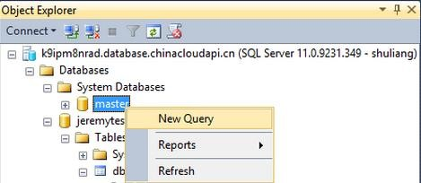
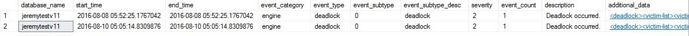
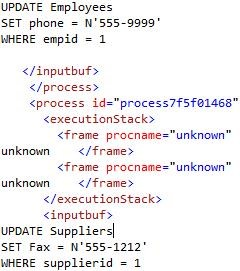
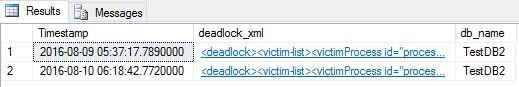

<properties 
	pageTitle="如何查看 SQL Azure 数据库死锁 (DB POD)" 
	description="如何查看 SQL Azure 数据库死锁 (DB POD)" 
	services="sql-database" 
	documentationCenter="" 
	authors=""
	manager="" 
	editor=""/>
<tags ms.service="sql-database-aog" ms.date="" wacn.date="08/31/2016"/>
# 如何查看 SQL Azure 数据库死锁 (DB POD)

>前言：对于 SQL Server on premise 来说, 我们可以 enable trace flag 1222 或者 1205，然后死锁的信息就会被打印到 error log 中，我们就可以进行进一步的分析。
但是对于 SQL Azure 来说，由于权限的问题，用户没有办法直接访问 SQL Azure 的 error log, 这篇文章的目的就是介绍如何查看 SQL Azure中 的数据库死锁的情况。


## V11：
对于 V11 版本的数据库，我们可以通过查看 sys.event_log 来查看死锁的具体信息。下面详细介绍查看死锁信息的主要步骤：

1. 首先我们来模拟一个死锁，创建两张名为 Employees 和 Suppliers 的表，并插入几条数据：


		CREATE TABLE Employees (
		    EmpId INT IDENTITY primary key,
		    EmpName VARCHAR(16),
		    Phone VARCHAR(16)
		)
		GO
		
		INSERT INTO Employees (EmpName, Phone)
		VALUES ('Martha', '800-555-1212'), ('Jimmy', '619-555-8080')
		GO
		
		CREATE TABLE Suppliers(
		    SupplierId INT IDENTITY primary key,
		    SupplierName VARCHAR(64),
		    Fax VARCHAR(16)
		)
		GO
		
		INSERT INTO Suppliers (SupplierName, Fax)
		VALUES ('Acme', '877-555-6060'), ('Rockwell', '800-257-1234')
		GO


2. 然后在 SSMS 中开启两个空的查询窗口，把 Session 1 下面的代码放到一个查询窗口，把 Session 2 下面的代码放到另外一个查询窗口，然后按照下图的顺序执行：


	


3. 通过步骤 1、2 我们会收到一个 Msg 1205 报错，显示其中一个事务完成，另外一个事务被选为 Deadlock Victim.

	

4. 我们对 Master 数据库新建一个查询。  
	>[AZURE.NOTE]由于 sys.event_log 有大概十分钟左右的延迟，所以请在十分钟后在执行查询。

	

	运行如下查询将得到发生在这个数据库上面的所有死锁的信息：

	```sql
	select* from sys.event_log
	where database_name='YourDatabaseDame' 
	and event_subtype_desc='deadlock'
	```


	

	关于某一个死锁的具体信息，可以通过点击 additional_data 列下面的链接来查看。我们找到刚才发生的死锁，点击查看详情：


	

	从详细的 XML 文件中，我们可以看出导致死锁发生的语句。有了这些信息，我们就可以进一步分析死锁发生的原因，进而解决这个问题或避免此问题再次发生。

## V12：

对于 V12 版本的数据库，我们可以通过运行如下语句来查询死锁信息，死锁的模拟可以参照上文中 V11 部分所述来完成。

>[AZURE.NOTE]V12 的死锁信息也会有一些延迟，所以刚发生的死锁可能需要等待 10 分钟左右才能看到。


	WITH CTE AS (
	       SELECT CAST(event_data AS XML)  AS [target_data_XML] 
	   FROM sys.fn_xe_telemetry_blob_target_read_file('dl', null, null, null)
	)
	SELECT target_data_XML.value('(/event/@timestamp)[1]', 'DateTime2') AS Timestamp,
	target_data_XML.query('/event/data[@name=''xml_report'']/value/deadlock') AS deadlock_xml,
	target_data_XML.query('/event/data[@name=''database_name'']/value').value('(/value)[1]', 'nvarchar(100)') AS db_name
	FROM CTE 

得到的结果如下：



可以通过点击 deadlock_xml 列下面的链接来查看某个死锁的具体信息，同样可以看到和 V11 中类似的死锁的具体信息，从而进行后续的分析和排查。


