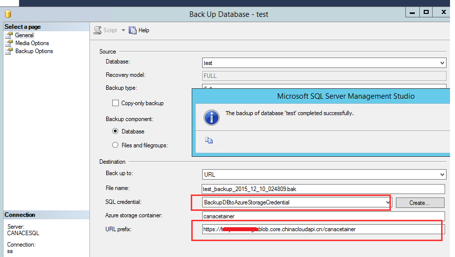

<properties
    pageTitle="SQL Server 如何将数据库备份到 Azure Storage"
    description="SQL Server 如何将数据库备份到 Azure Storage"
    service=""
    resource=""
    authors="Yu Tao"
    displayOrder=""
    selfHelpType=""
    supportTopicIds=""
    productPesIds=""
    resourceTags="SQL Server, Storage, Backup"
    cloudEnvironments="MoonCake" />
<tags
    ms.service="sql-server-aog"
    ms.date=""
    wacn.date="05/16/2017" />

# SQL Server 如何将数据库备份到 Azure Storage

打开本地的 SQL Server Management Studio。首先创建 Credentials。命令如下：

    IF NOT EXISTS
    (SELECT * FROM sys.credentials
    WHERE credential_identity = 'BackupDBtoAzureStorageCredential')
    CREATE CREDENTIAL BackupDBtoAzureStora
    geCredential WITH IDENTITY = '[存储账号名称]'
    ,SECRET = '[存储账号密钥]' ;

如果需要删除 Credential，我们可以通过命令：

    DROP CREDENTIAL [CredentialName]

可用如下两种方法实现：

1. 执行以下 T-SQL 语句，如下:

        declare @url varchar(256)
        set @url= 'https://xxxxx.blob.core.chinacloudapi.cn/dbcontainer/'+ CONVERT(nvarchar(8), GETDATE(), 112)+ '-AdventureWorks2008.bak'
        BACKUP DATABASE testDB
        TO URL = @url
            WITH CREDENTIAL = 'BackupDBtoAzureStorageCredential'
            ,COMPRESSION
            ,STATS = 5;

2. 利用 SSMS 中 “Back Up Database”

    右击数据库，在任务中选择 “Back Up Database”,选择您创建的 credentials，修改 globalUrl 为存储容器 URL,结果如下图：

    