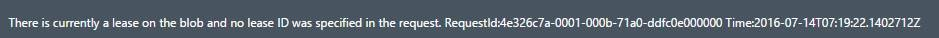

<properties 
	pageTitle="Page Blob 文件释放租约工具" 
	description="通过 Page Blob 文件释放租约工具解决删除 Page Blob 文件被占用的问题" 
	service=""
	resource="storage"
    authors=""
    displayOrder=""
    selfHelpType=""
    supportTopicIds=""
    productPesIds=""
    resourceTags="Page Blob,lease ID"
    cloudEnvironments="MoonCake" 
/>
<tags 
    ms.service="storage-blob-aog"
    ms.date="" 
    wacn.date="01/12/2017"
/>
# Page Blob 文件释放租约工具

## **问题描述**

有些情况下，我们删除 Page Blob 文件会报告以下错误：

## **解决方法**

从[这里](https://github.com/hello-azure/pageblob-breaklease/)下载工具。
语法格式：

	breaklease <accountName> <accountKey> <page blob url>
	 
	breaklease portalvhds70gssrgbwgbn3 dvxTERq99Ws8EkGbmRK4VThrclJ2THAK1gd051gFK9z6k29NR4L51BFrm5Q4NPJt7qUKRwq33nMSlRjpAX1BnA== https://portalvhds70gssrgbwgbn3.blob.core.chinacloudapi.cn/vhds/team-server-team-server-0530-1.vhd

## **测试示例**

1.	测试删除一个挂载的磁盘，由于该磁盘被占用，删除会报告以下错误：
	 
	
	
 
2.	运行工具，执行：
	
		breaklease portalvhds70gssrgbwgbn3 dvxTERq99Ws8EkGbmRK4VThrclJ2THAK1gd051gFK9z6k29NR4L51BFrm5Q4NPJt7qUKRwq33nMSlRjpAX1BnA== https://portalvhds70gssrgbwgbn3.blob.core.chinacloudapi.cn/vhds/team-server-team-server-0530-1.vhd

	释放租约成功后，成功删除文件：
 
	

