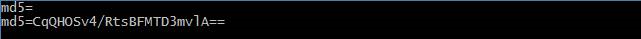
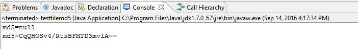

<properties
	pageTitle="如何调用 API 获取 Azure 文件存储中文件的 MD5 "
	description="Azure storage file中api获取不到MD5的问题解释。"
	services="storage"
	documentationCenter=""
	authors=""
	manager=""
	editor=""
	tags="File存储,Blob存储,MD5,API"/>

<tags
	ms.service="storage-aog"
	ms.date="10/28/2016"
	wacn.date="10/28/2016"/>

# 如何调用 API 获取 Azure File 存储中文件的 MD5值 #

**问题：** 如何调用 API 获取 Azure File 存储中文件的 MD5值

**现象：** 文件以 Blob 形式存储，可以通过调用 API 获取其 MD5 值。而如果文件存储在 File 存储中时，通过 API 获取到的 MD5 值为空 

1. NET SDK 测试：

	测试代码：

			//file 文件测试
			String filePath1 = "E:\\Background\\linux-087.jpg";
			CloudFile cloudFile1 = rootDir.GetFileReference("image-03.jpg");
			cloudFile1.UploadFromFile(filePath1,FileMode.OpenOrCreate);   
			Console.WriteLine("md5="+cloudFile1.Properties.ContentMD5);
			
			//blob 文件测试
			CloudBlobClient blobClient = storageAccount.CreateCloudBlobClient();
			CloudBlobContainer container = blobClient.GetContainerReference("file");
			CloudBlockBlob blob = container.GetBlockBlobReference(@"image-03.jpg");
			blob.UploadFromFile(filePath1, FileMode.OpenOrCreate);
			Console.WriteLine("md5=" + blob.Properties.ContentMD5);

	测试结果：

	

2. JAVA SDK 测试：

	测试代码：	

    		//file 文件测试
    		final String filePath = "E:\\Background\\linux-087.jpg";
    		CloudFile cloudFile = rootDir.getFileReference("image-04.jpg");
    		cloudFile.uploadFromFile(filePath); 
    		System.out.println("md5="+cloudFile.getProperties().getContentMD5());
    		
    		//blob 文件测试
    		CloudBlobClient blobClient = account.createCloudBlobClient();
    		CloudBlobContainer container = blobClient.getContainerReference("file");
    		CloudBlockBlob blobFile = container.getBlockBlobReference("image-04.jpg");
    		blobFile.uploadFromFile(filePath);
    		System.out.println("md5="+blobFile.getProperties().getContentMD5());
 
	 测试结果：

	

**问题原因：** 由于文件存储本身应用形式为磁盘，而文件的一些更新等动作会导致 MD5 重新计算，这对于磁盘性能影响较大，因此暂不支持 MD5 自动生成。而 Blob 本身而言并不支持修改操作，文件的 MD5 值相对稳定。详细请参考[这篇文章](/documentation/articles/storage-dotnet-how-to-use-files/#develop-with-file-storage)。

**解决方法：** 如果一定要使用这种特性，建议考虑 Blob Storage 或者手动方式计算文件的 MD5。

