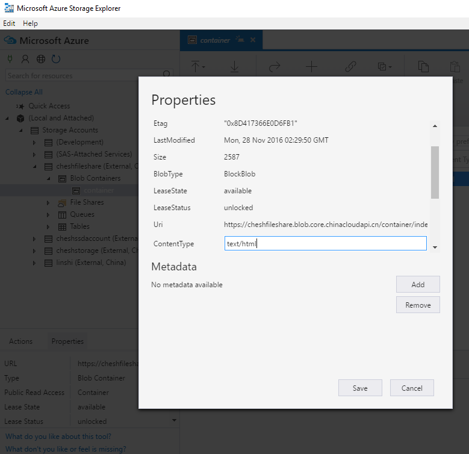

<properties
                pageTitle="如何配置 Azure Blob 存储中文件的互联网媒体类型"
                description="配置 Azure Blob 存储中文件的互联网媒体类型以避免被点击时反复下载"
                services="storage"
                documentationCenter=""
                authors=""
                manager=""
                editor=""
                tags="存储,Blob,互联网媒体类型,MIME,AzCopy, Azure Storage Explorer"/>

<tags
                ms.service="storage-aog"
                ms.date="12/15/2016"
                wacn.date="12/15/2016"/>

# 如何配置 Azure Blob 存储中文件的互联网媒体类型

### Azure Blob 存储 ###

Azure Blob 存储是一种将非结构化数据作为对象 / Blob 存储在云中的服务。Blob 存储可以存储任何类型的文本或二进制数据，例如文档、媒体文件或应用程序安装程序。

### 理解互联网媒体类型 ###

互联网媒体类型（Internet Media Type，也称 MIME 类型或内容类型）是给互联网上传输的内容赋予的一种两段式的分类类型。一个文件的互联网媒体类型与其后缀名相对应。互联网媒体类型的分类标准由 [IANA](https://www.iana.org/) 发布，最初在 [RFC](http://www.ietf.org/rfc.html) 2045 中被定义，当时仅用于使用 SMTP 协议的电子邮件中。现在在其他协议（如 HTTP 或 SIP ）中也常使用互联网媒体类型。  
一个互联网媒体类型至少包含两个部分：一个类型（ Type ）和一个子类型（ Subtype ）。此外，它还可以包括一个或多个可选参数。比如，HTML 文件的互联网媒体类型可能是 `text/html; charset = UTF-8`  
在该例中，文件类型为 `text`，子类型为 `html`，而 `charset` 是一个可选参数，其值为 `UTF-8`。

### 为何要关注互联网媒体类型 ###

浏览器通过互联网媒体类型这个参数决定对某些文件的处理方式，比如下载 `application/octet-stream` 类型的文件，调用播放器打开 `video/mpeg` 类型的文件等。错误的互联网媒体类型可能会使浏览器错误地处理文件，例如下载本应该直接打开的视频文件，或报出 `“Error: Unsupported video type or invalid file path” `等错误。

### Azure Blob 存储中的互联网媒体类型的实现 ###

Azure Blob 存储支持大部分常见的互联网媒体类型，并将媒体类型配置在文件的内容类型（ content type ）字段里。当一个文件被上传至 Azure Blob 存储时，如果没有特别设置内容类型，Azure 存储默认会给该文件赋予 `application/octet-stream` 二进制文件的内容类型。

### 如何在上传时自动设置正确的内容类型 ###

目前，通过 Azure 存储传输工具 [AzCopy](/documentation/articles/storage-use-azcopy/) 或管理工具 Azure Storage Explorer（[Windows](http://go.microsoft.com/fwlink/?linkid=698844&clcid=0x804)/[Mac](http://go.microsoft.com/fwlink/?linkid=698845&clcid=0x804)）上传到 Blob 存储的文件都会通过分析文件的后缀名，被自动加上正确的内容类型。如果需要通过客户自定义代码上传文件，可以引用 .Net Framework 4.5 BCL 库中的 [System.Web.MimeMapping](https://msdn.microsoft.com/zh-cn/library/system.web.mimemapping.getmimemapping.aspx) 类，或在代码中加入[ MIME 类型词典](https://github.com/samuelneff/MimeTypeMap)进行媒体类型的判断（三方代码，仅供参考）。

### 如何更改已上传的文件内容类型 ###

可以安装 Azure Storage Explorer（[Windows](http://go.microsoft.com/fwlink/?linkid=698844&clcid=0x804)/[Mac](http://go.microsoft.com/fwlink/?linkid=698845&clcid=0x804)），登录存储账号，找到文件，使用右键菜单的属性来更改内容类型。

>[AZURE.NOTE] Azure Storage Explorer 在 `0.8.6` 及以上版本才有修改 Blob 及文件的属性的功能。如发现无法修改 Blob 属性，请升级至最新版。

对于一个 Blob 容器内所有文件的批处理，可以参考 PowerShell 脚本 [How to batch change the content type of Microsoft Azure blob storage(PowerShell)](https://gallery.technet.microsoft.com/How-to-batch-change-the-47e310b4)。

### 改好文件的媒体类型后，浏览器仍然提示下载或报错 ###

请清空浏览器的缓存，或更换未访问过该文件的浏览器再试。

