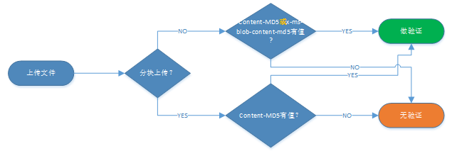
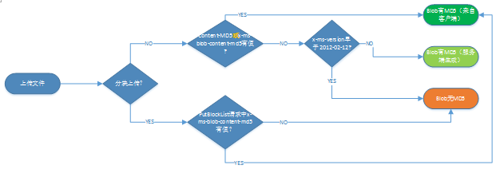

<properties
    pageTitle="Azure Blob 存储基于 MD5 的完整性检查"
    description="Azure Blob 存储如何通过 MD5 检查上传文件完整性"
    service=""
    resource="sotrage"
    authors="Allan Li"
    displayOrder=""
    selfHelpType=""
    supportTopicIds=""
    productPesIds=""
    resourceTags="Sotrage Blob, MD5"
    cloudEnvironments="MoonCake" />
<tags
    ms.service="storage-aog"
    ms.date=""
    wacn.date="04/18/2017" />

# Azure Blob 存储基于 MD5 的完整性检查

在上传文件或者其他二进制内容到 Azure Blob 存储时，可以利用请求中的 MD5 值来验证内容的完整性，而上传成功后的 Blob 属性里面也会包含 MD5 这个属性，以用作后续的验证。但是有时候会出现 Blob 属性里 MD5 值为空的情况，或者本地文件产生的 MD5 值跟存储里对应 Blob 里的 MD5 值不匹配的情况，这篇文章将详细讲述 Azure Blob 存储里 MD5 值的来龙去脉。

## 分析

首先，完整性的检查是基于当前 REST 请求的，也就是说只会对当前上传内容进行 MD5 值的计算和对比，因为 REST API 是无状态的。

然后，基于 MD5 的完整性检查的工作过程是这样的：

1. 计算当前上传内容得出 MD5 值
2. 在当前上传文件的 REST 请求头部（Content-MD5）中设置该 MD5 值
3. 服务端根据当前请求里的内容计算 MD5，并对比请求头部中的 MD5 值
4. 相同则验证成功，并将该 MD5 值赋予 Blob 的 MD5 属性，否则失败。

最后，上传到 Azure Blob 支持两种方式，整体上传和分块上传。如果上传内容比较小，比如小于 128MB，就可以采用整体上传方式，一个请求就完成。但如果内容很大，比如几个 GB，那么就需要分块上传，这个时候上传就分为了多个请求，每个请求只上传部分内容，这样可以保证更高的效率和成功率。

如果是整体上传，实际是调用 [PutBlob](https://docs.microsoft.com/zh-cn/rest/api/storageservices/fileservices/put-blob) 请求，这个时候上传的内容就是文件的完整内容，因此完全符合前面描述的 MD5 完整性检查工作过程，也就是最终既会做验证，blob 也会有 MD5 值。

但如果是分块上传，实际是多个 [PutBlock](https://docs.microsoft.com/zh-cn/rest/api/storageservices/fileservices/put-block-list) 请求加上一个 [PutBlockList](https://docs.microsoft.com/zh-cn/rest/api/storageservices/fileservices/put-block-list) 请求组成。每个 PutBlock 请求只上传部分内容，因此这类请求里面的 MD5 只可能是针对当前上传的内容，而且不能作为最终 blob 的 MD5 值。而 PutBlockList 请求的内容是一个列表，包含前面所有上传 Block 的标识，因此这个请求里的 MD5 值也只能是对这个列表做完整性检查。但是所有这些请求都验证成功时可以保证内容的完整性。所以验证是有的，但 blob 没有 MD5 值。目前出于性能的考虑，Storage 服务端不会去汇总前面请求里的所有 block 的内容来计算整个 blob 的 MD5 值，但提供了一个特殊的请求头部 x-ms-blob-content-md5，服务端会将该头部属性值设置为 blob 的 MD5 值。因此客户端只要在最终的 PutBlockList 请求里设置了整个内容的 MD5 值到 x-ms-blob-content-md5，那么就保证了验证，blob 也有了 MD5 值。所以分块上传基于 MD5 的完整性检查的工作过程是：

1. 将上传文件分成多块
2. 将每一块以 PutBlock 请求发送，并计算当前块的 MD5 值设置到 Content-MD5 头部
3. 当所有块都发送完成后，发送 PutBlockList 请求

    1. 计算整个上传文件的 MD 值并设置到 x-ms-blob-content-md5 头部
    2. 将前面发送的块的标识组成列表作为请求的内容
    3. 计算块标识列表的 MD5 值设置到 Content-MD5 头部

5. 对于所有请求，服务端根据当前请求里的内容计算 MD5，并对比请求头部中的 Content-MD5 值，相同则验证成功
6. 然后将 PutBlockList 请求里的 x-ms-blob-content-md5 的值赋予 Blob 的 MD5 属性

## 总结

### 如何判断是否做完整性验证？

取决于请求的头部 Content-MD5，有则验证，否则无验证。
注意：
1. PutBlob 请求里面 Content-MD5 和 x-ms-blob-content-md5 效果一样。
2. 分块上传发送 PutBlockList 请求时，如果把整个文件内容的 MD5 值设置给了 Content-MD5，那么会验证报错。因为 Content-MD5 只用于当前请求内容的验证。

### 如何判断 Blob 是否包含 MD5 值？

整体上传时，如果当前请求的 x-ms-version 大于等于 2012-02-12，那么即使客户端没有设置 MD5 值，服务端也会自行计算并赋予 Blob MD5 属性。

分块上传时，就取决于 x-ms-blob-content-md5 是否有值。

