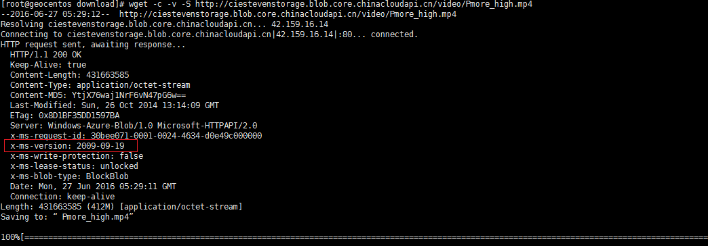

<properties
	pageTitle="关于 wget 下载 Blob 文件如何断点续传"
	description="关于 wget 下载 Blob 文件如何断点续传。"
	services="storage"
	documentationCenter=""
	authors=""
	manager=""
	editor=""
	tags="wget,blob文件,断点续传"/>

<tags
	ms.service="storage-aog"
	ms.date="10/28/2016"
	wacn.date="10/28/2016"/>

# 关于 wget 下载 Blob 文件如何断点续传 #

**问题：**
Linux 环境下使用 wget 命令下载 Blob 文件断点续传问题

**现象：**
使用 wget 下载 blob 文件时，如果遇到中断后重新执行下载命令，会重新下载。下载非 blob 文件，会从断点处继续下载：

**问题原因：** 
`wget –c` 通过 http range 实现断点续传功能。Storage  是基于 REST HTTP 构建的，但是随着架构不断更替，REST 版本也在不断升级。我们通过打印 `wget –c` ，得到服务器端的回应，发现发起的 http 请求默认是基于早期的 REST 版本的(2009-09-19)，而这个版本及更早的版本是不支持 range 请求格式 “[offset]-”的，因此导致我们无法根据 range 来实现断点续传。更多详细请阅读[这篇文章](https://msdn.microsoft.com/zh-cn/library/dd894041.aspx "https://msdn.microsoft.com/zh-cn/library/dd894041.aspx")。 

**解决方法：**
通过加参数 `--header "x-ms-version: 2015-04-05"`，指定 REST HTTP 请求版本：

