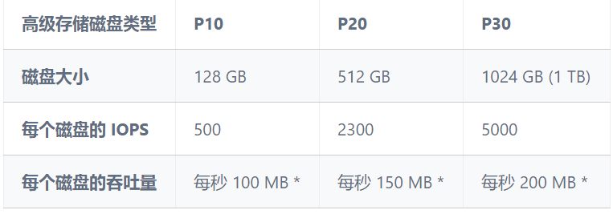

<properties
    pageTitle="使用fio工具对Azure存储进行IOPS测试"
    description="介绍如何使用fio工具对Azure存储进行IOPS测试。"
    services="storage"
    documentationCenter=""
    authors=""
    manager=""
    editor=""
    tags=""/>

<tags
    ms.service="storage-aog"
    ms.date="10/27/2016"
    wacn.date="11/03/2016"/>

# 使用 fio 工具对 Azure 存储进行 IOPS 测试
 

fio 是用来测试磁盘 IOPS 的工具，具有安装简单，测试方法灵活、方便的特点。 
本例，我将使用 fio 对 Azure 高级存储磁盘进行 IOPS 测试。

**测试环境：**

	[root@DS13IOTEST ~]# cat /etc/redhat-release
	CentOS release 6.5 (Final)
	[root@DS13IOTEST ~]# uname -a
	Linux DS13IOTEST 2.6.32-431.29.2.el6.x86_64 #1 SMP Tue Sep 9 21:36:05 UTC 2014 x86_64 x86_64 x86_64 GNU/Linux
	 
	[root@DS13IOTEST ~]# fio --version
	fio-2.1.10
	 
	[root@DS13IOTEST ~]# modinfo hv_vmbus
	filename:       /lib/modules/2.6.32-431.29.2.el6.x86_64/weak-updates/microsoft-hyper-v/hv_vmbus.ko
	version:        4.1.2
	license:        GPL
	srcversion:     82B9AE7A2B6BFE26B1AC6A4
	alias:          acpi*:VMBus:*
	alias:          acpi*:VMBUS:*
	depends:
	vermagic:       2.6.32-431.el6.x86_64 SMP mod_unload modversions
	 
	[root@DS13IOTEST ~]# df -T
	Filesystem     Type   1K-blocks    Used  Available Use% Mounted on
	/dev/sda1      ext4    30962684 2745376   26644496  10% /
	tmpfs          tmpfs   28913628       0   28913628   0% /dev/shm
	/dev/sdb1      ext4   115596768  192120  109532680   1% /mnt/resource
	/dev/sdc1      ext4   528444416  202520  501398488   1% /datadrive512G
	/dev/sdd1      ext4  1055860904  204056 1002022244   1% /datadrive1023G
 
**测试脚本下载：**[https://azuresupport.blob.core.windows.net/linux/fio.sh.tar.gz](https://azuresupport.blob.core.windows.net/linux/fio.sh.tar.gz)

根据Azure高级存储磁盘的说明，当前Azure共有三种高级存储：P10, P20, P30。 这三者是怎么区分的呢？ 实际上，Azure根据磁盘的大小来划分该磁盘所属的性能类型。

高级存储磁盘性能类型如下：

我们知道，通过 Portal 来添加高级存储磁盘， 其大小一般只有三种：128GB，512GB，1023GB。但如果我们通过命令的方式来添加磁盘，则磁盘大小是可以任意的（不超过当前最大的1T限制）。那么，当用户添加了一块129G的高级存储磁盘，其性能是属于 P10，还是 P20 呢？原来，Azure 在划分高级存储磁盘所属的性能类型时，采用的是向上舍入 (round up) 的方式。这样 10GB 的磁盘，其性能指标属于 P10， 129GB 的磁盘，其性能指标属于 P20，1000GB 的磁盘其性能指标属于P30

以下是使用测试脚本对 P20, P30 及 Raid0 所做的 IOPS 测试

P20 测试:

	[root@DS13IOTEST ~]# ./fio.sh /datadrive512G >p20_fio_report  
	 
	[root@DS13IOTEST ~]# cat p20_fio_report | grep -i iops
	  write: io=282164KB, bw=9385.8KB/s, iops=2346, runt= 30063msec
	  write: io=281960KB, bw=9382.1KB/s, iops=2345, runt= 30053msec
	  write: io=281804KB, bw=9377.9KB/s, iops=2344, runt= 30050msec
	  read : io=141200KB, bw=4691.7KB/s, iops=1172, runt= 30096msec
	  write: io=141248KB, bw=4693.3KB/s, iops=1173, runt= 30096msec
	  read : io=141196KB, bw=4692.4KB/s, iops=1173, runt= 30091msec
	  write: io=141248KB, bw=4694.3KB/s, iops=1173, runt= 30091msec
	  read : io=141200KB, bw=4692.2KB/s, iops=1173, runt= 30093msec
	  write: io=141248KB, bw=4693.8KB/s, iops=1173, runt= 30093msec
 
p30 测试：  

	[root@DS13IOTEST ~]# ./fio.sh /datadrive1023G >p30_fio_report 
	 
	[root@DS13IOTEST ~]# cat p30_fio_report | grep -i iops
	  write: io=524288KB, bw=20405KB/s, iops=5101, runt= 25694msec
	  write: io=524288KB, bw=20399KB/s, iops=5099, runt= 25702msec
	  write: io=524288KB, bw=20394KB/s, iops=5098, runt= 25708msec
	  read : io=262544KB, bw=10222KB/s, iops=2555, runt= 25685msec
	  write: io=261744KB, bw=10191KB/s, iops=2547, runt= 25685msec
	  read : io=262544KB, bw=10223KB/s, iops=2555, runt= 25682msec
	  write: io=261744KB, bw=10192KB/s, iops=2547, runt= 25682msec
	  read : io=262544KB, bw=10224KB/s, iops=2556, runt= 25678msec
	  write: io=261744KB, bw=10193KB/s, iops=2548, runt= 25678msec
 
新增两块盘 sde(512G）,sdf（1023G) 做 raid 0测试：
 
	[root@DS13IOTEST ~]# yum -y install mdadm
	[root@DS13IOTEST ~]#  mdadm --create /dev/md512 --level 0 --raid-devices 2 /dev/sdc1 /dev/sde1
	[root@DS13IOTEST ~]#  mdadm --create /dev/md1023 --level 0 --raid-devices 2 /dev/sdd1 /dev/sdf1
	 
	[root@DS13IOTEST /]# mount -O barrier=0 /dev/md512 /raid0_datadrive512G
	[root@DS13IOTEST ~]# ./fio.sh /raid0_datadrive512G > raid0_p20_fio_report
	[root@DS13IOTEST ~]# cat raid0_p20_fio_report | grep -i iops
	  write: io=524288KB, bw=18665KB/s, iops=4666, runt= 28090msec
	  write: io=524288KB, bw=18635KB/s, iops=4658, runt= 28134msec
	  write: io=524288KB, bw=18669KB/s, iops=4667, runt= 28084msec
	  read : io=262544KB, bw=9345.9KB/s, iops=2336, runt= 28092msec
	  write: io=261744KB, bw=9317.4KB/s, iops=2329, runt= 28092msec
	  read : io=262544KB, bw=9349.2KB/s, iops=2337, runt= 28082msec
	  write: io=261744KB, bw=9320.8KB/s, iops=2330, runt= 28082msec
	  read : io=262544KB, bw=9349.9KB/s, iops=2337, runt= 28080msec
	  write: io=261744KB, bw=9321.4KB/s, iops=2330, runt= 28080msec
	 
	[root@DS13IOTEST /]# mount -O barrier=0 /dev/md1023 /raid0_datadrive1023G  
	[root@DS13IOTEST ~]# ./fio.sh /raid0_datadrive1023G > raid0_p30_fio_report  
	[root@DS13IOTEST ~]# cat raid0_p30_fio_report | grep -i iops
	  write: io=524288KB, bw=40683KB/s, iops=10170, runt= 12887msec
	  write: io=524288KB, bw=40624KB/s, iops=10155, runt= 12906msec
	  write: io=524288KB, bw=40709KB/s, iops=10177, runt= 12879msec
	  read : io=262544KB, bw=20363KB/s, iops=5090, runt= 12893msec
	  write: io=261744KB, bw=20301KB/s, iops=5075, runt= 12893msec
	  read : io=262544KB, bw=20366KB/s, iops=5091, runt= 12891msec
	  write: io=261744KB, bw=20304KB/s, iops=5076, runt= 12891msec
	  read : io=262544KB, bw=20368KB/s, iops=5092, runt= 12890msec
	  write: io=261744KB, bw=20306KB/s, iops=5076, runt= 12890msec
	[root@DS13IOTEST ~]#
 
 
综上，我们可以得出以下结论：p20, p30 的高级存储 iops 测试符合磁盘的 iops 性能预期。

