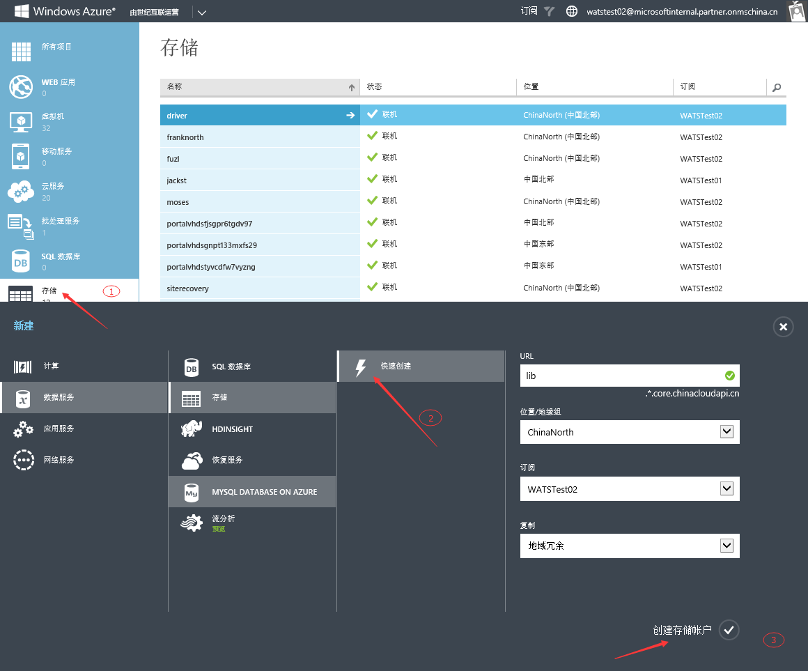
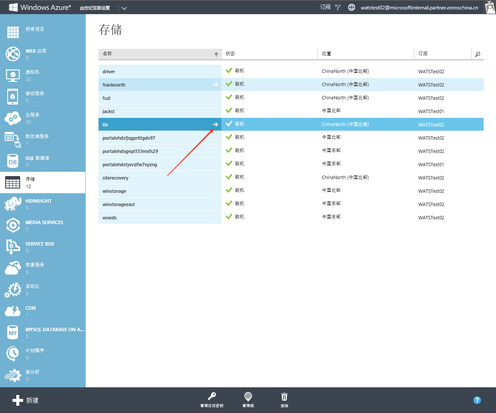
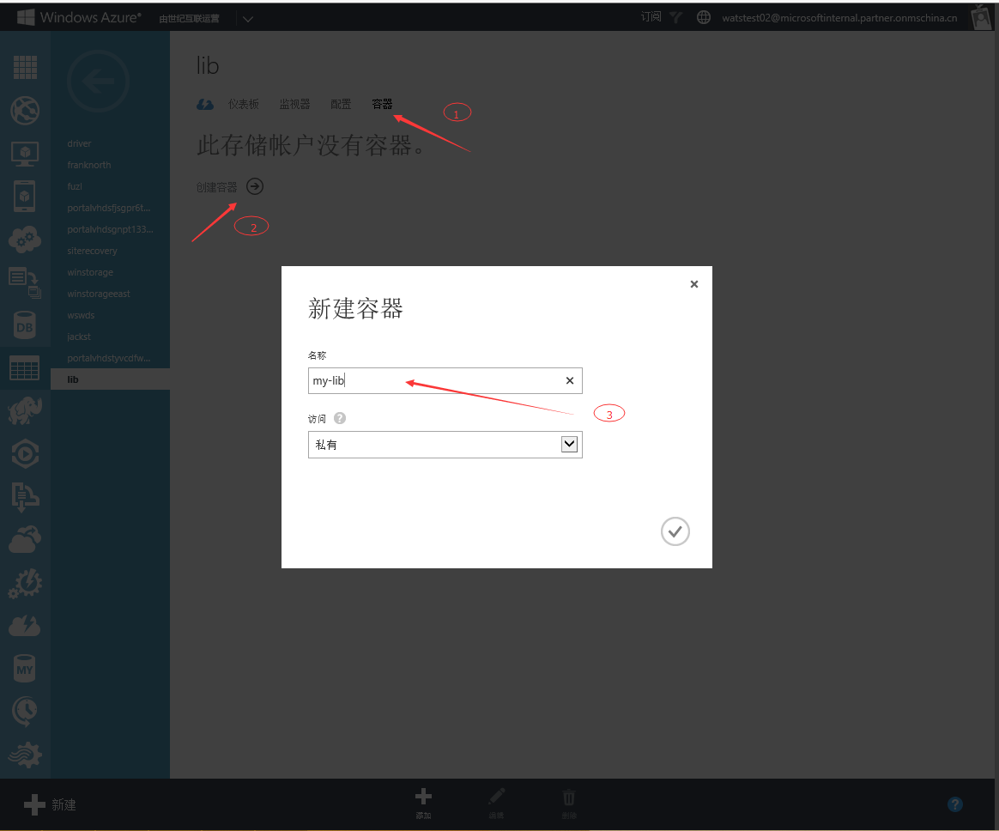
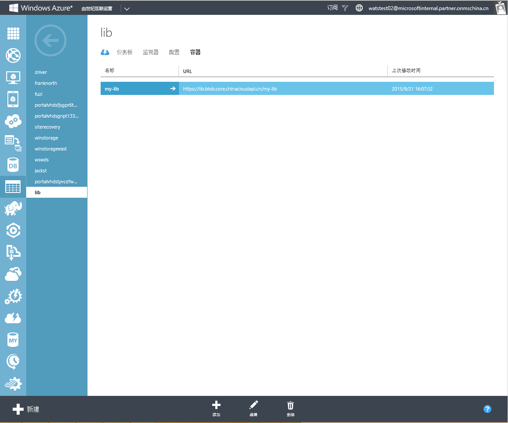

<properties 
	pageTitle="如何创建存储账号及容器" 
	description="本页介绍如何创建存储账号及容器。" 
	services="storage" 
	documentationCenter="" 
	authors=""
	manager="" 
	editor=""/>

<tags ms.service="storage" ms.date="" wacn.date="12/14/2015"/>

#如何创建存储账号及容器

本文包含以下内容

* [相关概念](#concept)
* [详细步骤](#operation)
* [推荐工具](#tool)
 
## 相关概念

**位置/地缘组**：中国版Azure有上海和北京中国东部和中国北部两个数据中心，我们可以选择其中的一个作为我们存储的位置。地缘组的概念就是将我们的存储和其他Azure服务放置在同一个数据中心，可以有效的提高我们的访问速度和降低成本。

###复制###

**本地冗余(LRS)**：本地冗余将在单个区域中的单个设施内复制三次，可以保护我们的数据免受普通硬件故障的损害。

**地域冗余(GRS)**：地域冗余将在主区域中复制三次，然后再辅助区域内复制三次，一共维护六个副本，当主区域中发生故障时，Azure 存储空间将故障转移到辅助区域。

**读取访问地域冗余(RA-GRS)**：读取访问地域冗余存储将你的数据复制到一个辅助地理位置，同时提供对你在辅助位置中的数据的读访问权限。读取访问地域冗余存储允许你从主位置或辅助位置访问数据，以防其中一个位置不可用。

更多详细请阅读[这篇文章](/documentation/articles/storage-redundancy/)

###存储和容器的命名规则###
Azure存储的命名规则可以阅读[这篇文章](http://blogs.msdn.com/b/jmstall/archive/2014/06/12/azure-storage-naming-rules.aspx)，文章包含了Azure存储中所涉及的Blob、Table、Queue的命名规则。
 
**容器的属性**

**私有**：不允许匿名用户读取该容器中的Blob

**公共容器**：匿名用户可以读取该容器中的Blob，并且可以读取该容器，可以列出容器下的所有Blob

**公共Blob**：匿名用户可以读取Blob，无法列出容器下的所有Blob

## 详细步骤##

1. 存储-数据服务-存储-快速创建（URL+位置地缘组+订阅+复制）-创建存储帐户
2. Lib存储帐户-右箭头  
**Note**：存储账号创建完成后我们可以通过最下方的“管理访问密钥”按钮获取或者更新密钥。
3.  容器-创建容器-名称
 
4. 容器创建完成
 
 
 
## 推荐工具##
Azure Store Explorer是一个不错的工具，可以让我们很直观的管理我们的存储，请点击[此处](https://azurestorageexplorer.codeplex.com/)下载。
