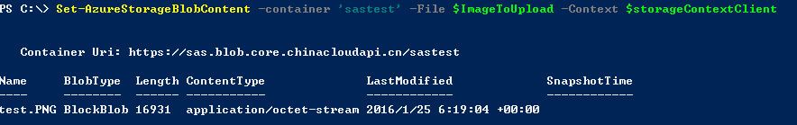
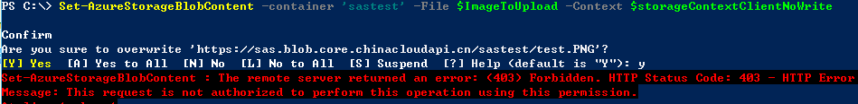

<properties 
	pageTitle="如何为Azure存储的Blob创建SAS（共享访问签名）令牌" 
	description="如何为Blob创建SAS令牌" 
	services="storage" 
	documentationCenter="" 
	authors=""
	manager="" 
	editor=""/>
<tags ms.service="storage-aog" ms.date="" wacn.date="06/08/2016"/>

#如何为Azure存储的Blob创建SAS（共享访问签名）令牌

存储账号名称和存储账号密钥是操作存储账号的重要的信息，一旦存储账号外泄，存储账号内的资源将会完全暴露。SAS可以帮助我们避免存储账户密钥的泄露，请阅读[这篇文章](/documentation/articles/storage-dotnet-shared-access-signature-part-1/)了解SAS的详细的概念，文章中也包含了令牌中各个参数的含义。

这篇文章将帮助我们创建SAS令牌

- .Net的方式创建SAS令牌
- PowerShell的方式创建SAS令牌
- Rest API的方式创建Blob的SAS令牌

##.Net的方式创建SAS令牌

关于.Net的方式创建SAS令牌请阅读下面的文章：

[创建SAS并将SAS用于Blob服务](/documentation/articles/storage-dotnet-shared-access-signature-part-2/)

##PowerShell的方式创建SAS 令牌

>使用Powershell前有关Azure PowerShell的安装、配置和连接到订阅请阅读[这篇文章](/documentation/articles/powershell-install-configure/)

下面内容包含：

- 创建容器的临时SAS令牌
- 为Blob创建临时SAS令牌
- 根据容器临时SAS令牌上传文件
- 给容器指定存储访问策略
- 为Blob创建具有存储访问策略的SAS令牌

**如何为容器和Blob创建SAS令牌**

	#定义一些参数
	$storageAccountName = <storage account name>
	$storageAccountKey = <storage account key>
	$containerName = 'sastest'

	#PowerShell的方式创建storage操作的上下文
	$storageContext = New-AzureStorageContext -Environment AzureChinaCloud -StorageAccountName $storageAccountName -StorageAccountKey $storageAccountKey
	
	#创建一个新的容器
	$container = New-AzureStorageContainer -Context $storageContext -Name $containerName
	$cbc = $container.CloudBlobContainer
	
	#为容器创建临时SAS (临时SAS和具有存储访问策略的SAS请阅读下面的参考文档)
	$sasToken = New-AzureStorageContainerSASToken -container $containerName -permission rwl -Context $storageContext
	write-host $sasToken

	$sasTokenNoWrite = New-AzureStorageContainerSASToken -container $containerName -permission rl -Context $storageContext
	
	#为blob创建SAS 令牌
	New-AzureStorageBlobSASToken -Container 'sastest' -Blob 'test.txt' -Context $storageContext -Permission rw		
	

参考文档： [临时SAS和具有存储访问策略的SAS](/documentation/articles/storage-dotnet-shared-access-signature-part-1/)

PowerShell指令：[New-AzureStorageContainerSASToken](https://msdn.microsoft.com/zh-cn/library/azure/dn584416.aspx)、
[New-AzureStorageBlobSASToken](https://msdn.microsoft.com/zh-cn/library/f3833d85-ef4e-449e-8e81-1a2367e39026)		

**如何在已知SAS令牌的情况下来使用**

	#在知道Blob容器SAS令牌的客户端创建存储上下文
	$storageContextClient = New-AzureStorageContext -StorageAccountName $storageAccountName -SASToken $sasToken	
	#这个存储上下文只可以在该容器下做相应的操作并且只能拥有在创建过程中赋予的权限
	#如果你要继续创建container将会报错
	New-AzureStorageContainer -Context $storageContextClient -Name 'test1'
	#错误内容: New-AzureStorageContainer : The remote server returned an error: (403) Forbidden.

	#测试上传文件
	$ImageToUpload = "D:\test.PNG"
	Set-AzureStorageBlobContent -Container 'sastest' -File $ImageToUpload -Context $storageContextClient

	#如果知道Blob的SAS令牌的话，我们就可以知道完整的Blob的url，并可以执行相应权限的操作。		
	
结果：

**注意**:在创建临时SAS中我们赋予了read、write和list权限，如果没有write权限上述上传将会报错具体如下所示

	$storageContextClientNoWrite = New-AzureStorageContext -StorageAccountName $storageAccountName -SASToken $sasTokenNoWrite
	Set-AzureStorageBlobContent -container 'sastest' -File $ImageToUpload -Context $storageContextClientNoWrite

**创建具有存储访问策略的Blob的SAS令牌**

	#定义一些参数
	$storageAccountName = <storage account name>
	$storageAccountKey = <storage account key>
	$containerNameWithPolicy = 'sastestwithpolicy'

	#PowerShell的方式创建storage操作的上下文
	$storageContext = New-AzureStorageContext -Environment AzureChinaCloud -StorageAccountName $storageAccountName -StorageAccountKey $storageAccountKey
	
	#创建一个新的容器
	$container = New-AzureStorageContainer -Context $storageContext -Name $containerNameWithPolicy
	$cbc = $container.CloudBlobContainer
	#为新创建的容器设置存储访问策略
	$permissions = $cbc.GetPermissions();
	$policyName = 'policy1'
	$policy = new-object 'Microsoft.WindowsAzure.Storage.Blob.SharedAccessBlobPolicy'
	$policy.SharedAccessStartTime = $(Get-Date).ToUniversalTime().AddMinutes(-5)
	$policy.SharedAccessExpiryTime = $(Get-Date).ToUniversalTime().AddDays(10)
	$policy.Permissions = "Read,Write,List,Delete"
	$permissions.SharedAccessPolicies.Add($policyName, $policy)
	$cbc.SetPermissions($permissions);
	
	#获取SAS令牌
	$sas = $cbc.GetSharedAccessSignature($policy, $policyName)
	Write-Host 'Shared Access Signature= '$($sas.Substring(1))''

	#为blob创建访问策略为policy1的SAS令牌
	New-AzureStorageBlobSASToken -Container 'sastestwithpolicy' -Policy 'policy1' -Blob 'test.txt' -Context $storageContext
	
	#如何删除存储访问策略
	Remove-AzureStorageContainerStoredAccessPolicy -Container "sastestwithpolicy" -context $storageContext -Policy 'policy1'

存储策略的好处可以更方便我们管理SAS。它比临时SAS多了以下功能

- 删除存储访问策略吊销SAS
- 设置存储访问策略的过期时间来吊销SAS
- 可以通过上述方式批量吊销SAS

关于吊销SAS的更详细信息，请阅读[这篇文章](/documentation/articles/storage-dotnet-shared-access-signature-part-1/)。

##Rest API的方式创建Blob的SAS令牌

参考文档：[共享访问签名的示例](https://msdn.microsoft.com/zh-cn/library/azure/dn140256.aspx)、[建立存储的访问策略](https://msdn.microsoft.com/zh-cn/library/azure/dn140257.aspx)、[构造服务 SAS](https://msdn.microsoft.com/zh-cn/library/azure/dn140255.aspx)

- 通过Rest API方式创建临时SAS
- 通过Rest API方式创建具有存储访问策略的SAS

####通过Rest API方式创建临时SAS

 		public static string GenerateSAS()
        {       
            string accountName = "sas";
            string accountKey = "<account Key>";
			#设置访问权限
            string signedpermissions = "r";
			#设置临时SAS的过期时间
            string signedstart = DateTime.UtcNow.ToString("O");
            string signedexpiry = DateTime.UtcNow.AddDays(1).ToString("O");
			#设置需要访问的资源
            string canonicalizedresource = "/blob/"+accountName+"/sastestwithpolicy/test.txt";
			#设置提供访问的IP的范围
            string signedIP = "";
			#指定HTTP协议
            string signedProtocol = "";
            string signedidentifier = "";
			#指定Rest API版本
            string signedversion = "2015-04-05";
			#设置响应标头
            string rscc = "";
            string rscd = "file; attachment";
            string rsce = "";
            string rscl = "";
            string rsct = "binary";

            string StringToSign = signedpermissions + "\n" +
               signedstart + "\n" +
               signedexpiry + "\n" +
               canonicalizedresource + "\n" +
               signedidentifier + "\n" +
               signedIP + "\n" +
               signedProtocol + "\n" +
               signedversion + "\n" +
               rscc + "\n" +
               rscd + "\n" +
               rsce + "\n" +
               rscl + "\n" +
               rsct;

			#获取签名（签名是利用 SHA256 算法通过字符串到签名和密钥计算然后使用 Base64 编码进行编码的 HMAC）
            byte[] SignatureBytes = System.Text.Encoding.UTF8.GetBytes(StringToSign);
            System.Security.Cryptography.HMACSHA256 SHA256 = new System.Security.Cryptography.HMACSHA256(Convert.FromBase64String(accountKey));
            string sig = Convert.ToBase64String(SHA256.ComputeHash(SignatureBytes));
            
            string sasURL = string.Format("http://{0}.blob.core.chinacloudapi.cn/sastestwithpolicy/test.txt?sv={1}&sr={2}&sig={3}&st={4}&se={5}&sp={6}&rscd={7}&rsct={8}",
                HttpUtility.UrlEncode(accountName),
                HttpUtility.UrlEncode(signedversion),
                HttpUtility.UrlEncode("b"),
                HttpUtility.UrlEncode(sig),
                HttpUtility.UrlEncode(signedstart),
                HttpUtility.UrlEncode(signedexpiry),
                HttpUtility.UrlEncode(signedpermissions),
                HttpUtility.UrlEncode(rscd),
                HttpUtility.UrlEncode(rsct)
                );

            return sasURL;
        }

####通过Rest API方式创建具有存储访问策略的SAS
使用上述PowerShell操作过程中创建的存储访问策略"policy1"，有关Rest API方式创建存储访问策略请阅读[这篇文章](https://msdn.microsoft.com/zh-cn/library/azure/dd179391.aspx)。

 		public static string GenerateSAS()
        {    
            string accountName = "sas";
            string accountKey = "<account key>";

			#设置带存储访问策略的SAS不需要设置开始时间、过期时间、访问权限
            string signedpermissions = "";
            string signedstart = "";
            string signedexpiry = "";
			
            string canonicalizedresource = "/blob/"+accountName+"/sastestwithpolicy/test.txt";
            string signedIP = "";
            string signedProtocol = "";
			#指定存储访问策略
            string signedidentifier = "policy1";
            string signedversion = "2015-04-05";

            string rscc = "";
            string rscd = "file; attachment";
            string rsce = "";
            string rscl = "";
            string rsct = "binary";

            string StringToSign = signedpermissions + "\n" +
               signedstart + "\n" +
               signedexpiry + "\n" +
               canonicalizedresource + "\n" +
               signedidentifier + "\n" +
               signedIP + "\n" +
               signedProtocol + "\n" +
               signedversion + "\n" +
               rscc + "\n" +
               rscd + "\n" +
               rsce + "\n" +
               rscl + "\n" +
               rsct;

            byte[] SignatureBytes = System.Text.Encoding.UTF8.GetBytes(StringToSign);
            System.Security.Cryptography.HMACSHA256 SHA256 = new System.Security.Cryptography.HMACSHA256(Convert.FromBase64String(accountKey));
            string sig = Convert.ToBase64String(SHA256.ComputeHash(SignatureBytes));
			#SAS URL去掉开始时间、过期时间和访问权限，增加si
            string sasURL = string.Format("http://{0}.blob.core.chinacloudapi.cn/sastestwithpolicy/test.txt?si={1}&sv={2}&sr={3}&sig={4}&rscd={5}&rsct={6}",
               HttpUtility.UrlEncode(accountName),
               HttpUtility.UrlEncode(signedidentifier),
               HttpUtility.UrlEncode(signedversion),
               HttpUtility.UrlEncode("b"),
               HttpUtility.UrlEncode(sig),
               HttpUtility.UrlEncode(rscd),
               HttpUtility.UrlEncode(rsct)
             );           
            return sasURL;
        }

