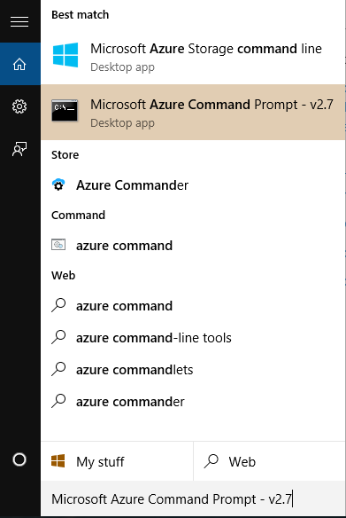

<properties 
	pageTitle="通过AzCopy操作Azure存储" 
	description="本页介绍如何使用AzCopy操作storage。" 
	services="storage" 
	documentationCenter="" 
	authors=""
	manager="" 
	editor=""/>
<tags ms.service="storage" ms.date="" wacn.date="01/21/2016"/>

#通过AzCopy操作Azure存储

###本文包含以下内容

* [相关概念](#related)
* [详细步骤](#operation)
* [常用命令](#common)
 
## 相关概念
<b> Azcopy</b>： AzCopy是一个高性能的命令行实用程序，用于将数据上载、复制到 Azure 二进制存储（Blob）、文件存储（File）和表存储（Table）以及从其中下载和复制数据。如何下载，安装以及更多的AzCopy命令请参见： [AzCopy命令行实用程序入门](/documentation/articles/storage-use-azcopy/) 

## 详细步骤
1.	打开Azure Command Prompt.
 
	

2.	使用 `cd %ProgramFiles(x86)%\Microsoft SDKs\Azure\AzCopy` 定位到AzCopy的安装目录， 64-bit Window为 `%ProgramFiles(x86)%\Microsoft SDKs\Azure\`，32-bit Windows 为 `%ProgramFiles%\Microsoft SDKs\Azure\`. 

3.	使用下面的命令即可做对应的操作。

## 常用命令

#####*上传文件到 Blob storage:

	AzCopy /Source:C:\myfolder /Dest:https://myaccount.blob.core.chinacloudapi.cn/mycontainer /DestKey:key /Pattern:abc.txt 

#####*下载文件到文件系统:

	AzCopy /Source:https://myaccount.blob.core.chinacloudapi.cn/mycontainer /Dest:C:\myfolder /SourceKey:key /Pattern:abc.txt

#####*在同一个storage账号里面拷贝文件：

	AzCopy /Source:https://myaccount.blob.core.chinacloudapi.cn/mycontainer1 /Dest:https://myaccount.blob.core.chinacloudapi.cn/mycontainer2 /SourceKey:key /DestKey:key /Pattern:abc.txt 

#####*在不同的storage账号里面拷贝文件:

	AzCopy /Source:https://sourceaccount.blob.core.chinacloudapi.cn/mycontainer1 /Dest:https://destaccount.blob.core.chinacloudapi.cn/mycontainer2 /SourceKey:key1 /DestKey:key2 /Pattern:abc.txt

#####*上传文件到storage下新建文件夹:

	AzCopy /Source:C:\myfolder /Dest:https://myaccount.blob.core.chinacloudapi.cn/mynewcontainer /DestKey:key /Pattern:abc.txt

#####*递归方式上传文件夹下所有内容到storage:

	AzCopy /Source:C:\myfolder /Dest:https://myaccount.blob.core.chinacloudapi.cn/mycontainer /DestKey:key /S

#####*递归查找匹配的文件并上传到storage:

	AzCopy /Source:C:\myfolder /Dest:https://myaccount.blob.core.chinacloudapi.cn/mycontainer /DestKey:key /Pattern:a* /S

#####*拷贝Blob及其快照到另一个storage:

	AzCopy /Source:https://sourceaccount.blob.core.chinacloudapi.cn/mycontainer1 /Dest:https://destaccount.blob.core.chinacloudapi.cn/mycontainer2 /SourceKey:key1 /DestKey:key2 /Pattern:abc.txt /Snapshot  
