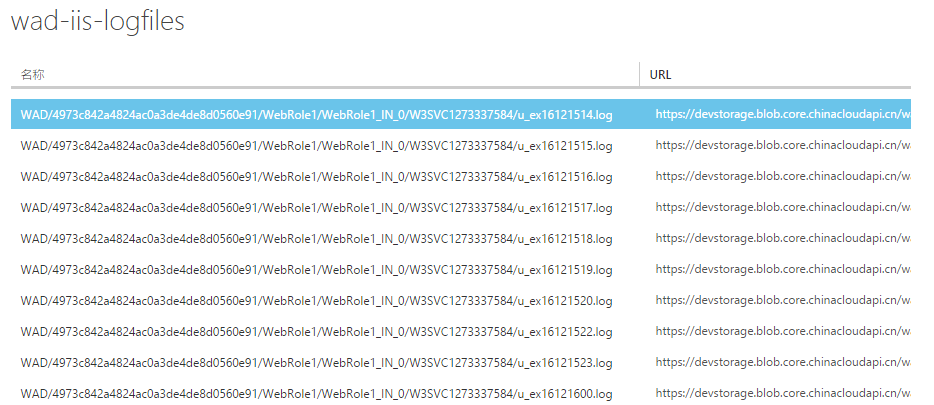

<properties
    pageTitle="Python 操作存储获取指定目录 Blob 文件的实现"
    description="如何使用 Python 操作存储获取指定目录 Blob 文件的实现"
    service=""
    resource=""
    authors="Chen Rui"
    displayOrder=""
    selfHelpType=""
    supportTopicIds=""
    productPesIds=""
    resourceTags="Storage Blob, Python"
    cloudEnvironments="MoonCake" />
<tags
    ms.service="storage-aog"
    ms.date=""
    wacn.date="05/25/2017" />

# Python 操作存储获取指定目录 Blob 文件的实现

## 现象描述

在容器下面的 Blob 文件是按一定的虚拟目录结构存储的，那么如何通过 BlockBlobService 的 list_blobs 法来访问指定目录下的文件。如下这个容器中的文件，由一定层次的目录组成：

## 实现原理

通过 list_blobs 的复合参数来实现，容器参数只设置“容器名称”，通过 prefix 来控制“目录层级”， delimiter 设定目录的分隔符，这样只会列出当前目录的内容，不会进行递归遍历。

模块安装：
本次测试在 Windows Python 环境下进行测试，环境及模块依赖如下：

- 官网下载 msi 安装包，管理员命令行执行以下安装脚本

        msiexec /package python-xxx.msi

- 使用 PIP 安装 Azure（需要 pip 9+ 支持，Python 2.7 环境已内置 pip 9+ 版本，不需更新）

        pip install azure

- 安装程序依赖的模块

        pip install azure-storage==0.33.0

- 查看模块的版本

        >pip install azure-storage==
        Collecting azure-storage==
        Could not find a version that satisfies the requirement azure-storage== (from
        versions: 0.20.0rc1, 0.20.0rc2, 0.20.0, 0.20.1, 0.20.2, 0.20.3, 0.30.0, 0.31.0,
        0.32.0, 0.33.0, 0.34.0, 0.34.2)
        No matching distribution found for azure-storage==

## 代码实现

    from azure import *
    from azure.storage.blob import BlockBlobService
    from azure.storage.blob import ContentSettings

    account = 'devstorage'
    key = 'GVbNd6Ntz4xfXyPAQ4GspP2oIeXXXXXXXXXXXXXXXXXXXXXXXXXXXXXXXXXXXXXXXXygaS2u+Yg=='
    endpoint = 'core.chinacloudapi.cn'
    print '1'
    blockblobservice=BlockBlobService(account_name=account, account_key=key,endpoint_suffix=endpoint)
    print '2'

    blobs = blockblobservice.list_blobs('wad-iis-logfiles',prefix='WAD/', delimiter='/')
    for blob in blobs:
                print blob.name

    print '=============================================='

    blobs = blockblobservice.list_blobs('wad-iis-logfiles',prefix='WAD/4973c842a4824ac0a3de4de8d0560e91/WebRole1/WebRole1_IN_0/W3SVC1273337584/', delimiter='/')
    for blob in blobs:
                print blob.name

    print '=============================================='
