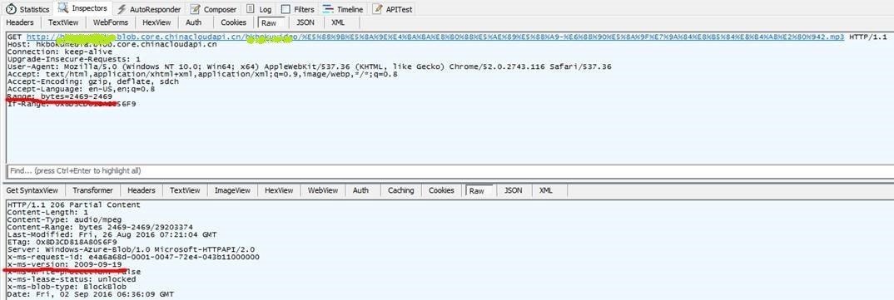
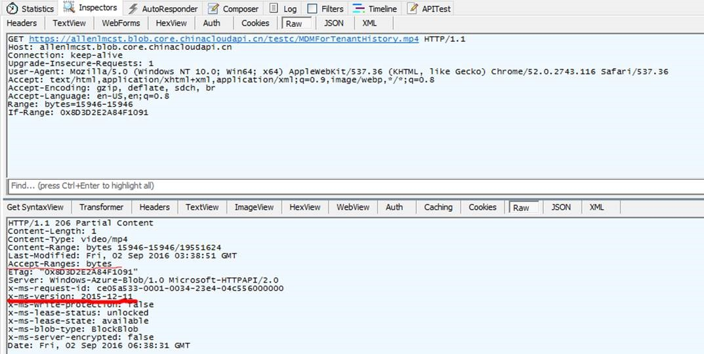
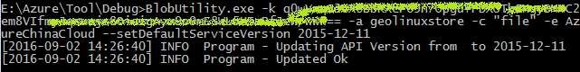

<properties
    pageTitle="如何使用 azure blob storage 在浏览器中实现对媒体文件拖拽点播"
    description="如何使用 azure blob storage 在浏览器中实现对媒体文件拖拽点播。"
    services="storage"
    documentationCenter=""
    authors=""
    manager=""
    editor=""
    tags="blob存储,媒体文件,拖拽点播,Progressive Download"/>

<tags
    ms.service="storage"
    ms.date="10/27/2016"
    wacn.date="11/10/2016"/>

#如何使用 azure blob storage 在浏览器中实现对媒体文件拖拽点播

Azure blob storage 是 azure 提供的一种服务，blob 存储可以用来存储一些松散结构的数据，例如各类文本文件数据或者二进制数据（各类型格式文件、媒体文件以及应用安装文件）。

而对于在 Azure storage 存放的 mp3 等格式的媒体文件，我们可以使用 Azure storage 提供的 url，可以通过浏览器访问的形式来播放该类媒体文件。这篇文章主要讨论在使用 azure storage 提供的 url 播放媒体文件时遇到的点播问题。需要注意的是，azure storage 主要提供的服务是存储服务，对于媒体文件的播放和编码等工作，azure 提供专业的 media services，详细内容可以参考[链接](/documentation/services/media-services/)。

###问题描述：

在 Azure 存储中存放 mp3 文件, 播放 mp3 文件时, 拖动到还没有缓存好的进度时(例如已经缓冲到 10 秒, 现在拖动到 60 秒), 不能在第60秒开始缓冲接着播放, 会跳回第 10 秒播放。

 
###问题分析：

对于视频或者音频文件的播放，如果实现点播（拖拽到某一时间播放）效果可以基于两种方式：Streaming 和 Progressive Download。

Streaming：一种实时流技术

•	Streaming 不需要缓存实体文件，并且可以从任意时间点开始播放

•	Streaming 在低速网络下会出现不断卡顿缓冲问题

•	Streaming 在传输方面会丢包

•	Streaming 对网络的利用率更高
 
Progressive Download：一种分片后的分段式下载缓冲

•	Progressive Download 需要将预下载文件存放到本地存储，并且默认情况下，播放器不会自动删除缓存文件

•	Progressive Download 无法精确到帧开始播放，只能从流媒体文件的切片点开始

•	Progressive Download 在低速网络下具备更多优势

•	Progressive Download 由于需要校验以及其他一些协议上的原因，网络利用率较低

•	Progressive Download 由于基于 HTTP 协议，在传输方面出现丢包会重新传输数据

目前 Azure Blob storage 是不支持 Streaming 点播方式，但是 Azure Blob storage 可以支持 Progressive Download，也就是说我们可以使用 Blob Storage 实现 Progressive Download 形式的点播功能。

然而我们注意到一个问题是，默认情况下我们上传到 Azure storage 中的文件采用较低版本（2009-09-19）的 REST 协议，而低版本的协议是不支持“字节范围检索（byte ranges seek）”，从而导致无法下载指定节点的字节流，也就导致无法播放。

在播放媒体文件时我们使用 fiddler 工具进行抓包，发现默认使用的就是最原始的版本 2009-09-19，另外可以看到客户端有发送 Range 头，但是服务端返回里面没有 accept-ranges 头，所以就相当于没有指定 API 版本（ un-versioned ）。

Un-versioned 访问截图

 
设置 DefaultServiceVersion 后访问截图

 

###解决方案：

了解清楚无法通过 Azure blob storage 实现媒体文件的点播是因为使用 Progressive Download 点播方式默认使用的是最原始的版本 2009-09-19，而该低版本的协议是不支持“字节范围检索（byte ranges seek），接下来我们需要考虑如何更改默认版本为可以支持点播方式的版本。

根据[官方说明](https://blogs.msdn.microsoft.com/windowsazurestorage/2011/09/15/windows-azure-blobs-improved-http-headers-for-resume-on-download-and-a-change-in-if-match-conditions/)， 对于大部分浏览器，没有 accept-ranges 头就无法达到点播效果，而这一项是在2011-08-18版本后才加入的。因此，解决方案参考以下内容：

1.  如果是 un-versioned 的访问方式（比如浏览器访问方式），默认就是2009-09-19。这个时候就可以通过修改默认存储服务的 DefaultServiceVersion 来解决，可以通过以下方式来达到目的。

	a)      工具下载地址：[https://github.com/Plasma/AzureBlobUtility](https://github.com/Plasma/AzureBlobUtility)

     >备注：这个开源项目仅支持 Global Storage 服务，为此我们需要下载后对其进行修改编译，让其支持 China Storage 的工具。

	b)       执行脚本语法：`BlobUtility.exe -k <AccessKey> -a <StorageName> -c <ContainerName> --setDefaultServiceVersion 2015-02-21`

	示例：

	

    >备注：默认是支持 Global Storage 服务，修改过后需要指定 AzureChinaCloud 环境。
    
	c)       测试用例：我们测试一个视频文件，修改版本后，可以支持拖拽点播。

	
	
 
 
2.  如果是自己 code 开发的播放客户端，可以在读取音频或者视频文件时显示的设置 API 版本为最新。

