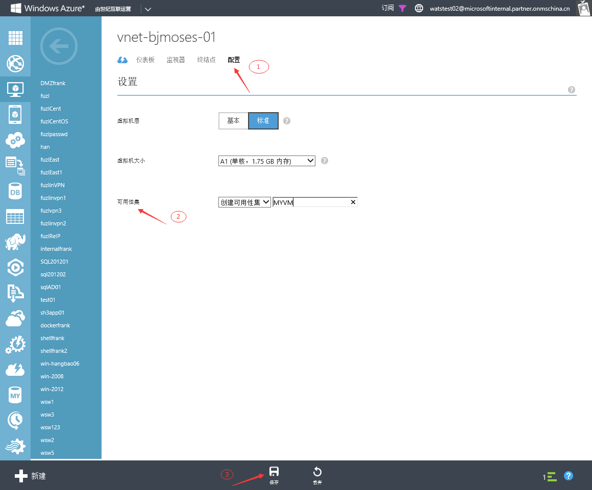

<properties 
	pageTitle="将虚拟机添加到可用性集中" 
	description="本页介绍如何将虚拟机添加到可用性集中。" 
	services="virtual machine" 
	documentationCenter="" 
	authors=""
	manager="" 
	editor=""/>
<tags ms.service="virtual-machine-aog" ms.date="" wacn.date="06/08/2015"/>

#将虚拟机添加到可用性集中

###本文包含以下内容

- [相关概念](#concept)
- [详细步骤](#detail)
- [注意事项](#note)
 
## 相关概念

**可用性集**：可用性集可以保证高可用性，在应用程序中使用多台虚拟机可以确保在出现本地网络故障、本地磁盘硬件故障以及平台可能需要的任何计划内停机时，应用程序仍然可用。每个可用性集至少包含两台虚拟机。

## 详细步骤

1. 虚拟机-(本例)VNET-BJMOSES-01

	 
 
2. 配置-可用性集-保存（在“可用性集”中，选择“创建可用性集”，在“可用性集名称”中，输入可用性集的名称，单击保存创建可用性集）

	 
 
3. 第二台VM-配置-可用性集（本例：MYVM）-保存

	
	 
 
4. 从新虚拟机的仪表板中，单击“配置”，您会看到该虚拟机现在是新可用性集的一个成员

	 
 
## 注意事项

-	要放入相同可用性集的虚拟机必须属于相同的云服务。
-	将现有虚拟机添加到可用性集可能会导致虚拟机重新启动以最终确定它是可用性集中的成员。
