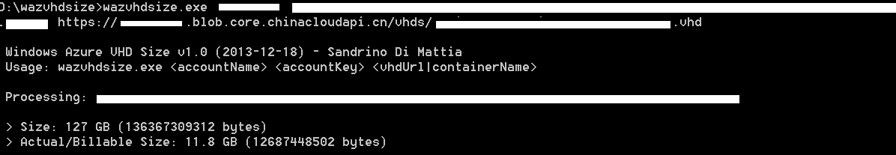

<properties 
	pageTitle="释放虚拟磁盘未使用空间来减少计费容量" 
	description="如何释放未使用的虚拟磁盘空间来减少费用" 
	services="virtual machine" 
	documentationCenter="" 
	authors=""
	manager="" 
	editor=""/>
<tags ms.service="billing-aog" ms.date="" wacn.date="05/27/2016"/>

#释放虚拟磁盘未使用空间来减少计费容量

一些 Azure 上的虚拟机用户遇到过一个令人困惑的虚拟磁盘计费问题。一旦写入大量数据使得磁盘容量变大后，即使删除那些数据，仍会一直按照最大时得磁盘容量计费。这实际上是由于一部分虚拟机上的操作系统不支持一些必要的功能或用户没有做一些磁盘维护所致的。

在 Azure 上，如果我有一个 100 GB 的虚拟磁盘，里面实际只保存了 20 GB 的数据，这个磁盘的实际大小会是 20 GB，也只会以 20 GB 计费(除非这个磁盘由高级存储帐户提供支持)。然而当我再加入 60 GB，然后删除 30 GB 后，这个磁盘的大小仍会是 80 GB 而不是 50 GB 。它的原理是这样的：

虚拟磁盘在 Azure 上是作为页 Blob 来存储的。页 Blob 是一种稀疏的存储方式，只有实际写入数据的容量会被计费。这就是为什么上面的例子中一开始以 20 GB 计费。在普通的文件系统中，当一个文件被删除后，它只是被标记为删除，而实际的存储介质上的数据不会被清空。这也是为什么我们能通过一些反删除软件来恢复已经删除的文件。在页 Blob 这样的稀疏存储系统中也是一样的，它的存储结构如下图所示，包含了 Header, Footer 和 Data blocks。我们在对它执行写操作时，文件系统会去寻找符合待写入文件大小的连续数据块。假设一个文件数据被写入了 Data Block i ~ Data Block i+k，当该文件被删除后，这些 Data Block 并不会被完全释放，与普通文件系统类似，它们只是被标记为可写数据块。这就导致在计算存储使用量时，这部分容量仍然被计算在内。 Azure 虚拟机作为一个 IaaS，没有操作系统的配合无法从外部判断哪些空间可以释放。
 

为了改善这个问题，Azure 虚拟机支持了 TRIM 功能。这个功能原先用于来自于固态硬盘（SSD），用于释放写入过的空间。在 Azure 上，虚拟机操作系统通过这个命令来告知页 Blob 哪些空间可以释放，从而减少计费容量。现在大部分 Azure 上由 Microsoft 提供的映像所使用的操作系统都支持 TRIM 功能，包括所有 Windows 的映像，和较新的 Linux 映像（如所有 UBUNTU，centos 7.2，和 SUSE Linux Enterprise Server 12）。对 TRIM 功能支持的确切版本信息，请查询具体 Linux 发行版本提供商的技术文档。对于不支持的 TRIM 的 Linux 版本，可尝试安装 [Linux Integration Services Version 4.1 for Hyper-V驱动](https://www.microsoft.com/en-us/download/confirmation.aspx?id=51612)，增加对 TRIM 的支持。

在 Windows 系统中，这个功能是通过驱动器优化提供的，默认每周会自动执行一次。当然也可以在“控制面板->系统和安全->对你的驱动器进行碎片整理和优化”中进行手动执行或更改设置。另一个必要条件是启用 UnMap，因为在 Azure 虚拟机上是默认不启用的，需要通过以下命令启用。

	fsutil behavior set DisableDeleteNotify 0

在支持 TRIM 功能的 Linux 系统中，可以用fstrim命令来执行。例如对一个挂载在 /mnt/data 的 Azure 磁盘执行TRIM操作可以用以下命令：

	sudo /sbin/fstrim /mnt/data

现在我们明白了虚拟磁盘计费的原理，就可以理解导致“已释放”空间被计费问题的原因。为了减少计费容量，首先要确定操作系统是否支持 TRIM 功能。尤其在 Linux 的情况下，各种不同的系统和版本的支持情况都略有不同，需要用户自己根据实际配置去确认和启用。如果系统支持，还须在必要时去执行它。为了方便维护，可以建一个计划任务来定期执行。
最后，笔者再介绍一个用于查询 Azure 上的虚拟磁盘实际可计费大小的工具 [https://github.com/sandrinodimattia/WindowsAzure-VhdSize/releases/tag/v1.0](https://github.com/sandrinodimattia/WindowsAzure-VhdSize/releases/tag/v1.0)。它由 Azure MVP，Sandrino Di Mattia 开发，默认用于国际版 Azure，也可用于中国版。用法：wazvhdsize.exe <存储账户名> <访问密钥> <VHD的URL>

 

##常见问题

问：如果在虚拟机上挂载一个 100 GB 的数据盘，是只对使用的部分收费，还是整个 100 GB 收费？

答：如果您的存储账号类型是高级存储，那么我们会按照磁盘大小（如 P10，P20, P30）收取每月固定费用；如果您的存储账号是其他类型（比如普通账号），则按照您的实际使用量进行收费。

问： Azure 存储是如何统计磁盘计费容量的？

答：请参考[这篇文档](https://blogs.msdn.microsoft.com/windowsazurestorage/2010/07/08/understanding-windows-azure-storage-billing-bandwidth-transactions-and-capacity/)，里面详细阐述了存储容量的计算算法。算法的 PowerShell 实现样例可以在[这里下载](https://gallery.technet.microsoft.com/scriptcenter/Get-Billable-Size-of-32175802)。

##参考文献

- [Release unused space from your Azure Virtual Hard Disks to reduce their billable size](http://fabriccontroller.net/releasing-unused-space-from-your-windows-azure-virtual-hard-disk-reduce-billable-size/), Sandrino Di Mattia, 2013-12-19
- [TRIM Support comes to Azure Virtual Machines](http://mvwood.com/blog/trim-support-comes-to-windows-azure-virtual-machines/), MikeWo, 2013-10-14
- [Disk Storage on Linux VMs in Azure](https://convective.wordpress.com/2014/05/27/disk-storage-on-linux-vms-in-azure/), [https://convective.wordpress.com](https://convective.wordpress.com/), 2014-5-27
