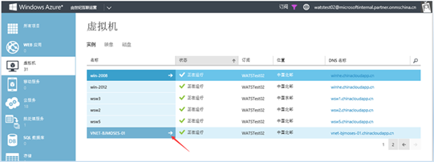
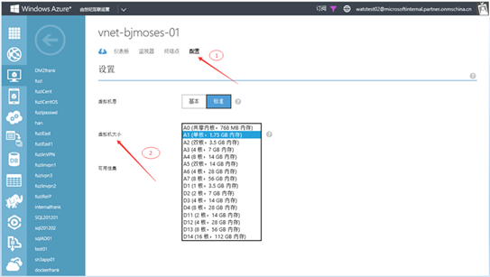

<properties 
	pageTitle="调整虚拟机的尺寸" 
	description="本文介绍如何调整虚拟机的尺寸" 
	services="virtual machine" 
	documentationCenter="" 
	authors=""
	manager="" 
	editor=""/>
<tags ms.service="virtual machine" ms.date="" wacn.date="12/18/2015"/>

#调整虚拟机的尺寸

###本文包含以下内容

- [常见问题](#faq)
- [详细步骤](#detail)
 
## 常见问题

- 调整虚拟机尺寸计费怎么算的？

	Azure是按分钟对虚拟机收费，例如你的虚拟机运行了1个小时，但前45分钟是A1尺寸，后面15分钟是A2尺寸，则前45分钟是按A1收费，后15分钟是按A2收费。

- 修改尺寸后我的虚拟机的IP是否会变？

	在修改虚拟机尺寸后虚拟机的IP可能会改变，如果业务逻辑中不希望IP变化的话，请尝试“保留IP”，关于更多有关保留IP的内容，请阅读：http://www.windowsazure.cn/documentation/articles/virtual-networks-reserved-public-ip

## 详细步骤

1. 虚拟机-(本例)VNET-BJMOSES-01
 
	
 
2. 配置-虚拟机大小

	

**请注意**：在调整虚拟机的尺寸后，虚拟机需要重新启动！
 
