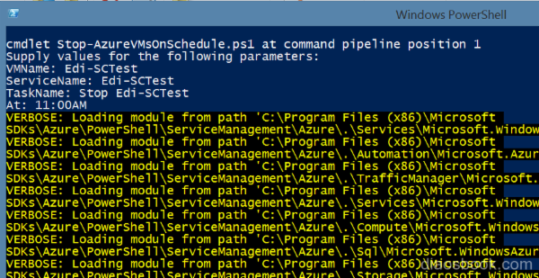
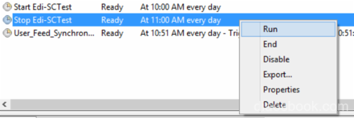
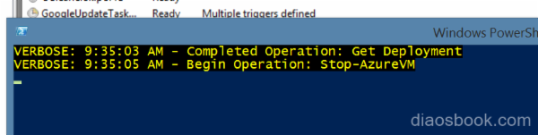
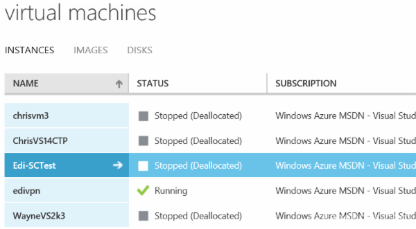

<properties 
	pageTitle="自动化实现定时关闭虚拟机" 
	description="在虚拟机中配置如何定时关闭虚拟机" 
	services="virtual machine" 
	documentationCenter="" 
	authors=""
	manager="" 
	editor=""/>
<tags ms.service="virtual-machine-aog" ms.date="" wacn.date="06/08/2016"/>

#使用本地计划任务定时关闭azure虚拟机

###本文包含以下内容

* [前提条件](#prerequisite)
* [如何实现定时关闭虚拟机](#operation)

 
## 前提条件
Controller 机器上必须安装 Azure PowerShell，并且要在 PowerShell 里登录一次 Azure, 请参见： [如何安装和配置 Azure PowserShell](/documentation/articles/powershell-install-configure/)

## 如何实现定时关闭虚拟机
配好 Azure PowerShell 以后，就可以用下面这个脚本创建定时关机任务。把下面的代码另存为一个 PowerShell 脚本保存到本地磁盘，比如叫`Stop-AzureVMsOnSchedule.ps1`

<pre><code>
<#
.Synopsis
  Creates scheduled tasks to stop Virtual Machines.
.DESCRIPTION
  Creates scheduled tasks to stop a single Virtual Machine or a set of Virtual Machines (using
  wildcard pattern syntax for the Virtual Machine name).
.EXAMPLE
  Stop-AzureVMsOnSchedule.ps1 -ServiceName "MyServiceName" -VMName "testmachine1" -TaskName "Stopt Test Machine 1" -At 5:30PM
  Stop-AzureVMsOnSchedule.ps1 -ServiceName "MyServiceName" -VMName "test*" -TaskName "Stop All Test Machines" -At 5:30PM
#>

param(
  # The name of the VM(s) to start on schedule.  Can be wildcard pattern.
  [Parameter(Mandatory = $true)] 
  [string]$VMName,

  # The service name that $VMName belongs to.
  [Parameter(Mandatory = $true)] 
  [string]$ServiceName,

  # The name of the scheduled task.
  [Parameter(Mandatory = $true)] 
  [string]$TaskName,

  # The name of the "Stop" scheduled tasks.
  [Parameter(Mandatory = $true)] 
  [DateTime]$At
)

# The script has been tested on Powershell 3.0
Set-StrictMode -Version 3

# Following modifies the Write-Verbose behavior to turn the messages on globally for this session
$VerbosePreference = "Continue"

# Check if Azure Powershell is avaiable
if ((Get-Module -ListAvailable Azure) -eq $null)
{
  throw "Azure Powershell not found! Please install from http://www.windowsazure.com/en-us/downloads/#cmd-line-tools"
}

# Define a scheduled task to stop the VM(s) on a schedule.
$stopAzureVM = "Stop-AzureVM -Name " + $VMName + " -ServiceName " + $ServiceName + " -Force -Verbose"
$stopTaskTrigger = New-ScheduledTaskTrigger -Daily -At $At
$stopTaskAction = New-ScheduledTaskAction -Execute "PowerShell.exe" -Argument $stopAzureVM
$startTaskSettingsSet = New-ScheduledTaskSettingsSet  -AllowStartIfOnBatteries 
 
$stopScheduledTask = New-ScheduledTask -Action $stopTaskAction -Trigger $stopTaskTrigger -Settings $startTaskSettingsSet

# Register the scheduled tasks to start and stop the VM(s).
Register-ScheduledTask -TaskName $TaskName -InputObject $stopScheduledTask 

</code></pre>

还是刚才那个文件，右键用 PowerShell 运行，按 PowerShell 提示输入四个必要的参数：

* VMName, 要关闭的 Virtual Machine 名称
* ServiceName, 关联的服务名称
* TaskName, 任务名称
* At，具体操作时间

 
然后到计划任务列表里就能刷出这个定时关机的任务了，可以测一下：

 
到指定时间 powershell 开始执行关闭虚拟机的操作。

 
到 Portal 里验证一下，已经成功关机了.
 

