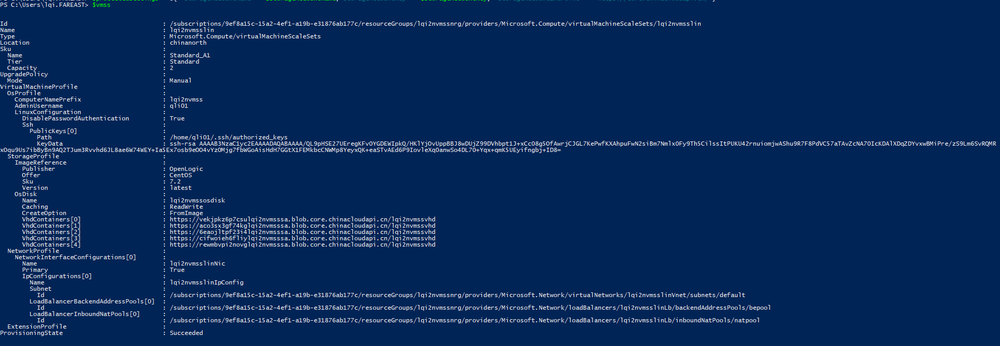
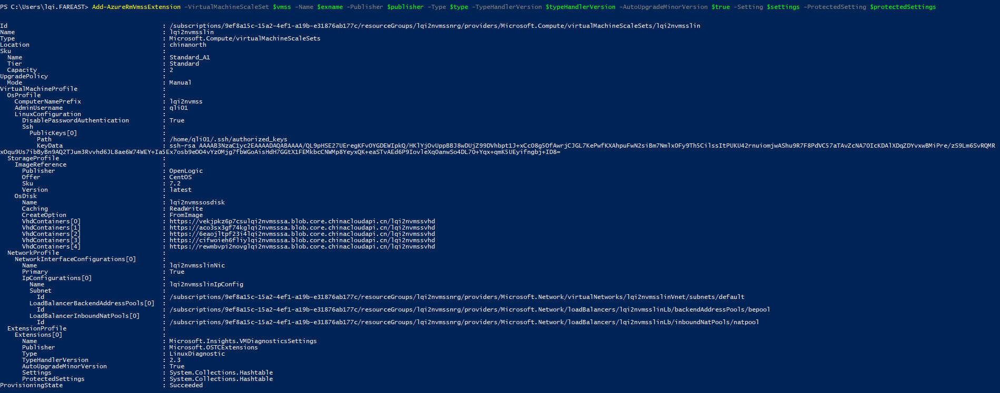
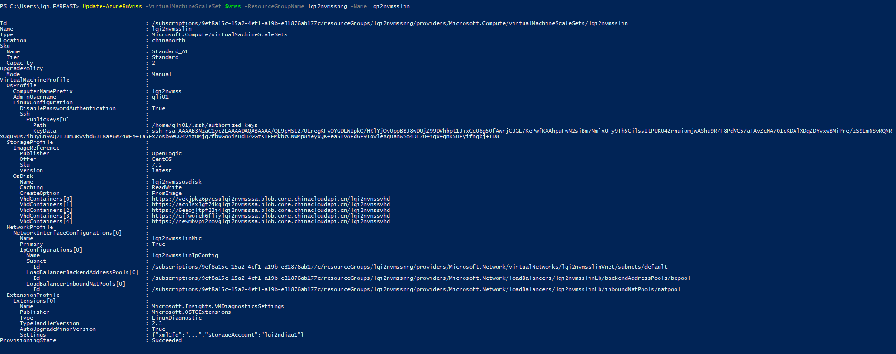
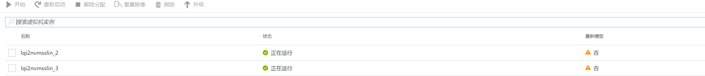
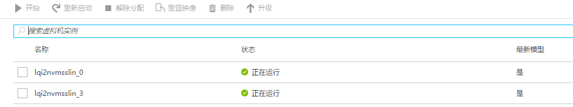
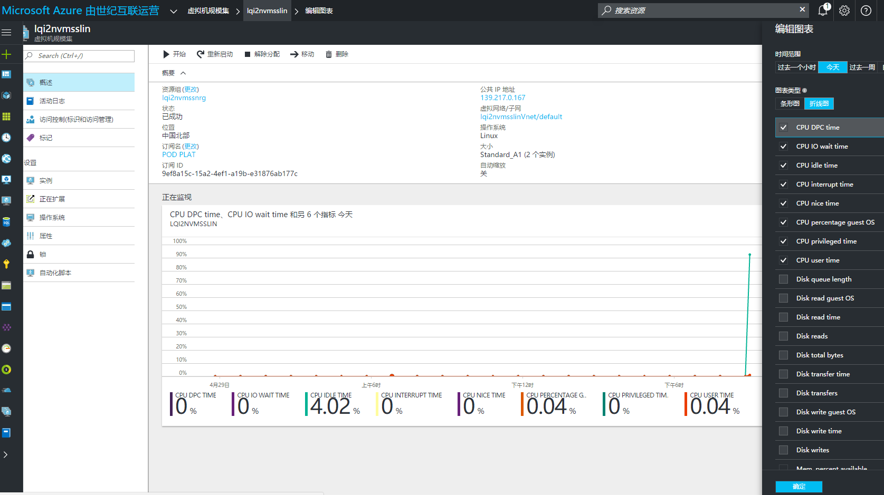

<properties
    pageTitle="为运行中的 Linux VMSS 启用诊断"
    description="为运行中的 Linux VMSS 启用诊断"
    service=""
    resource="virtualmachinescalesets"
    authors="Qi Li"
    displayOrder=""
    selfHelpType=""
    supportTopicIds=""
    productPesIds=""
    resourceTags="Virtual Machine Scale Sets, Linux, VMSS, ARM, PowerShell"
    cloudEnvironments="MoonCake" />
<tags
    ms.service="virtual-machine-scale-sets-linux-aog"
    ms.date=""
    wacn.date="05/16/2017" />

# 为运行中的 Linux VMSS 启用诊断

目前，在中国区 Azure，默认 ARM 中创建的虚拟机的监控视图是没有数据的，用户需要手动开启诊断才能从虚拟机内部获取性能数据并展现在门户监控视图中；为虚拟机开启诊断可以在门户中操作。

同样，默认通过门户创建的虚拟机规模集（下面简称 VMSS）的监控视图也是没有数据的；但目前为止，用户无法在门户中开启诊断，必须要使用命令行工具进行。

当然，用户可以通过模板创建开启了诊断的 VMSS。

如果您已经创建了 VMSS 且没有开启诊断，但又不想重新部署 VMSS，如何为已经在运行的 VMSS 开始诊断呢？下面为大家介绍基于 Linux 的开启方法。

这里使用 PowerShell 进行操作。

假设我们已经通过门户创建了基于 CentOS 的 VMSS。资源组名 [lqi2nvmssnrg，VMSS] 名 [lqi2nvmsslin]。

我们首先看看默认的配置，大家注意到没有 extension 的信息，并将 ID 记录下来：

    $vmss = Get-AzureRmVmss -ResourceGroupName lqi2nvmssnrg -VMScaleSetName lqi2nvmsslin

目前 LAD 2.3 版本不支持使用 JSON 格式的配置文件配置诊断扩展，但 ARM 又不支持 XML 格式的文件。因此这里我们需要将 XML 格式的配置文件进行转换。

1. 配置 XmlCfg，请将 `wadmetricsresourceid` 中的信息替换成您自己的 VMSS 的资源 ID。

        $wadlogs = '<WadCfg><DiagnosticMonitorConfiguration>'
        $wadperfcounters1 = '<PerformanceCounters scheduledTransferPeriod=\"PT1M\"><PerformanceCounterConfiguration counterSpecifier=\"\\Memory\\AvailableMemory\" sampleRate=\"PT15S\" unit=\"Bytes\"><annotation displayName=\"Memory available\" locale=\"en-us\"/></PerformanceCounterConfiguration><PerformanceCounterConfiguration counterSpecifier=\"\\Memory\\PercentAvailableMemory\" sampleRate=\"PT15S\" unit=\"Percent\"><annotation displayName=\"Mem. percent available\" locale=\"en-us\"/></PerformanceCounterConfiguration><PerformanceCounterConfiguration counterSpecifier=\"\\Memory\\UsedMemory\" sampleRate=\"PT15S\" unit=\"Bytes\"><annotation displayName=\"Memory used\" locale=\"en-us\"/></PerformanceCounterConfiguration><PerformanceCounterConfiguration counterSpecifier=\"\\Memory\\PercentUsedMemory\" sampleRate=\"PT15S\" unit=\"Percent\"><annotation displayName=\"Memory percentage\" locale=\"en-us\"/></PerformanceCounterConfiguration><PerformanceCounterConfiguration counterSpecifier=\"\\Memory\\PercentUsedByCache\" sampleRate=\"PT15S\" unit=\"Percent\"><annotation displayName=\"Mem. used by cache\" locale=\"en-us\"/></PerformanceCounterConfiguration><PerformanceCounterConfiguration counterSpecifier=\"\\Processor\\PercentIdleTime\" sampleRate=\"PT15S\" unit=\"Percent\"><annotation displayName=\"CPU idle time\" locale=\"en-us\"/></PerformanceCounterConfiguration><PerformanceCounterConfiguration counterSpecifier=\"\\Processor\\PercentUserTime\" sampleRate=\"PT15S\" unit=\"Percent\"><annotation displayName=\"CPU user time\" locale=\"en-us\"/></PerformanceCounterConfiguration><PerformanceCounterConfiguration counterSpecifier=\"\\Processor\\PercentProcessorTime\" sampleRate=\"PT15S\" unit=\"Percent\"><annotation displayName=\"CPU percentage guest OS\" locale=\"en-us\"/></PerformanceCounterConfiguration><PerformanceCounterConfiguration counterSpecifier=\"\\Processor\\PercentIOWaitTime\" sampleRate=\"PT15S\" unit=\"Percent\"><annotation displayName=\"CPU IO wait time\" locale=\"en-us\"/></PerformanceCounterConfiguration>'
        $wadperfcounters2 = '<PerformanceCounterConfiguration counterSpecifier=\"\\PhysicalDisk\\BytesPerSecond\" sampleRate=\"PT15S\" unit=\"BytesPerSecond\"><annotation displayName=\"Disk total bytes\" locale=\"en-us\"/></PerformanceCounterConfiguration><PerformanceCounterConfiguration counterSpecifier=\"\\PhysicalDisk\\ReadBytesPerSecond\" sampleRate=\"PT15S\" unit=\"BytesPerSecond\"><annotation displayName=\"Disk read guest OS\" locale=\"en-us\"/></PerformanceCounterConfiguration><PerformanceCounterConfiguration counterSpecifier=\"\\PhysicalDisk\\WriteBytesPerSecond\" sampleRate=\"PT15S\" unit=\"BytesPerSecond\"><annotation displayName=\"Disk write guest OS\" locale=\"en-us\"/></PerformanceCounterConfiguration><PerformanceCounterConfiguration counterSpecifier=\"\\PhysicalDisk\\TransfersPerSecond\" sampleRate=\"PT15S\" unit=\"CountPerSecond\"><annotation displayName=\"Disk transfers\" locale=\"en-us\"/></PerformanceCounterConfiguration><PerformanceCounterConfiguration counterSpecifier=\"\\PhysicalDisk\\ReadsPerSecond\" sampleRate=\"PT15S\" unit=\"CountPerSecond\"><annotation displayName=\"Disk reads\" locale=\"en-us\"/></PerformanceCounterConfiguration><PerformanceCounterConfiguration counterSpecifier=\"\\PhysicalDisk\\WritesPerSecond\" sampleRate=\"PT15S\" unit=\"CountPerSecond\"><annotation displayName=\"Disk writes\" locale=\"en-us\"/></PerformanceCounterConfiguration><PerformanceCounterConfiguration counterSpecifier=\"\\PhysicalDisk\\AverageReadTime\" sampleRate=\"PT15S\" unit=\"Seconds\"><annotation displayName=\"Disk read time\" locale=\"en-us\"/></PerformanceCounterConfiguration><PerformanceCounterConfiguration counterSpecifier=\"\\PhysicalDisk\\AverageWriteTime\" sampleRate=\"PT15S\" unit=\"Seconds\"><annotation displayName=\"Disk write time\" locale=\"en-us\"/></PerformanceCounterConfiguration><PerformanceCounterConfiguration counterSpecifier=\"\\PhysicalDisk\\AverageTransferTime\" sampleRate=\"PT15S\" unit=\"Seconds\"><annotation displayName=\"Disk transfer time\" locale=\"en-us\"/></PerformanceCounterConfiguration><PerformanceCounterConfiguration counterSpecifier=\"\\PhysicalDisk\\AverageDiskQueueLength\" sampleRate=\"PT15S\" unit=\"Count\"><annotation displayName=\"Disk queue length\" locale=\"en-us\"/></PerformanceCounterConfiguration></PerformanceCounters>'
        $wadcfgxstart = $wadlogs + $wadperfcounters1 + $wadperfcounters2 + '<Metrics resourceId="'
        $wadmetricsresourceid = '/subscriptions/xxxxxxxxxxxxxxxxxxxxxxxxxxxxxxxxxxx/resourceGroups/vmsstest/providers/Microsoft.Compute/virtualMachineScaleSets/diagtest6'
        $wadcfgxend = '"><MetricAggregation scheduledTransferPeriod="PT1H"/><MetricAggregation scheduledTransferPeriod="PT1M"/></Metrics></DiagnosticMonitorConfiguration></WadCfg>'

        $xmlCfg = $wadcfgxstart + $wadmetricsresourceid + $wadcfgxend

2.	转码 XmlCfg

        $xmlCfg = [System.Convert]::ToBase64String([System.Text.Encoding]::UTF8.GetBytes($xmlCfg))

3. 设置安装诊断扩展需要的其他参数

    用户保存性能和日志信息的存储账号和存储账号密钥：

        $storageAccountName = "vmssdiag6"
        $storageAccountKey = "xxxxxxxxxxxxxxxxxxxxxxxxxxxxxxxxxxxxxxxxxxxxxxxxxxxxxxxxxxxxxxxxxxx”

    将 XmlCfg 和存储账号信息整合到一起。

        $settings = @{"xmlCfg" = $xmlCfg; "storageAccount" = $storageAccountName}

    设置诊断扩展信息。由于诊断扩展随时会更新，版本信息可能发生变化，使用下面命令查询最新的版本。

        Get-AzureRmVMExtensionImage -Location chinaeast -PublisherName Microsoft.OSTCExtensions -Type LinuxDiagnostic

    设置扩展名字：该名字可以自定义。

        $exname = "Microsoft.Insights.VMDiagnosticsSettings"

    下面三个参数值请根据 `Get-AzureRmVMExtensionImage` 的结果来设置，不可随便更改。

        $publisher =  "Microsoft.OSTCExtensions"
        $type =  "LinuxDiagnostic"
        $typeHandlerVersion = "2.3"

    设置私有设置，包括存储账号，密钥和终结点。这里是中国 Azure 存储的终结点。

        $protectedSettings = @{ "storageAccountName" = $storageAccountName;"storageAccountKey" = $storageAccountKey; "storageAccountEndPoint" = "https://core.chinacloudapi.cn"}

4. 为 VMSS 添加诊断扩展并更新 VMSS

        Add-AzureRmVmssExtension -VirtualMachineScaleSet $apivmss -Name $exname -Publisher $publisher -Type $type -TypeHandlerVersion $typeHandlerVersion -AutoUpgradeMinorVersion $true -Setting $settings -ProtectedSetting $protectedSettings

    

        Update-AzureRmVmss -VirtualMachineScaleSet $apivmss -ResourceGroupName "vmsstest" -Name "diagtest6"

    

5. 升级虚拟机

    最后一步，也是最重要的：升级 VMSS 的虚拟机到最新版本，以安装扩展，收集性能数据。如果跳过该步骤，诊断数据是不会收集的，因为虚拟机并没有应用我们对 VMSS 的最新配置。

    在门户中的 VMSS 的实例栏，如您看到实例的**最新模型**显示为否，说明没有应用最新的 profile。

    

    勾选实例，点击升级，将实例应用最新的 profile。建议依次单独进行，因为实例可能会重启。更新后的状态如图：

    

    等待一段时间，大约 15 分钟，再去查看性能视图，会看到已经有数据了。

    

配置完成。