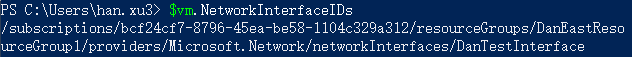
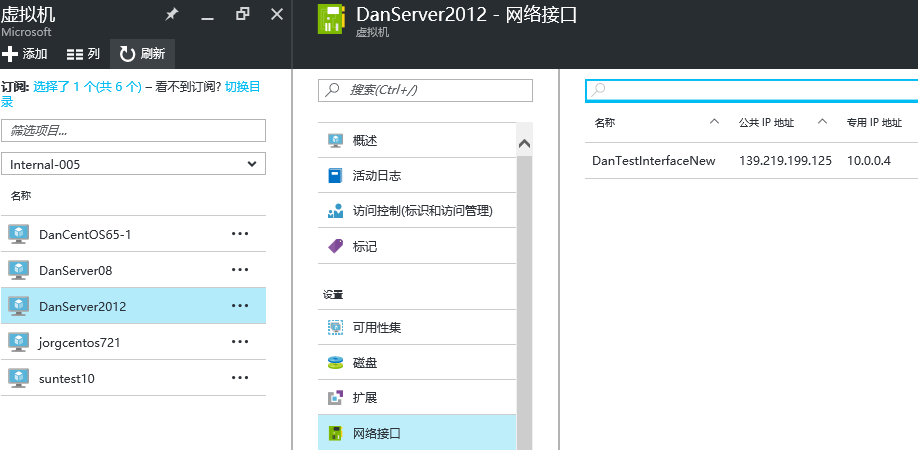

<properties
    pageTitle="通过 Powershell 来替换 ARM 模式下虚拟机的网络接口"
    description="通过 Powershell 来替换 ARM 模式下虚拟机的网络接口"
    service=""
    resource="virtualmachines"
    authors="Xu Han"
    displayOrder=""
    selfHelpType=""
    supportTopicIds=""
    productPesIds=""
    resourceTags="Virtual Machines, ARM, PowerShell"
    cloudEnvironments="MoonCake" />
<tags
    ms.service="virtual-machines-aog"
    ms.date=""
    wacn.date="03/17/2017" />
# 通过 Powershell 来替换 ARM 模式下虚拟机的网络接口

## 需求描述

客户在部署完 ARM 模式的虚拟机以后，由于误操作在虚拟机内部禁用了网卡导致远程访问虚拟机受到限制，以下是通过 Powershell 命令来替换原有虚拟网络接口实现虚拟网卡重置功能。

>[AZURE.NOTE]本文只限于 ARM 模式下的虚拟机，经典模式的虚拟机不适用。

## 操作步骤

1. 首先，我们需要使用下面的命令在虚拟网络的子网下新添加一个新的网络接口：

        #获取虚拟网络对象
        $vnet = Get-AzureRmVirtualNetwork -Name <虚拟网络名称> -ResourceGroupName <资源组名称>
        #获取子网对象
        $subnet01 = Get-AzureRmVirtualNetworkSubnetConfig -Name <子网名称> -VirtualNetwork $vnet
        #添加一个公网 IP
        $publicIP = New-AzureRmPublicIpAddress -Name <PublicIP名称> -ResourceGroupName <资源组名称> -Location "China East" -AllocationMethod Dynamic -IpAddressVersion IPv4 –Force
        #创建新的网络接口
        $NIC = New-AzureRmNetworkInterface -Name <NIC的名称> -ResourceGroupName <资源组名称> -Location "China East" -SubnetId $subnet01.Id -PublicIpAddressId $publicIP.Id -PrivateIpAddress 10.0.0.4

2. 创建完成后，使用下面的命令替换掉旧的网络接口：

        #获取虚拟机对象
        $vm = Get-AzureRmVM -ResourceGroupName <资源组名称> -Name <虚拟机名称>
        #查看虚拟机的默认网卡的 ID
        $vm.NetworkInterfaceIDs

    

        #删除默认网络接口
        Remove-AzureRmVMNetworkInterface -VM $vm -NetworkInterfaceIDs $vm.NetworkInterfaceIDs[0]
        #添加新的网络接口
        Add-AzureRmVMNetworkInterface -VM $vm -Id $NIC.Id –Primary
        #更新虚拟机
        Update-AzureRmVM -ResourceGroupName <资源组名称> -VM $vm

3. 更新完成后，可以看到虚拟机的网卡已经换掉了：

    