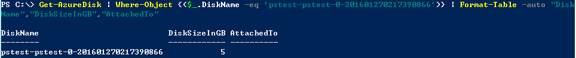

<properties 
	pageTitle="如何为虚拟机附加磁盘" 
	description="如何使用ps为虚拟机附加磁盘" 
	services="virtual machine" 
	documentationCenter="" 
	authors=""
	manager="" 
	editor=""/>
<tags ms.service="virtual-machine-aog" ms.date="" wacn.date="06/08/2016"/>

#如何为虚拟机附加磁盘

关于如何在经典管理门户网站上附加磁盘请阅读[这篇文章](/documentation/articles/virtual-machines-windows-classic-attach-disk/)

>使用 Powershell 前有关 Azure PowerShell 的安装、配置和连接到订阅请阅读[这篇文章](/documentation/articles/powershell-install-configure/)

相关 PowerShell 指令：[Get-AzureDataDisk](https://msdn.microsoft.com/zh-cn/library/azure/dn495197.aspx)、[Add-AzureDataDisk](https://msdn.microsoft.com/zh-cn/library/azure/dn495298.aspx)、[Remove-AzureDataDisk](https://msdn.microsoft.com/zh-cn/library/azure/dn495243.aspx)、[Update-AzureVM](https://msdn.microsoft.com/zh-cn/library/azure/dn495230.aspx?f=255&MSPPError=-2147217396)、[Get-AzureDisk](https://msdn.microsoft.com/zh-cn/library/azure/dn495125.aspx)

##通过 PowerShell 附加磁盘

本文主要在虚拟机"pstest"上测试。

	#获取虚拟机上数据磁盘的详细信息
	$vm=Get-AzureVM -ServiceName 'pstest' -Name 'pstest'
	Get-AzureDataDisk -VM $vm

	#添加数据磁盘
	Add-AzureDataDisk -VM $vm -CreateNew -DiskSizeInGB 10 -DiskLabel 'test' -LUN 0 -MediaLocation "https://portalvhdsw0kfpkwrwbyf2.blob.core.chinacloudapi.cn/vhds/pstest-sport1.vhd" | Update-AzureVM	

	#附加存在于 Azure 存储中的数据磁盘
	Add-AzureDataDisk -ImportFrom -MediaLocation "https://***.blob.core.chinacloudapi.cn/vhds/myvhdfile.vhd" -VM $vm -DiskLabel 'test' -LUN 0 | Update-AzureVM 

	#从已经存在的数据磁盘附加到虚拟机
	#Get-AzureDisk 获取可以附加的磁盘信息
	#附加磁盘的条件：与虚拟机同一个 Location、同一个存储账号下，数据磁盘没有附加在其它虚拟机上
	#以下是我测试位于 China East，没有附加于其它虚拟机，且在 portalvhdsw0kfpkwrwbyf2 存储账户下的数据磁盘
	Get-AzureDisk | Where-Object {($_.AttachedTo -eq $null) -and ($_.Location -eq 'China East') -and ($_.MediaLink -Like '*portalvhdsw0kfpkwrwbyf2*') } | Format-Table -auto "DiskName","DiskSizeInGB","AttachedTo"
	#将要附加的DiskName输入下述PowerShell指令
	Add-AzureDataDisk -Import -DiskName "pstest-pstest-0-201601270217390866" -LUN 3 -VM $vm | Update-AzureVM	

**注意：**

- 附加磁盘不会引起虚拟机重启，也不需要虚拟机重启。
- 根据虚拟机的尺寸，附加磁盘的个数也不一样。具体尺寸对应的附加磁盘数量请阅读[这篇文章](/documentation/articles/virtual-machines-windows-sizes/)。
- 如果磁盘已经被其他虚拟机附加，请首先分离磁盘，然后重新附加。
- 附加磁盘的大小限制为：最小：1GB，最大1TB.

##如何修改附加磁盘的大小

	#测试前"pstest-pstest-0-201601270217390866"为 1GB	

	Update-AzureDisk -DiskName "pstest-pstest-0-201601270217390866" –ResizedSizeInGB 5 –label "resize"

通过 Get_AzureDisk 查看结果

	Get-AzureDisk | Where-Object {($_.DiskName -eq 'pstest-pstest-0-201601270217390866')} | Format-Table -auto "DiskName","DiskSizeInGB","AttachedTo"	

	
	
**注意：**

- 请在数据磁盘大小限制范围内修改数据磁盘大小，最大 1TB。
- 在修改数据磁盘前，请首先将数据磁盘和虚拟机分离。
- 修改后添加的大小附加到虚拟机上是未分配状态。
- **只可以增加**数据磁盘的大小，不可以减小。数据磁盘都是页 Blob，是按实际使用量来收费的，在设计时可考虑最大化，最大 1TB，这样可避免此操作。

#如何移除数据磁盘

	Remove-AzureDataDisk -LUN 0 -VM $vm | Update-AzureVM

**注意：**

- 附加磁盘不会引起虚拟机重启，也不需要虚拟机重启。
- 通过 Remove-AzureDataDisk 操作后 vh d文件没有被删除，只是数据磁盘从虚拟机上移除掉。如果磁盘完全没有用处并希望避免不必要的费用，请单独删除。