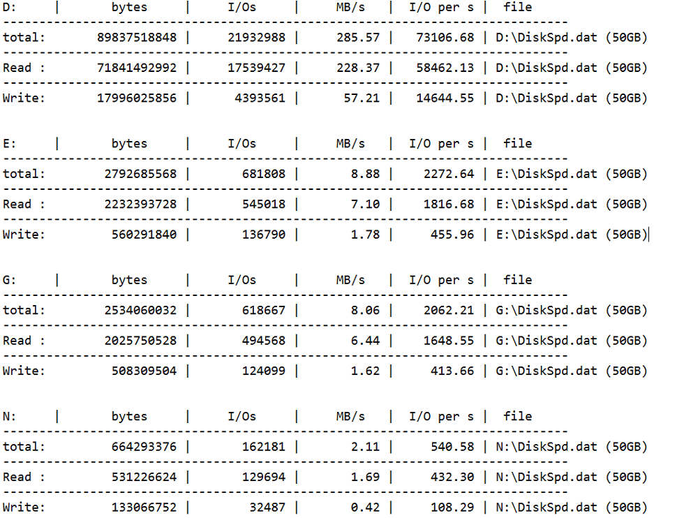
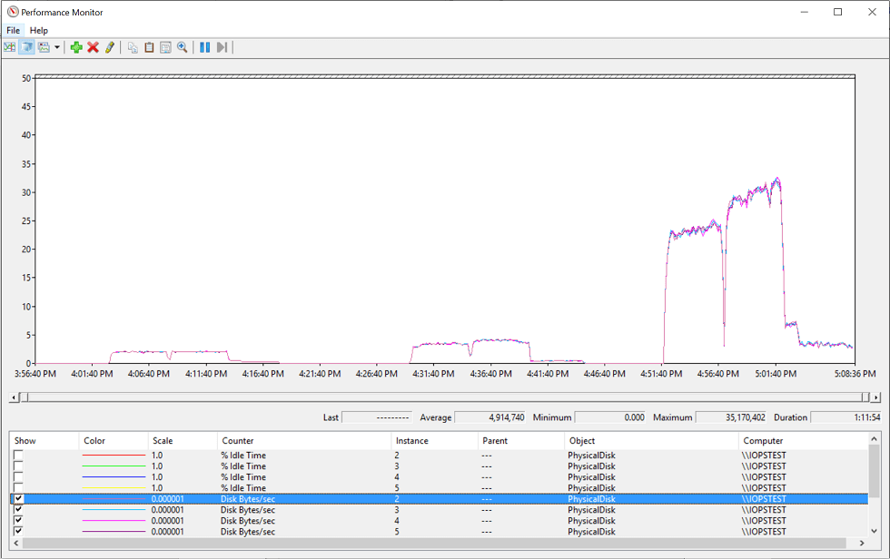
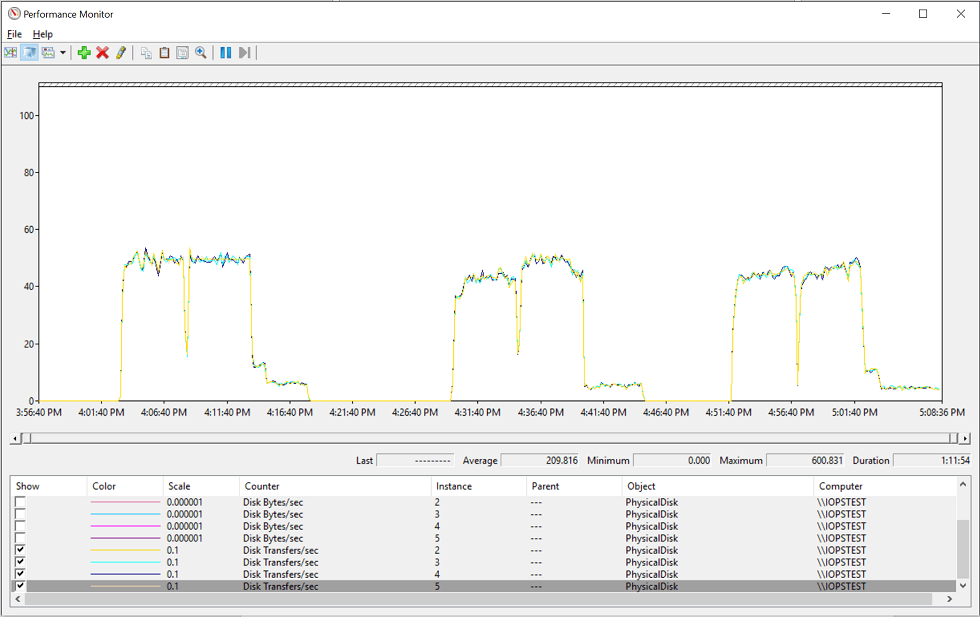

<properties 
	pageTitle="理解及快速测定 Azure 虚拟机的磁盘性能" 
	description="理解及快速测定 Azure 虚拟机的磁盘性能" 
	services="virtual machine" 
	documentationCenter="" 
	authors=""
	manager="" 
	editor=""/>
<tags ms.service="virtual-machine-aog" ms.date="" wacn.date="10/28/2016"/>
# 理解及快速测定 Azure 虚拟机的磁盘性能 #

随着越来越多的用户将生产系统迁移到 Azure 平台的虚拟机服务中，Azure 虚拟机的性能愈发被关注。传统的数据中心中，我们通常使用 CPU，内存，存储和网络的性能来衡量生产压力。特别是对于 IO 密集型工作负荷，比如虚拟机内部运行的 SQL 服务，存储系统的吞吐容量，往往成为生产系统的瓶颈所在。

Azure 提供了标准存储和高级存储两种存储服务。针对于生产环境中的 IO 密集型负荷，我们推荐使用高级存储。标准存储仅推荐在开发测试环境中使用。针对于具体的高级存储的介绍，以及虚拟机存储的最佳实践等信息，建议完成以下阅读：
- [高级存储简介](/documentation/articles/storage-premium-storage/ "https://www.azure.cn/documentation/articles/storage-premium-storage/")
- [Azure 虚拟运行 SQL 服务的最佳实践](/documentation/articles/virtual-machines-windows-sql-performance/ "https://www.azure.cn/documentation/articles/virtual-machines-windows-sql-performance/")
- [在 SQL 虚拟机中使用 Azure 高级存储](/documentation/articles/virtual-machines-windows-classic-sql-server-premium-storage/ "https://www.azure.cn/documentation/articles/virtual-machines-windows-classic-sql-server-premium-storage/")
	
然而在现实环境中，由于种种条件所限，很多用户暂时无法使用高级存储来达到最佳的存储性能。本文的目的在于帮助目前仍然使用标准存储的用户如何准确理解虚拟机的存储性能，从而在发生存储性能问题时快速有效的从支持部门得到帮助。

首先，由于虚拟机运行在 Azure 平台，我们需要了解 [Azure 存储空间可伸缩性和性能目标](/documentation/articles/storage-scalability-targets/ "https://www.azure.cn/documentation/articles/storage-scalability-targets")：
- 单个标准存储帐户总请求率上限为 20,000 IOPS，所有虚拟机磁盘的 IOPS 总数不应超过此限制。
- 标准层虚拟机的单个磁盘 IOPS 上限约为 500。
- 单个标准存储帐户中用于生产应用的磁盘不应超过 40 个

其次，针对于虚拟机操作内部，不同的应用也有不同的磁盘系统优化方案。例如，对于 Windows 平台，我们通常使用 Storage Space 来尽可能分散 IO 请求到不同的硬件设备来提升存储带宽：

- 使用虚拟机允许的最大磁盘数和最大磁盘容量构建存储空间
- 使用合理的 interleave 避免 Split IO
- 根据实际生产的单个 IO 数据大小规划文件系统簇的大小，例如 SQL 服务，建议使用 64K 的簇

在理解了存储系统的一些基本概念之后，下一步我们需要通过合理的方法衡量虚拟机的磁盘性能。

在 Windows 平台，用户常常选择通过文件管理器直接进行文件拷贝来观察磁盘性能。这种测试往往很容易进行。同时，在用户界面上也有图形化的吞吐量显示。然而，文件拷贝并不是一个测试存储性能的合理的方法：

- 文件拷贝，特别是 Windows 图形界面的拷贝过程并没有针对磁盘系统本省进行优化。为了达到磁盘系统的最佳性能，我们需要在存储系统中积累足够的 IO 请求来促使磁盘始终处于一个忙碌状态。
- 当我们使用 Windows 文件拷贝引擎拷贝大文件时，缺省情况下，系统会发起 8 个 1MB 的异步 IO 请求。而在进行小文件拷贝时，除非通过多线程拷贝的方式，否则很难在存储系统中产生足够的 IO 积压。
- 多数的文件拷贝操作是顺序操作。通常只有在一个文件拷贝完成后，才会处理下一个文件。这种顺序化的处理会导致文件拷贝的性能远远低于实际存储系统的处理能力。
- 为了加快文件处理，在进行文件拷贝时，Windows 会尝试使用内核的文件缓存机制进行 buffered IO 处理。这一方面无法正常反应物理存储的处理能力，同时也会收到操作系统的内存和 Cache 管理的影响。文件拷贝时，如果使用 Perfmon 等工具收集到的实际磁盘的压力数据，和图形中的拷贝速率曲线比较时，往往有较大的差异。
- 文件拷贝是一个端对端的操作。任何一端的限制都会导致拷贝的速率受影响。因此，很难隔离瓶颈出现的具体位置。

为方便说明，我在中国东区的数据中心创建了一个服务器，具体的参数为：

- 服务器大小: Standard_D4
- 标准存储账户，该账户中仅存储该测试服务器的磁盘以排除干扰
- 该服务器未运行任何生产业务。闲置时没有 CPU ,内存和磁盘 IO 的压力
- 虚拟机加载的 D 盘为本地 SSD 磁盘。
- 服务器加载 8 块 1TB 数据盘，使用其中 4 块创建存储池并建立 Simple 的虚拟磁盘。
- 在此虚拟磁盘上创建两个简单卷，E 卷的簇大小为 4K，G 卷的簇为 64K
- 另外使用一个简单磁盘创立 N 卷，簇大小为 4K。

为进行文件拷贝测试，我们创建了 3 种不同类型的数据文件：

- 文件夹 MixFiles 中含有各种随机大小的文件
- 文件夹 SingleFile 中含有一个 6GB 大小的文件
- 文件夹 SmallFiles 中含有 200,000 个小文件，每个文件大小为 3KB

从下图中可以看到根据文件的类型不同，整个过程分为三个阶段，

- 系统在处理随机大小文件时，拷贝的性能在 10MB/s 到 25MB/s 之间变化。
- 处理单个大文件的拷贝，性能上升到 40MB/s 以上，但是即便是对单个文件，拷贝性能也不稳定。
- 处理 200000 个 3KB 大小的小文件时，拷贝性能急剧下降到 500KB/s 左右。

 如果我们多次重复文件的拷贝过程，随着文件系统碎片状态的变化，服务器 Cache 的使用情况变化等等，同样的文件拷贝性能的差异性很大。

抛开用户界面上的性能指示，当我们使用 Perfmon 来具体分析单个磁盘的性能时，很明显，无论处理那种类型的文件拷贝，磁盘仍然未处于完全忙碌的状态。而磁盘的数据吞吐量和 IOPS 都处于不稳定状态

根据以上的分析和测试我们可以确定，使用文件拷贝的方式无法科学地衡量磁盘的性能。

在现实中，为了得到稳定的磁盘数据，通常建议使用 DiskSPD 或是 IOMeter 等工具。
- DiskSPD: [https://gallery.technet.microsoft.com/DiskSpd-a-robust-storage-6cd2f223](https://gallery.technet.microsoft.com/DiskSpd-a-robust-storage-6cd2f223 "https://gallery.technet.microsoft.com/DiskSpd-a-robust-storage-6cd2f223") 
- IOMeter: [http://www.iometer.org/](http://www.iometer.org/ "http://www.iometer.org/") 
这些工具大多数都是使用服务器的 CPU 资源产生多个工作线程，每个线程根据设定的 IO 读或写的比例，IO 请求的大小，顺序读写或随机读写等，产生大量的并发请求，直接作用于目标存储设备。

以同一个测试服务器为例，通过以下命令分别对于 D,E,F 和 N 卷进行 4K，8K，64K 大小的随机读写 IO 压力测试（80% 读操作，20% 写操作）

	diskspd -c50G -d300 -F16 -w20 -r -b4k -o4 [X]:\DiskSpd.dat
	diskspd -c50G -d300 -F16 -w20 -r -b8k -o4 [X]:\DiskSpd.dat
	diskspd -c50G -d300 -F16 -w20 -r -b64k -o4 [X]:\DiskSpd.dat

由于篇幅所限，仅仅将 4K 大小的结果总结如下:

同时，根据测试时生成的 Perfmon 日志，我们可以清晰地看到单个磁盘在进行测试时基本上保持在完全忙碌的状态，并体现出一致的 IO 性能指标(第一个测试为 4K 读写，第二个为 8K 读写，第三个为 64K 读写，每个测试区间前者为 E 卷，后者为 G 卷)
- 当 IO 为 4K 时，单个磁盘吞吐量(Disk Bytes/sec)，D 卷和 G 卷在 2MB 左右，IOPS（Disk Transfer/sec）约为 480
- 当 IO 为 4K 时，单个磁盘吞吐量(Disk Bytes/sec)，D 卷在 3.4MB 左右，G 卷约为 4MB，IOPS（Disk Transfer/sec）约为 440
- 当 IO 为 4K 时，单个磁盘吞吐量(Disk Bytes/sec)，D 卷在 24MB 左右，G 卷约为 31MB，IOPS（Disk Transfer/sec）约为 450
- 对于同一类测试，G 卷的性能要稍好于 E 卷。

需要指出的是，尽管 DiskSPD 和 IOMeter 等工具都可以模拟不同的类型的 IO 请求，但他们同真实的生产环境中的 IO 模型还是有一定区别的。如果可能，尽可能使用生产环境的真实 IO 来判断当前的存储系统是否满足需求。

1. 如果用户环境中的虚拟机出现类似存储瓶颈的问题，建议您可以通过以下步骤快速排查：
2. 通过 Perfmon 等性能监控工具收集生产环境下的服务器数据，包括内存，CPU，磁盘，网络等等方面。
3. 暂停所有的生产压力，使用 DiskSPD 或 IOMeter 等工具进行单纯存储压力测试
4. 使用 [Microsoft Automated Troubleshooting Services](https://support.microsoft.com/zh-cn/kb/2598970 "https://support.microsoft.com/zh-cn/kb/2598970")，来快速自动排查虚拟机内部可能影响磁盘性能的问题
5. 检查存储账户容量，虚拟大小等配置信息，避免由于并发 IO 或是容量配置导致的问题。

如果以上步骤没有发现明显问题，但是压力测试得到的磁盘数据比本文中的数据相差明显，建议您可以联系 Azure 支持部门 (/support/contact/)，我们很愿意协助您快速定位问题。
