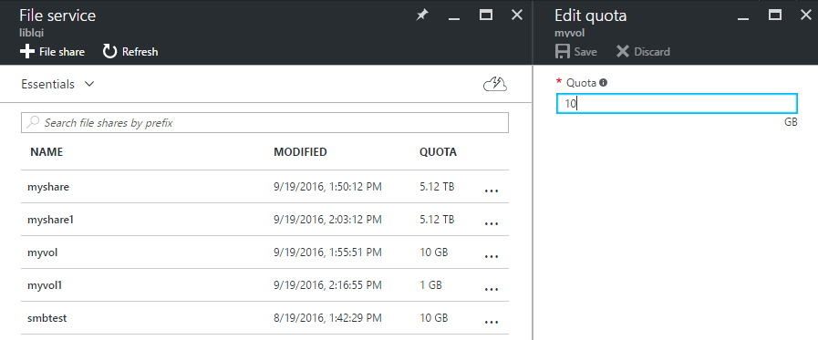

<properties 
	pageTitle="创建基于 AFS 的 Docker 容器卷" 
	description="创建基于 AFS 的 Docker 容器卷" 
	services="virtual machine" 
	documentationCenter="" 
	authors=""
	manager="" 
	editor=""/>
<tags ms.service="virtual-machine-aog" ms.date="" wacn.date="09/29/2016"/>
# 创建基于 AFS 的 Docker 容器卷

标准的 Docker 容器卷一般是位于 Docker 主机上的一个本地目录。在这样的配置下，容器必须依赖于一台特定的主机，因此使得容器的迁移和扩展变得困难。通过使用容器卷插件，能让容器访问独立于主机的存储，使得迁移或者共享变得简单。

Docker Volume Plugin for Azure File Storage 是 Microsoft 提供的容器共享存储解决方案。使用该插件，通过 SMB3.0 协议将 AFS 挂载到本地，Docker 就能够使用通过该插件驱动创建 Docker 容器卷。

目前 Docker Volume Plugin for Azure File Storage 仅支持 Ubuntu。更多信息和更新，请参见 [https://github.com/Azure/azurefile-dockervolumedriver](https://github.com/Azure/azurefile-dockervolumedriver) 。

在开始前，请确认您已经拥有一个共享出来的 AFS 和一个已经搭建好的 docker 虚拟机。登录到该虚拟机，切换到 root 账号。确认 cifs-utils 已经安装。

	# apt-get install cifs-utils

根据 Ubuntu 系统版本不同，配置方式稍有区别。Ubuntu14 及以下版本使用 upstart 模式；Ubuntu15 及以上版本使用 systemd 模式。

## Upstart 模式下的配置
	
	#wget -O azurefile-dockervolumedriver.conf https://raw.githubusercontent.com/Azure/azurefile-dockervolumedriver/master/contrib/init/upstart/azurefile-dockervolumedriver.conf
	#wget -O azurefile-dockervolumedriver.default https://raw.githubusercontent.com/Azure/azurefile-dockervolumedriver/master/contrib/init/upstart/azurefile-dockervolumedriver.default

其中 azurefile-dockervolumedriver.default 是 AFS 账号配置文件，您需要按照下面步骤修改存储链接后缀，并添加存储账号和密钥；azurefile-dockervolumedriver.conf 是服务启动配置文件。

###编辑 AFS 配置文件

取消 AZURE_STORAGE_BASE 的注释，并将 core.windows.net 替换成中国区的环境 core.chinacloudapi.cn；将 youraccount 和 yourkey 替换成对应的存储账号和密钥。
	
	# Configuration file for Azure File Service Docker Volume Driver.  
	#  
	# Required keys:  
	# - AF_ACCOUNT_NAME: Azure storage account name  
	# - AF_ACCOUNT_KEY:  Azure storage account key  
	#  
	# Customize location of executable (dev/test purposes):  
	# AF_CMD=/usr/local/bin/azurefile-dockervolumedriver  
	#  
	# Additional arguments to executable:  
	# AF_OPTS=--debug  
	AZURE_STORAGE_BASE= **core.chinacloudapi.cn**  
	
	AF_ACCOUNT_NAME= **youraccount**   
	AF_ACCOUNT_KEY= **yourkey**  
	#mv azurefile-dockervolumedriver.conf /etc/init/	  
	#mv azurefile-dockervolumedriver.default /etc/default/azurefile-dockervolumedriver  
	
###安装插件

访问 [https://github.com/Azure/azurefile-dockervolumedriver/releases](https://github.com/Azure/azurefile-dockervolumedriver/releases)，选择您要使用的版本并下载到本地。建议使用最新版的插件。

	# wget -O /usr/bin/azurefile-dockervolumedriver https://github.com/Azure/azurefile-dockervolumedriver/releases/download/v0.5.1/azurefile-dockervolumedriver  
	# chmod +x /usr/bin/azurefile-dockervolumedriver  
	# 使用 ls -al 或者 file 命令查看文件是否下载成功，且处于可执行状态。  
	# file /usr/bin/azurefile-dockervolumedriver  
	# 启动服务并检查服务状态  
	# initctl reload-configuration  
	# initctl start azurefile-dockervolumedriver  
	# initctl status azurefile-dockervolumedriver  
 

##Systemd 模式下的配置

###下载配置文件
	#wget -O azurefile-dockervolumedriver.default https://raw.githubusercontent.com/Azure/azurefile-dockervolumedriver/master/contrib/init/systemd/azurefile-dockervolumedriver.default
	
	#wget -O azurefile-dockervolumedriver.service https://raw.githubusercontent.com/Azure/azurefile-dockervolumedriver/master/contrib/init/systemd/azurefile-dockervolumedriver.service
 
其中 azurefile-dockervolumedriver.default 是 AFS 账号配置文件，您需要按照下面步骤修改存储链接后缀，并添加存储账号和密钥；azurefile-dockervolumedriver.service 是服务启动配置文件。

###编辑 AFS 配置文件
取消 AZURE_STORAGE_BASE 的注释，并将 core.windows.net 替换成中国区的环境 core.chinacloudapi.cn；将 youraccount 和 yourkey 替换成对应的存储账号和密钥。

	#vi azurefile-dockervolumedriver.default  
	# Environment file for azurefile-dockervolumedriver.service  
	#  
	# AF_OPTS=--debug  
	AZURE_STORAGE_BASE=**core.chinacloudapi.cn**
	
	AZURE_STORAGE_ACCOUNT=**youraccount**  
	AZURE_STORAGE_ACCOUNT_KEY=**yourkey**  

	# 将文件移动到正确的目录下面。
	
	# mv azurefile-dockervolumedriver.default /etc/default/azurefile-dockervolumedriver  
	# mv azurefile-dockervolumedriver.conf /etc/systemd/system/  
 
###安装插件
访问 [https://github.com/Azure/azurefile-dockervolumedriver/releases](https://github.com/Azure/azurefile-dockervolumedriver/releases)，选择您要使用的版本并下载到本地。建议使用最新版的插件。

	# wget -O /usr/bin/azurefile-dockervolumedriver https://github.com/Azure/azurefile-dockervolumedriver/releases/download/v0.5.1/azurefile-dockervolumedriver
	# chmod +x /usr/bin/azurefile-dockervolumedriver  
	# 使用 ls -al 或者 file 命令查看文件是否下载成功，且处于可执行状态。  
	# file /usr/bin/azurefile-dockervolumedriver
 
###加载服务
重新加载守护进程，使其识别到新添加的 azurefile-dockervolumedriver 服务。设置服务开机自启动，并启动服务。

	# systemctl daemon-reload  
	# systemctl enable azurefile-dockervolumedriver  
	# systemctl start azurefile-dockervolumedriver

使用 status 检查服务状态。Active(running) 表示服务启动成功；如果是其他状态，请根据错误信息进行错误排查，如确认配置文件的正确性；尝试其他版本的插件等。

	# systemctl status azurefile-dockervolumedriver  
	● azurefile-dockervolumedriver.service - Azure File Service Docker Volume Driver  
	Loaded: loaded (/etc/systemd/system/azurefile-dockervolumedriver.service; disabled; vendor preset: enabled)  
	Active: active (running) since Sun 2016-09-18 05:50:08 UTC; 3s ago  
	 Docs: https://github.com/Azure/azurefile-dockervolumedriver/  
	Main PID: 38866 (azurefile-docke)  
	Tasks: 4  
	Memory: 860.0K  
	  CPU: 8ms  
	CGroup: /system.slice/azurefile-dockervolumedriver.service  
	       └─38866 /usr/bin/azurefile-dockervolumedriver  
           
##创建和使用 Docker volume
下面命令会在 docker 虚拟机上创建一个名为 myvol 的卷；同时，在您的 AFS 中，会创建一个名为 myvol 的文件服务。

	# docker volume create -d azurefile --name myvol -o share=myvol  
	myvol  
	# docker volume ls  
	DRIVER              VOLUME NAME  
	azurefile           myvol  

使用 volume 存放数据，实际上是通过 SMB 协议挂载共享文件夹，并将数据写入到共享文件夹中；因为 Linux 目前还不支持 SMB3.0，因此在使用 AFS 时，可能会有性能上的影响。

在创建 volume 的过程中，azurefile 驱动支持的可选参数如下，这其实与通过 mount.cifs 挂载 AFS 的选项相关。

	-o share=sharename #在 portal 中看到的 AFS share 的名字  
	-o uid=<uid>  
	-o gid=<gid>   
	-o filemode=0600   
	-o dirmode=0755   
	-o nolock=true   
	-o remotepath=directory #  

通过该驱动创建的共享文件夹，默认 quota 是 5TB。您可能需要在 Azure portal 上去修改该 quota 值以适应您的需求。

