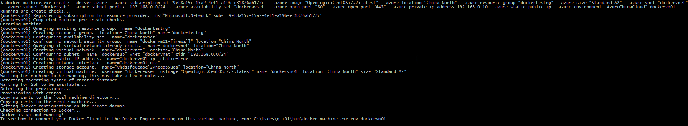
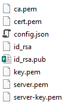
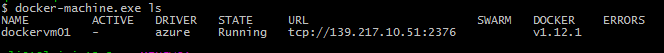
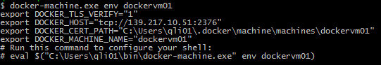
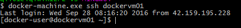
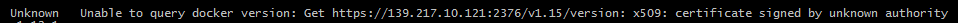

<properties 
	pageTitle="使用 docker-machine 管理 Azure 容器虚拟机" 
	description="如何使用 docker-machine 管理 Azure 容器虚拟机" 
	services="virtual machine" 
	documentationCenter="" 
	authors=""
	manager="" 
	editor=""/>
<tags ms.service="virtual-machine-aog" ms.date="" wacn.date="10/28/2016"/>

# 使用 docker-machine 管理 Azure 容器虚拟机 #

安装 docker-machine 请参见该链接（[https://docs.docker.com/machine/install-machine](https://docs.docker.com/machine/install-machine "https://docs.docker.com/machine/install-machine")）本例中，先安装了 git bash 工具，再通过 git bash 安装 docker-machine. 

第一次运行 docker-machine，会在当前用户的用户目录里（一般为 C:\Users\<user>\）生成 . =docker 的文件夹。该文件夹下的内容主要有：

1. Certs: 初次运行 docker-machine 创建VM会自动生成一系列 X509 的证书。在启动虚拟机中的 Docker 服务时，需要使用这些证书；在重置 docker 证书时，会使用这些证书重新生成 docker 证书。
2. Credentials： 用以保存 docker-machine 登录到不同平台的认证信息。
3. Machines: 保存该 docker-machine 能管理的 Docker 虚拟机的配置信息。每个虚拟机有一个与其名字一样的文件夹，其中包括了用户 ssh 的密钥和公钥，json 配置文件和在通过 docker-machine 进行 docker 服务的管理时进行身份验证的证书。

Docker-machine 使用不同的驱动，能与不同的平台进行通信，进行docker 虚拟机及内部 Docker 服务的管理。这里仅介绍 docker-machine 如何管理 Azure 平台上的资源。

## Docker 虚拟机的管理 ##

**创建**

Azure 驱动版本随着 Docker-machine 的版本一同更新。参见下面链接查看最新的 docker-machine 的版本，修复的往期的 bug，以及支持的新功能等。

[https://github.com/docker/machine/releases ](https://github.com/docker/machine/releases  "https://github.com/docker/machine/releases ")

 根据 docker-machine 版本的不同，参数可能不同。参见下面链接查看最新的Azure驱动支持的参数选项及其默认值。

[https://docs.docker.com/machine/drivers/azure/](https://docs.docker.com/machine/drivers/azure/ "https://docs.docker.com/machine/drivers/azure/") 
除了必须指定订阅号，其他必须参数都包含了默认值；您也可以根据需求自定义各参数值。下面是一个示例（使用 docker-machine 0.8.2 ）：

	docker-machine.exe create --driver azure \
	--azure-subscription-id "xxxxxxxx-xxxx-xxxx-xxxx-xxxxxxxxxxx" \
	--azure-image "Openlogic:CentOS:7.2:latest" \

> 这里需要指定 docker-machine 支持的 OS 版本，同时也需要在中国版 Azure 中存在。通过 Powershell 查看中国版 Azure 支持的 image，命令为 Get-AzureRmVMImagePublisher；Get-AzureRmVMImageOffer；Get-AzureRmVMImageSku；Version 一般都是 latest。

	--azure-location "China North" \
	--azure-resource-group "dockertestrg" \
	--azure-size "Standard_A2" \
	#Powershell中通过Get-AzureRmVMSize查看支持的虚拟机尺寸大小。
	--azure-vnet "dockervnet" \
	--azure-subnet "dockersub" \
	--azure-subnet-prefix "192.168.0.0/24" \
	--azure-availability-set "dockeravset" \
	--azure-open-port "80" \
	--azure-open-port "443" \
	--azure-private-ip-address  192.168.0.10 \

> 指定的内网 IP 简易不要在网段中太靠前，有些 IP 已经被预留，创建时会出现使用预留 IP 的错误。

`--azure-static-public-ip  \ `

> 公网 IP 不需要指定值，由 Azure 分配，公网 IP 的名字也由 Docker-machine 自动命名。

`--azure-environment "AzureChinaCloud" dockervm01`

创建成功后，本地文件夹 C:\Users\<user>\.docker\machine\machines\ 下会产生一个以虚拟机命名命名的文件夹，该文件夹中包含的文件有：

其中，config.json 文件保存了关于该虚拟机的一些配置信息：虚拟机的配置和连接信息；docker 证书信息等。如果遗失，需要手动创建，其中关于虚拟机的信息可以通过 portal 或者 powershell 获取。

id_rsa* 是 ssh 连接的密钥和公钥；如果遗失，可通过 portal 重置，并修改这两个文件即可。

*pem 文件是 docker 服务启动时用到的证书。如果遗失，无法找回，可通过 regenerate-certs 重置，但会影响现有的 docker 服务。

**管理**

通过 docker-machine -help 可以查看 docker-machine 支持的命令和操作。

如 ls 查看虚拟机及基本状态：

env 查看某台 VM 的配置环境

ssh 登录虚拟机

使用 docker-machine 创建的虚拟机，和通过其他方式如 portal，powershell 创建的虚拟机没有本质上的区别，用户可以使用 portal 或者 powershell 等命令行进行如开关机，resize，设置 DNS 等管理。

**故障排查：**

1. Docker-machine v.0.7.0 对 CentOS 的支持有一定问题。通过该版本配置的 docker 服务无法正常启动。建议到 github（https://github.com/docker/machine） 上查询最新版本信息，以及已知 bug。
2. 下面错误一般是因为 docker vm 上的证书与本地的证书不匹配造成的；使用 regenerate-certs 可以重置证书。

	
