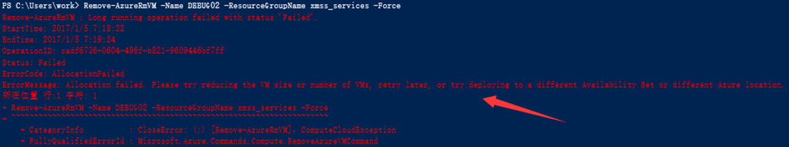
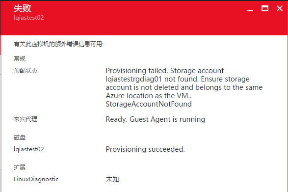
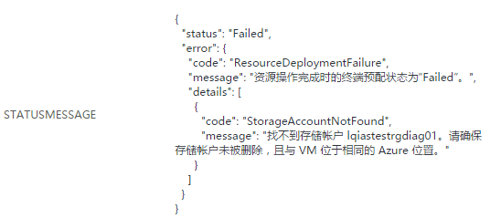

<properties
    pageTitle="ARM 中可用性集使用的注意事项"
    description="ARM 中可用性集使用的注意事项"
    service=""
    resource="virtual-machines"
    authors=""
    displayOrder=""
    selfHelpType=""
    supportTopicIds=""
    productPesIds=""
    resourceTags="Virtual Machines, ARM, ASM, HA"
    cloudEnvironments="MoonCake" />
<tags
    ms.service="virtual-machines-aog"
    ms.date=""
    wacn.date="02/21/2017" />

# ARM 中可用性集使用的注意事项

Azure 目前有两种部署模型：经典部署模型 (ASM) 和资源管理器 (ARM)。如果您之前使用过 ASM 模式下的可用性集，那么很可能在使用 ARM 模式下的可用性集时，会遇到一些问题或者疑惑。这里就 ARM 中可用性集使用的一些常见问题做个简单回答。

1. ARM 中，虚拟机的整个生命周期都不能更改其可用性集设置。

    在经典模式中，只需要经过停止分配再启动虚拟机，就可以将虚拟机加入，移除或者更换可用性集。
    而在 ARM 模式中，在查看虚拟机可用性集是，您会注意到如下提示：

    

    什么意思呢？就是说：

    1. 如果在创建虚拟机的时候，如果没有指定可用性集，那么虚拟机完成部署后，是不能将该虚拟机加入到可用性集中的。

    2. 如果虚拟机已经在可用性集中，您需要给它换个可用性集，或者将其移除可用性集，这也是不能的。

    如果您的确需要更改该虚拟机的可用性集设置，唯一的方法，就是通过删除虚拟机保留磁盘，并重建虚拟机的方式，指定可用性集。

2. 可用性集的设置也是只能在创建的时候指定。

    创建可用性集时，您可以自定义容错域和更新域的数量。但在创建完成后，这些设置就不能再更改了。 
    容错域：范围 1-3，默认值是 3。在物理上，一个域中的所有虚拟机和物理机，会共享同样的电源和网络资源。 
    更新域：范围 1-20， 默认值是 5。这是一个逻辑的概念，后台在执行计划内维护时，所有更新域中一次只会有一个域在进行维护。

3. 可用性集中虚拟机操作常见错误 1 :

    由于后台部署失败，造成虚拟机创建失败。这些失败的虚拟机因放在可用性集中，删除也遇到问题。删除单个虚拟机，报错虚拟机分配失败；通过删除整个可用性集，报错须首先删除虚拟机。

    

    **解决方法 :**

    将可用性集下的所有虚拟机，都执行一遍删除操作，无论成功与否。然后再删除该可用性集。 
    原因：通过对每台虚拟机都执行删除操作，即使未能成功删除，也会将虚拟机的状态标记为 “ToBeDelete”。此时再删除可用性集，可用性集在验证虚拟机状态时，发现所有虚拟机都是可以被删除的，则会将虚拟机连同可用性集一起删除。

4. 可用性集中虚拟机操作常见错误 2 :

    在对可用性集中的虚拟机进行一些管理平面的操作时，你可能会遇到如下错误。 
    如更改诊断设置存储账号/删除虚拟机：

    

    或者向该可用性集中创建新虚拟机 :

    

    而实际上，您操作的虚拟机可能并没有使用这些存储账号。

    这是由于在对可用性集中的虚拟机进行管理操作时，可用性集会验证其所有虚拟机的 OS Profile，保证信息的一致性。如果任何一台虚拟机引用的诊断存储账号不存在了，该验证过程失败，则操作无法继续进行，该虚拟机状态会被同步标记为失败。

    **解决方法 :**

    1. 找到被删除的存储账号是被哪个虚拟机在使用。

        通过 `Get-AzureRmVM -ResourceGroupName <resource_name> -Name <vm_name>` 查看 BootDiagnostics 和 Diagnostic Extensions 的存储账号设置。 
        禁用该虚拟机的诊断存储账号即可。

    2. 如果该可用性集中同时有多个诊断存储账号被误删，则方法 1 因一个虚拟机设置等待另一个虚拟机设置先修正而造成死锁。在这种情况下，需要找到所有被误删的诊断存储账号，重建之。

        [AZURE.NOTE] 前端显示存储账号重建成功后，后台各资源提供程序间的同步需要一段时间，可能发生因同步延迟造成的存储账号还是找不到的问题。请在重建好所有存储账号，大约一至一个半小时后，再次尝试管理操作。
同时，建议客户在使用可用性集时，提前进行规划，比如使用有意义的虚拟机和存储账号命名，将诊断设置放在同一个单独的存储账号中等，避免存储账号被误删的情况发生。

