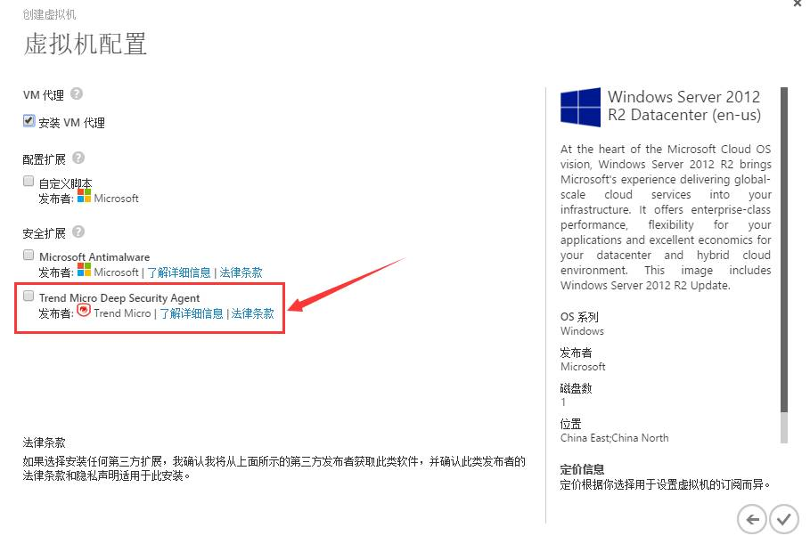
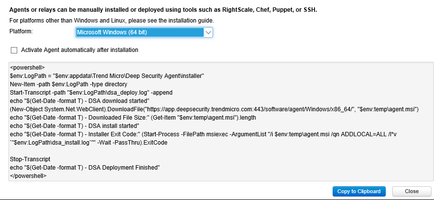
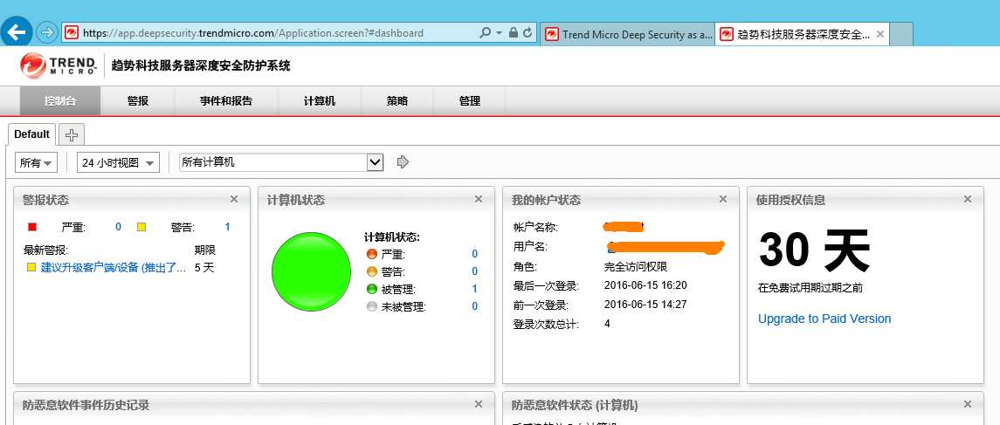

<properties
                pageTitle="如何激活 Trend Micro Deep Sercurity for Azure"
                description="如何激活使用趋势科技的 DSA "
                services="virtual-machines"
                documentationCenter=""
                authors=""
                manager=""
                editor=""
                tags="Azure VM,DSA,Trend Micro"/>

<tags
                ms.service="virtual-machines-aog"
                ms.date="12/23/2016"
                wacn.date="12/23/2016"/>

# 如何激活 Trend Micro Deep Security Agent

Deep Security 即服务包括反恶意软件保护、防火墙、入侵防御系统和完整性监视。  
Trend Micro Deep Security Agent (DSA) 可以配合 Deep Security Manager 工作，也可以使用 Trend Micro Deep Security 即服务。前一种方式由于配置和维护成本较高，我们推荐使用 Trend Micro Deep Security 即服务来激活 DSA。

### 安装 DSA 的界面如下图所示： ###

详细操作步骤可以参考[如何在 Windows VM 上安装和配置 Trend Micro Deep Security 即服务](/documentation/articles/virtual-machines-windows-classic-install-trend/)。

### 激活步骤如下： ###

1.	在 [Trend Micro 官网](https://app.deepsecurity.trendmicro.com/SignUp.screen)注册一个试用版账号。
2.	登陆账号，下载对应平台（如 Microsoft Windows 64bit）的激活脚本。

	

3.	将该 PowerShell 脚本拷贝到安装有 DSA 的虚拟机上运行即可完成激活操作。

	

### 更多 Trend Micro DSA 信息请参考: ###

- [Trend Micro Azure 云服务安全](http://www.trendmicro.com/azure/)  
- [Trend Micro Deep Security 技术支持](https://help.deepsecurity.trendmicro.com/welcome.html)  
- [Deep Security Manager 快速入门](https://help.deepsecurity.trendmicro.com/azure-marketplace-getting-started-with-deep-security.html)  
- [Deep Security 服务包.pdf](http://docs.trendmicro.com/all/ent/ds/v9.6_sp1/en-us/Deep_Security_96_SP1_Admin_Guide_EN.pdf)  

